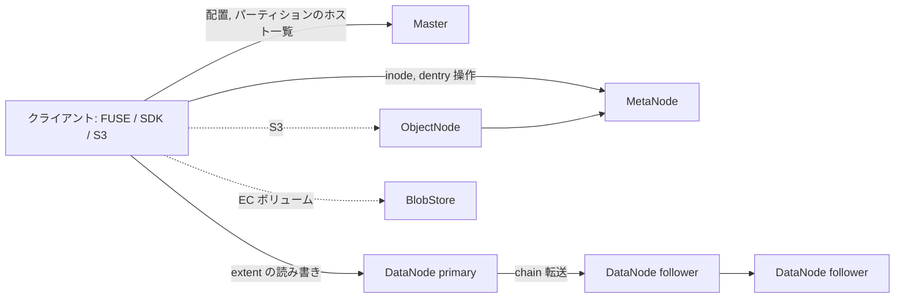

# アーキテクチャ

## 全体像

CubeFS は複数のロールとして動き、すべて 1 つのバイナリから作られます。config の `role` キーがプロセスの起動ロールを選び (`cmd/cmd.go:184`)、`cmd/cmd.go:206-239` の switch が対応するサーバを構築します。ロール名は `cmd/cmd.go:71-93` の定数です。master, metanode, datanode, objectnode, authnode, console, lcnode, flashnode, flashgroupmanager の 9 つです。

中核は 3 つのプレーンへの分割です。Master プレーンはクラスタトポロジとパーティション配置を追跡します。メタデータプレーン (MetaNode) は inode とディレクトリエントリをメモリに保持します。データプレーン (DataNode) はファイル実データをローカルディスク上の extent として格納します。クライアントは 3 者すべてと通信しますが、Master はデータパスに介在しません。パーティションを保持する DataNode の一覧を配るだけです。

## コンポーネント

### Master (`master/`)

リソース管理ノード。クラスタ台帳・ボリューム・データパーティション・メタパーティションを管理します。主要な型は `master/cluster.go:141` `type Cluster`、`master/vol.go:142` `type Vol`、`master/data_partition.go:34`、`master/meta_partition.go:54`。Master 自身も可用性のため raft で複製されます。

### MetaNode (`metanode/`)

すべてのファイルメタデータ (inode とディレクトリエントリ) をメモリに保持します。メタデータはメタパーティション単位でシャーディングされ、各パーティションは multi-raft で複製されます。インメモリ索引はパーティションごとに 2 本の B-Tree です (`metanode/partition.go:489-490`)。

### DataNode (`datanode/`)

ファイル実データを extent (ローカルファイル) として格納します。ストレージはデータパーティション単位でシャーディングされ、各パーティションはプライマリ-バックアップ chain で複製されます。`datanode/partition.go:102` `type DataPartition` がノード上のパーティション実体です。

### ObjectNode (`objectnode/`)

S3 互換ゲートウェイ。S3 操作を同じメタデータ/データプレーンへマッピングし、オブジェクトと POSIX ファイルが同じバイト列になれるようにします。

### BlobStore (`blobstore/`)

低コスト・超大規模向けのイレイジャーコーディングエンジン。これ自体が複数のサブモジュール群です。clustermgr, blobnode, access, proxy, scheduler, shardnode です。ボリュームが multi-replica の代わりにこのエンジンを選択します。

### 補助ロールとクライアント

AuthNode は認証、Console は Web UI、lcnode はライフサイクルポリシー、flashnode と flashgroupmanager は分散キャッシュを構成します。クライアントは `client/` (FUSE)、`sdk/` (Go SDK)、`java/` (libcubefs) にあります。

## リクエストの流れ

append write をクライアントからレプリカまで追います。完全なコードウォークは [内部実装](./internals) にあります。コンポーネントの通過点は次のとおりです。

1. クライアント SDK は書き込みを extent 単位のリクエストに分解してバッファし、sender goroutine がパケットをプライマリ DataNode へ送ります (`sdk/data/stream/extent_handler.go:292`)。パケットには全レプリカアドレスが `packet.Arg` に載ります (`extent_handler.go:338`)。
2. プライマリ DataNode はパケットを受け取り、全 follower へ転送してからローカルに適用します (`datanode/repl/repl_protocol.go:334`, `datanode/repl/repl_protocol.go:342-349`)。これがプライマリ-バックアップ chain です。
3. ローカル書き込みは extent ストアに着地します (`datanode/wrap_operator.go:912`, `datanode/storage/extent.go:499`)。
4. 書き込み確定後、クライアントは得られた ExtentKey を MetaNode 上の inode に登録し、メタデータプレーンがデータの位置を知ります。

Master はステップ 1 から 4 に一切触れません。事前にパーティションのホスト一覧を渡しただけです。

## 主要な設計判断

決定的な選択はインメモリメタデータです。各メタパーティションは inode B-Tree と dentry B-Tree を完全に RAM 上に保持し (`metanode/partition.go:489-490`)、それは Google の `btree.BTree` を RWMutex で薄く包んだものです (`metanode/btree.go:31`)。耐久性は raft ログ + 定期 snapshot で確保するため、永続ストアは索引のソースではありません。SIGMOD 論文はメタデータをノードのメモリ使用量で配置し、容量拡張時の data rebalancing を不要にすると論じています (S7)。代償としてメタデータ容量はノード RAM に律速され、POSIX セマンティクスは整合コストを下げるため緩められています (S2)。

2 つ目の選択は、1 つのメタデータプレーンの下の 2 エンジンです。ボリュームは multi-replica (強整合) か BlobStore 経由のイレイジャーコーディングを選びます。inode 上の `StorageClass` フィールド (`metanode/inode.go:78`) が、どのエンジンを使う inode かを記録します。

## 拡張ポイント

- 任意の S3 SDK 向けの ObjectNode 経由 S3 API。
- Hadoop FileSystem (HDFS 互換) と POSIX FUSE クライアント。
- 別リポジトリのサブプロジェクトである CSI ドライバ (`cubefs/cubefs-csi`) と Helm chart (`cubefs/cubefs-helm`) (S1)。
- `util/exporter` 経由の Prometheus メトリクス。
