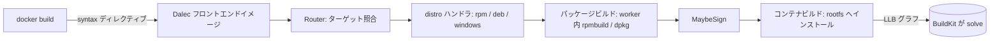

# アーキテクチャ

## 全体像

Dalec は BuildKit のフロントエンドとして動く。BuildKit が起動するコンテナイメージで、YAML spec とビルドオプションを渡され、LLB グラフを返すことが期待される。ビルド自体は実行しない。spec を読み、利用者が指定した distro ターゲットを判定し、ソース取得・worker イメージ内での `rpmbuild` または `dpkg` 実行・生成パッケージの新しい root ファイルシステムへのインストール・(任意で) 署名と attestation までを行う LLB グラフを組み立てる。そのグラフを BuildKit が並列・キャッシュ付きで solve する。

## コンポーネント

### フロントエンドのエントリポイント

`cmd/frontend/` は BuildKit が実行するバイナリだ。`main` (`cmd/frontend/main.go:34`) は引数で分岐する。引数なしなら `dalecMain` (`cmd/frontend/main.go:90`)、すなわちフロントエンド本体を呼ぶ。引数ありなら `lookupCmd` (`cmd/frontend/main.go:64`) で内部サブコマンドを実行し、そのコマンド集合は blank import された `internal/commands` パッケージ由来である (`cmd/frontend/main.go:22`)。`dalecMain` は `frontendapi.NewRouter` でルーターを構築し (`cmd/frontend/main.go:92`)、`frontend.WithTargetForwardingHandler` でラップし (`cmd/frontend/main.go:96`)、`grpcclient.RunFromEnvironment` で BuildKit gateway プロトコルの提供を開始する (`cmd/frontend/main.go:99`)。

### ルーター

`frontend/` がディスパッチ層を持つ。`Router` はフラットなルートテーブルで、`azlinux3/container` のような完全修飾パスをキーにした `routes map[string]Route` である (`frontend/router.go:73`)。ソースのコメントは、これが階層的な `BuildMux` を、より単純なディスパッチモデルに置き換えたものだと述べる (`frontend/router.go:71`)。`Router.Handle` はビルドオプションから要求された `target` を読み、(ターゲット一覧 API などの) サブリクエストを処理したうえで、`lookupTarget` でルートを引き当ててそのハンドラを呼ぶ (`frontend/router.go:119`, `frontend/router.go:148`, `frontend/router.go:158`)。ハンドラ最上部の `recover` が、panic をクラッシュではなくエラー返却に変える (`frontend/router.go:91`)。

### distro ハンドラとパッケージング

`targets/` はプラットフォーム系統ごとに 1 つのハンドラツリーを持つ。`targets/linux/rpm/distro` (Azure Linux・AlmaLinux・Rocky Linux)、`targets/linux/deb/distro` (Debian・Ubuntu)、`targets/windows`、そして外部フロントエンド連携用の `targets/plugin` だ。各 distro は `distro.Config` (`targets/linux/rpm/distro/distro.go:14`) で記述され、自身のルートを登録する (`targets/linux/rpm/distro/distro.go:93`)。spec から `.spec` ファイルや `debian/` ディレクトリへの実際の変換、および `rpmbuild`/`dpkg` の起動は、`packaging/linux/rpm` と `packaging/linux/deb` にあり、直接実行ではなく LLB として表現される。

### spec モデル

リポジトリのルート (`package dalec`) が、システム全体が読むデータモデルを持つ。`spec.go`、`load.go`、`source*.go` 群、`artifacts.go`、`tests.go`、そして `generator_gomod.go` などの generator である。これは、各 distro ハンドラが消費する YAML のパース済み表現だ。

## リクエストの流れ

`azlinux3/container` ターゲットを端から端まで追う。spec → RPM → 最小コンテナの流れだ。

1. `docker build` が spec の 1 行目 `# syntax=ghcr.io/project-dalec/dalec/frontend:latest` を読み、Dalec フロントエンドイメージを pull して実行する (`docs/examples/hello.inline.yml:1`)。
2. フロントエンドが起動し、ルーターを構築してディスパッチする。RPM distro の場合、`Config.Routes` が `azlinux3`・`azlinux3/rpm`・`azlinux3/container` などのルートを登録する (`targets/linux/rpm/distro/distro.go:93`)。`/container` ルートのハンドラは `linux.HandleContainer(cfg)` である (`targets/linux/rpm/distro/distro.go:124`)。
3. `HandleContainer` は `Config.BuildContainer` を呼ぶ (`targets/linux/rpm/distro/container.go:17`)。まずパッケージが必要なので、`Config.BuildPkg` がビルド依存入りの worker イメージを用意し、`spec.Preprocess` で spec の generator を実行し、`rpm.BuildRoot` で `rpmbuild` ツリーを組み、`rpm.Build` で `rpmbuild` を LLB として実行する (`targets/linux/rpm/distro/pkg.go:47`, `pkg.go:54`, `pkg.go:58`, `pkg.go:70`)。
4. `frontend.MaybeSign` は、spec が署名を要求していれば署名済み state を作り、`st.File(llb.Copy(signed, "/", "/"))` で未署名の出力へ上書きする (`targets/linux/rpm/distro/pkg.go:72`, `pkg.go:76`)。
5. `BuildContainer` に戻り、パッケージを新しい root ファイルシステムへインストールする。`spec.GetSingleBase(targetKey)` でベースイメージを選び、インストール時リポジトリをマウントし、worker 上で `cfg.Install` を実行して RPM を `/tmp/rootfs` に置き、post-install symlink があれば適用し、rootfs state を返す (`targets/linux/rpm/distro/container.go:23`, `container.go:31`, `container.go:68`, `container.go:76`)。
6. これらは即時には走らない。各ステップは LLB グラフに追記されるだけで、BuildKit がそのグラフを並列・キャッシュ付きで solve する。

## 主要な設計判断

フロントエンドはビルドを実行せず LLB を出力する。上記はすべてグラフの組み立てで、実際の `rpmbuild`・パッケージインストール・コピーは BuildKit が solve するときに起きる。これにより Dalec は任意の BuildKit (ローカル Docker・`buildx`・CI) 上で自前のビルドサーバなしに動き、キャッシュと並列性は BuildKit から無償で得られる (moby/buildkit、Docker フロントエンドドキュメント)。

ルーターはフラットなテーブルで、ルートは上書きできる。`Add` は同じ `FullPath` を持つ後のルートが前のルートを置き換えることを意図的に許し、コメントはこれがターゲットフォワーディングでビルトインを上書きするために使われると述べる (`frontend/router.go:79`)。`WithTargetForwardingHandler` (`frontend/router.go:399`) はこれを使い、spec が外部フロントエンドを指定したとき、ビルトインのハンドラが本来処理するルートを引き取らせる。拡張は、別建てのプラグインレジストリではなくルート上書きとして実装されている。

## 拡張ポイント

- **外部フロントエンド**: spec は別のフロントエンドにターゲットの処理を任せられる。ターゲットフォワーディングが対応するビルトインルートを上書きしてそこへディスパッチする (`frontend/router.go:399`、`targets/plugin`)。
- **ソース generator**: ソースの `Generate` ブロックが generator (gomod・cargohome・pip) を実行し、ビルドキャッシュを事前に用意する。パッケージビルドの前に `spec.Preprocess` で組み込まれる (`targets/linux/rpm/distro/pkg.go:54`)。
- **distro ターゲット**: 新しい distro は、新しい `distro.Config` の値とそのルート登録である (`targets/linux/rpm/distro/distro.go:14`)。Azure Linux・AlmaLinux・Rocky Linux が 1 つの RPM コードパスを共有するのはこのためだ。
