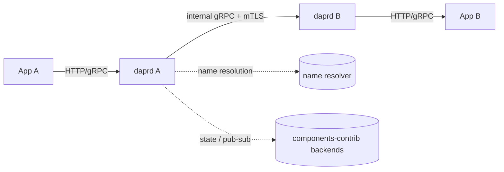

# アーキテクチャ

## 全体像

Dapr はデータプレーンとコントロールプレーンに分かれ、どちらも単一の `dapr/dapr` リポジトリの `cmd/` 配下から出荷される。データプレーンは 1 つのバイナリ `daprd` で、各アプリインスタンスの隣でサイドカーとして動く。コントロールプレーンは Kubernetes 上でサイドカー群を管理するバイナリの集合だ。アプリは常にローカルサイドカーと HTTP または gRPC で話し、サイドカー同士は mTLS で保護された内部 gRPC チャネルで通信する。

## コンポーネント

### daprd (データプレーンのサイドカー)

サイドカーランタイム本体。`cmd/daprd/main.go:21` が `app.Run()` を呼び、フラグ解析とランタイム起動を行う (`cmd/daprd/app/app.go:56`)。状態は 1 つの `DaprRuntime` 構造体に集まる (`pkg/runtime/runtime.go:102`)。アプリチャネル、direct messaging、actor、workflow エンジン、コンポーネントストア、resiliency、security ハンドラを保持する。gRPC サーバを 2 つ動かす。アプリ向けの公開 API サーバと、サイドカー間通信用の内部サーバだ (`pkg/runtime/runtime.go:139` 以降の `grpcAPIServer` / `grpcInternalServer` フィールド)。

### operator

Kubernetes オペレータ (`cmd/operator`)。Dapr の CRD (Component、Subscription、Resiliency ほか) を監視し、その内容をサイドカーへ配信する。

### injector

サイドカーインジェクタ (`cmd/injector`)。mutating admission webhook で、`dapr.io/enabled: "true"` アノテーション付きの Pod に `daprd` コンテナを注入する。

### sentry

認証局 (`cmd/sentry`)。サイドカーが mTLS に使う SPIFFE ベースのワークロード証明書を発行する。

### placement

actor の placement サービス (`cmd/placement`)。consistent hashing で actor のパーティション配置をホスト間で管理する。

### scheduler

スケジューリングバックエンド (`cmd/scheduler`)。ジョブ、actor reminder、workflow を扱う。

## リクエストの流れ

アプリ A からアプリ B のメソッドへのサービス呼び出しは、両方のサイドカーを通る。

1. アプリ A が `POST /v1.0/invoke/<app-id>/method/<method>` をサイドカー A に送る。HTTP ハンドラ `onDirectMessage` がデコード済みパスから targetID と method を抽出し、resiliency ポリシを選び、`InvokeMethodRequest` を組み立てる (`pkg/api/http/directmessaging.go:97`)。呼び出しを resiliency runner でラップして `a.directMessaging.Invoke` を呼ぶ (`pkg/api/http/directmessaging.go:164`)。

2. `directMessaging.Invoke` がメソッド名を正規化し (`pkg/messaging/direct_messaging.go:168`)、宛先を解決して 3 経路に分岐する (`pkg/messaging/direct_messaging.go:175` 以降)。HTTPEndpoint / 外部 URL、自分自身 (`invokeLocal`)、それ以外のリモートサイドカー (`invokeWithRetry(... d.invokeRemote ...)`) だ。

3. リモート宛先では `getRemoteApp` (`pkg/messaging/direct_messaging.go:607`) が `app.namespace` 形式を分解し、設定された name resolver (mDNS、Kubernetes、consul) で宛先サイドカーの gRPC アドレスを引く。

4. `invokeRemote` がコネクションを張り、forwarded / 宛先 appID / caller-callee ヘッダを付け、`internalv1pb.ServiceInvocationClient` で相手の内部 gRPC を呼ぶ (`pkg/messaging/direct_messaging.go:311`)。既定はストリーム送信だ。

5. サイドカー B では内部 gRPC サーバの `CallLocal` がリクエストを受ける (`pkg/api/grpc/daprinternal.go:44`)。`FromInternalInvokeRequest` で復元し、`callLocalValidateACL` で ACL を評価し、アプリチャネル `appChannel.InvokeMethod` でアプリ B を叩く (`pkg/api/grpc/daprinternal.go:71`)。レスポンスは protobuf で返る。

アプリは B の IP も DNS 名も知らず、app ID だけで B を指定する。サイドカー間は mTLS で守られる。

## 主要な設計判断

Dapr はサービス呼び出しのセキュリティ境界を 1 つのエッジに集約する。メソッド名は `directMessaging.Invoke` で 1 度だけ正規化され (`pkg/messaging/direct_messaging.go:168`)、その正規化後の形が ACL 評価とディスパッチの両方で使われる。だから `../` 形式のメソッドが、一方の形で評価され別の形でディスパッチされて ACL をすり抜けることはない。正規化のコードは [内部実装](./internals) を参照。

リトライ用の replay バッファリングはリクエストごとに判断される。`InvokeMethodRequest` はボディをバッファして再送できるが、チャンク転送や長さ不明のボディでは HTTP ハンドラがストリーミングフラグを立てて replay を無効化する。大きなストリームをリトライのためだけにメモリへ丸ごと貯めない (`pkg/api/http/directmessaging.go:148`)。

## 拡張ポイント

- **コンポーネント** はビルディングブロックのインターフェース (state store、pub/sub、binding、secret store、lock、crypto、conversation、name resolution、middleware) を実装し、コンポーネントストアに登録される (`pkg/runtime/compstore/compstore.go:42`)。コミュニティ実装は別リポジトリ `dapr/components-contrib` にある。
- **CRD** が Kubernetes 上の設定を駆動する。Component、Subscription、Resiliency、HTTPEndpoint、Configuration などが同じストアで追跡される (`pkg/runtime/compstore/compstore.go:58` 以降)。
- **Pluggable component** はコンポーネントをランタイムに組み込む代わりに別の gRPC プロセスとして動かせる。
- **SDK** は Go、Java、.NET、Python、JavaScript、Rust、C++、PHP で HTTP / gRPC API をラップする。
