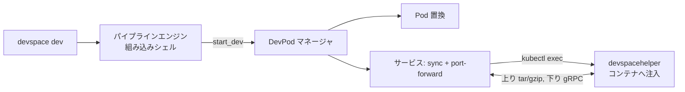

# アーキテクチャ

## 全体像

DevSpace は単一の CLI バイナリで、ユーザーの kube-context を通じて Kubernetes クラスタと話す。DevSpace のものがクラスタ内に恒久的に動くことはない。`devspace dev` のようなコマンドは、名前付きパイプラインを起動する薄いラッパである。パイプラインとは、組み込みインタプリタが実行する POSIX シェルスクリプトのことだ。そのスクリプトが DevSpace の組み込みコマンド (`build_images`・`create_deployments`・`start_dev`) を呼び、実際の仕事をする。イメージをビルドし、マニフェストをデプロイし、開発セッションを開始する。dev セッションは対象 Pod を開発用 Pod に置換し、そのコンテナへ小さなヘルパーバイナリを注入し、`kubectl exec` ストリーム上に双方向ファイル同期とポートフォワーディングを開く。

## コンポーネント

### CLI コマンド

`cmd/` は cobra のコマンドを持つ。`dev.go`・`deploy.go`・`build.go`・`sync.go`・`enter.go`・`run_pipeline.go` などがあり、root コマンドに組み立てられる (`cmd/root.go:51` `NewRootCmd`)。高レベルのコマンドの多くは自前のロジックを実装しない。パイプラインを設定して走らせる。`NewDevCmd` は `Pipeline: "dev"` を持つ `RunPipelineCmd` を作る (`cmd/dev.go:11`)。

### パイプラインエンジン

`pkg/devspace/pipeline/` が実行エンジンである。`engine/` は `mvdan.cc/sh/v3` シェルインタプリタをラップし (`pkg/devspace/pipeline/engine/engine.go:9`)、外部シェルなしで Linux・macOS・Windows で同じようにパイプラインが動く。`engine/pipelinehandler/commands/` は組み込みコマンド (`build_images.go`・`create_deployments.go`・`start_dev.go` など) を持ち、`types/default.go` は dev/build/deploy/purge の default パイプラインスクリプトを持つ。

### DevPod ライフサイクル

`pkg/devspace/devpod/` は開発用 Pod のライフサイクルを担う。起動・リトライ・Pod ごとのサービス起動である。`devpod.go` がエントリポイント (`pkg/devspace/devpod/devpod.go:74` `Start`)。

### サービス

`pkg/devspace/services/` は dev セッションが有効化する個別の機能を持つ。`sync/` (双方向ファイル同期)、`podreplace/` (対象ワークロードを dev pod に差し替え)、`inject/` (ヘルパーバイナリをコンテナに配置)、`portforwarding/`・`ssh/`・`terminal/`・`attach/`・`logs/` である。

### 同期エンジンとヘルパー

`pkg/devspace/sync/` はファイル同期エンジンのクライアント側である。`helper/` は別バイナリ (`devspacehelper`) で、DevSpace が対象コンテナへ注入する。同期のサーバ側 (`helper/server/upstream.go`・`helper/server/downstream.go`) に加え、SSH server と restart helper を持ち、独自の `helper/main.go` からビルドされる。

### ビルド・デプロイのバックエンド

`pkg/devspace/build/builder/` は差し替え可能なイメージビルダを実装する。`docker`・`buildkit`・`kaniko`・`custom` である。`pkg/devspace/deploy/` は Helm と kubectl マニフェスト経由のデプロイを実装する。`pkg/devspace/config/versions/` は古い `devspace.yaml` を動かし続けるための config スキーマ世代を持つ。

## リクエストの流れ

代表的な操作である `devspace dev` を、CLI から動作中のファイル同期まで追う。

1. `NewDevCmd` は `RunPipelineCmd{Pipeline: "dev", SkipPushLocalKubernetes: true}` を作る (`cmd/dev.go:11`)。`dev` コマンドはパイプライン起動のラッパである。
2. `RunPipelineCmd.Run` (`cmd/run_pipeline.go:199`) は config をロードし、名前付きパイプラインを解決する。ユーザーが未定義なら default を使う。
3. default の `dev` パイプラインはシェルスクリプトである (`pkg/devspace/pipeline/types/default.go:31`): `run_dependencies --all`、`ensure_pull_secrets --all`、`build_images --all`、`create_deployments --all`、`start_dev --all`。
4. スクリプトは組み込みインタプリタ上で走る。DevSpace 固有の語は通常のプログラムではなく、カスタム exec ハンドラに登録された組み込みコマンドである (`pkg/devspace/pipeline/engine/pipelinehandler/handler.go:45`、`:48`、`:55`)。ハンドラはこれを、素のシェルにフォールバックする前に横取りする (`handler.go:121`)。
5. `start_dev` は `StartDev` にディスパッチし (`pkg/devspace/pipeline/engine/pipelinehandler/commands/start_dev.go:27`)、dev config を解決して `pipeline.DevPodManager().StartMultiple(...)` を呼ぶ (`start_dev.go:74`)。
6. `devPod.Start` (`pkg/devspace/devpod/devpod.go:74`) は `startWithRetry` (`:123`) を経て `start` (`:221`) に至り、必要なら Pod を置換し、対象コンテナを選び、`startServices` を呼ぶ (`:501`)。
7. `startServices` は tomb (goroutine 群) で sync とポートフォワーディングを並行に走らせる。`sync.StartSync(...)` (`devpod.go:515`) と `portforwarding.StartPortForwarding(...)` (`devpod.go:526`)。
8. `StartSync` (`pkg/devspace/services/sync/sync.go:64`) はコントローラの `startSync` (`pkg/devspace/services/sync/controller.go:270`) を走らせる。まずヘルパーバイナリをコンテナの `/tmp/devspacehelper` に注入し (`controller.go:403` が `inject.InjectDevSpaceHelper` を呼ぶ。パス定数は `pkg/devspace/services/inject/inject.go:43`)、次に `sync.NewSync` で同期クライアントを組む (`controller.go:462`)。
9. コントローラは 2 本の `kubectl exec` ストリームを開く。上りは `[/tmp/devspacehelper sync upstream ...]` (`controller.go:468`)、下りは `[/tmp/devspacehelper sync downstream ...]` (`controller.go:513`)。これらを `InitUpstream` (`controller.go:507`) と `InitDownstream` (`controller.go:535`) で同期クライアントに配線する。
10. 同期エンジンの `Start` (`pkg/devspace/sync/sync.go:166`) が `mainLoop` (`:209`) を走らせる。`startUpstream` (`:232`) は再帰 watch tree でローカル FS を監視し (`notify.NewTree()` が `:234`、`tree.Watch` が `:241`)、`startDownstream` (`:268`) はコンテナ側の変更を取得し、`initialSync` (`:277`) は起動時に一度両者を突き合わせる。

以降、保存したローカル編集はコンテナへ上り、コンテナ側の変更はディスクへ下る。これが継続し、その間にイメージの再ビルドも再デプロイもない。

## 主要な設計判断

**クライアントオンリー、クラスタに常駐なし。** DevSpace は既存の kube-context を使い、オペレータも CRD も入れない。同期のサーバ側は常駐コンポーネントではなく、必要時に注入する使い捨てバイナリである (README、DevSpace 公式サイト)。トラストとインストールのフットプリントを `kubectl` と同じに保つ代わりに、クライアントから `exec` ストリーム越しに多くの仕事をする。

**差し替え可能なシェルスクリプトとしてのパイプライン。** v6 はハードコードのワークフローを POSIX スクリプト + 特権的な組み込みコマンドに変え、ユーザーが固定ワークフローを hook で曲げる代わりに `devspace.yaml` で丸ごと上書きできるようにした (Pipelines docs、DevSpace 6 announcement)。外部シェルを呼ぶ代わりに `mvdan.cc/sh` を内蔵することで、同じスクリプトがどの OS でも動く。

**サイドカーではなく Pod 置換。** dev セッションでは、DevSpace は対象 Deployment/StatefulSet を 0 にスケールダウンし、改変した dev pod (イメージ差し替え・コマンド上書き・任意の永続ボリューム) を立て、そこへ同期する (`pkg/devspace/services/podreplace/replace.go:52` `ReplacePod`)。開発者が完全に制御できるコンテナが得られる代わりに、動作中ワークロードを書き換える。

**非対称な同期プロトコル。** ローカルからコンテナへのアップロードは生の `tar`/`gzip` ストリーム、コンテナからローカルへはヘルパーへの gRPC である。両方向とも 1 本の `kubectl exec` の stdin/stdout に乗る。[内部実装](./internals) のページでこれを追う。

## 拡張ポイント

- **パイプラインと組み込みコマンド**: 組み込みコマンドを語彙にして、任意のワークフローを `devspace.yaml` で再定義する (`pkg/devspace/pipeline/engine/pipelinehandler/commands/`)。
- **ビルドバックエンド**: イメージごとに `docker`・`buildkit`・`kaniko`・`custom` を選ぶ (`pkg/devspace/build/builder/`)。
- **デプロイバックエンド**: Helm・kubectl マニフェスト・kustomize (`pkg/devspace/deploy/`)。
- **プラグインと hook**: `pkg/devspace/plugin/` と `pkg/devspace/hook/` が、外部コードによるコマンド拡張とライフサイクルイベント前後の発火を可能にする。
- **imports**: `devspace.yaml` は別の `devspace.yaml` から設定を取り込める。v6 で追加 (Pipelines docs)。
