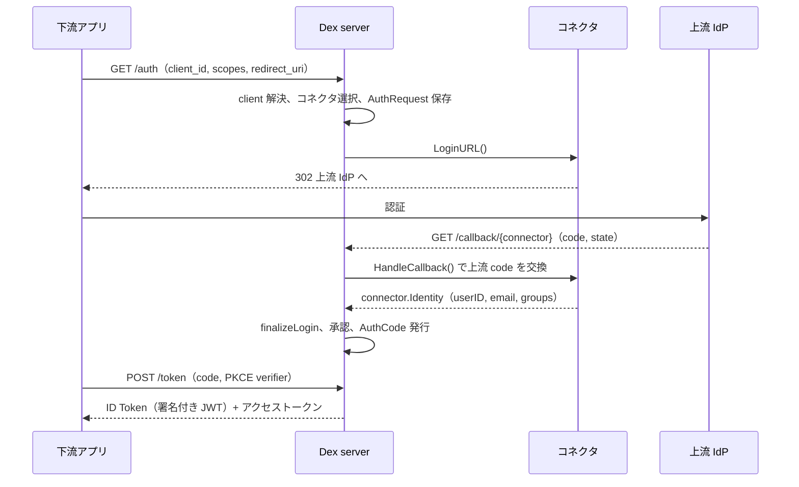

# アーキテクチャ

## 全体像

Dex はトップレベルに 3 つの部分を持つ単一の Go バイナリ。**server**（`server/`）は OIDC / OAuth2 の認可サーバで、HTTP ルートを登録し、トークンを発行し、署名鍵を管理し、Discovery を配信する。**connector**（`connector/`）はフェデレーション戦略で、上流 ID プロバイダごとに 1 つある。**storage**（`storage/`）は差し替え可能な状態層で、リクエスト状態・発行済みコードとトークン・クライアント登録を保持する。

下流アプリは server とだけ OIDC 越しにやり取りする。ユーザがログインする必要が生じると、server はコネクタに委ね、コネクタが上流プロバイダと話し、返ってきた ID は共通の形に正規化される。下のシーケンスは、上流が OIDC プロバイダの場合の認可コードフロー。

## コンポーネント

### server（`server/`）

認可サーバは HTTP 面を持つ。ルートは `server/server.go` で登録され、`/auth`・`/auth/{connector}`・`/callback`・`/callback/{connector}`・`/approval`・`/token`・`/keys`・`/userinfo`・`/.well-known/openid-configuration` を含む（`server/server.go:526-556`）。管理用 gRPC API も配信する。ログインとトークンのロジックの大半は `server/handlers.go` と `server/oauth2.go` にある。

### connector（`connector/`）

コネクタは、ある種類の上流に対してどう認証するかを封じ込める。インターフェースは `connector/connector.go` で定義される。`connector/` 配下に 16 の実装がある。`ldap`・`github`・`gitlab`・`google`・`microsoft`・`oidc`・`oauth`・`saml`・`openshift`・`keystone`・`linkedin`・`bitbucketcloud`・`gitea`・`atlassiancrowd`・`authproxy`・`mock`。上流が何であれ、コネクタはユーザ ID・ユーザ名・メール・グループを持つ正規化済みの `connector.Identity`（`connector/connector.go:38`）を返す。

### storage（`storage/`）

storage はインターフェース `storage.Storage`（`storage/storage.go:78`）で、4 通りに実装される。`memory`、`sql`（ent ORM 経由で SQLite・Postgres・MySQL を裏付ける）、`etcd`、`kubernetes`（カスタムリソース）。フロー状態と発行物、すなわち `AuthRequest`・`AuthCode`・`RefreshToken`・`Client`・`Connector` 設定を永続化する。

## リクエストの流れ

認可コードフローを、下流アプリの最初のリクエストから発行トークンまで追う。

1. **`GET /auth`** は `handleAuthorization`（`server/handlers.go:167`）に入る。`client_id` から client を引き、コネクタを列挙し、client の許可集合で絞る。適用されるコネクタが 1 つだけなら `/auth/{connector}` へそのままリダイレクトする（`server/handlers.go:229`）。
2. **`GET /auth/{connector}`** は `handleConnectorLogin`（`server/handlers.go:346`）に入る。認可リクエストをパースし、コネクタが許可されているか検証し、`authReq.ConnectorID` をセットして `AuthRequest` を storage に保存する。続いてコネクタの `LoginURL()` を呼び、ブラウザを上流プロバイダへリダイレクトする。
3. **上流のログイン URL** はコネクタが組み立てる。OIDC コネクタでは `LoginURL`（`connector/oidc/oidc.go:442`）が `oauth2Config.AuthCodeURL(state, ...)` を呼び、Dex の `AuthRequest` ID を `state` に入れ、PKCE (Proof Key for Code Exchange, RFC 7636。認可コードをフローを開始した client に紐付ける) パラメータを付ける。
4. **`GET /callback/{connector}`** は `handleConnectorCallback`（`server/handlers.go:701`）に入る。`state` から `AuthRequest` を復元し、コネクタ種別で型スイッチして `CallbackConnector.HandleCallback` を呼ぶ（`server/handlers.go:760`）。
5. **`HandleCallback`**（`connector/oidc/oidc.go:499`）は上流の code をトークンに交換し、`createIdentity`（`connector/oidc/oidc.go:559`）を呼ぶ。これが上流の ID Token を検証し、正規化した `connector.Identity` を返す。
6. **`finalizeLogin`**（`server/handlers.go:814`）は identity を `storage.Claims` に写し、`AuthRequest` をログイン済みにマークする。offline access が要求され、かつコネクタが refresh できるなら `OfflineSession` を作成/更新する（`server/handlers.go:852`）。
7. **承認とコード発行。** `handleApproval`（`server/handlers.go:960`）はスキップされない限り同意画面を出し、続いて `sendCodeResponse`（`server/handlers.go:1054`）が `storage.AuthCode` を発行し、`AuthRequest` を削除し、`?code=...&state=...` を付けて client にリダイレクトする。
8. **`POST /token`** は `handleToken`（`server/handlers.go:1261`）に入り、認可コードグラントでは `handleAuthCode`（`server/handlers.go:1312`）を呼ぶ。code を読み込んで検証し、PKCE 検証を走らせ、`exchangeAuthCode`（`server/handlers.go:1372`）がアクセストークンと ID Token を発行して一度きりの code を削除する。

トークンエンドポイント・PKCE・ID Token 署名の詳細は [内部実装](./internals) で追う。

## 主要な設計判断

- **ストレージより委譲。** Dex はユーザ ID を持たない。下流には単一の OIDC 面を見せ、実際の認証はコネクタへ押し上げる。だからアプリは OIDC を一度実装すればよく、あとは Dex が上流プロトコルを吸収する。
- **インターフェースで能力を表す。** コネクタはできることのインターフェースだけを実装する。直接のユーザ名・パスワード用の `PasswordConnector`（`connector/connector.go:58`）、OAuth2 リダイレクトフロー用の `CallbackConnector`（`connector/connector.go:65`）、SAML POST binding 用の `SAMLConnector`（`connector/connector.go:91`）、クレーム更新用の `RefreshConnector`（`connector/connector.go:109`）。server は各能力を型アサーションで発見する。
- **storage は差し替え可能、Kubernetes も含む。** 状態は `storage.Storage`（`storage/storage.go:78`）の背後に隠れるため、Dex は別途データベースなしで CRD 上をクラスタネイティブに動ける。組み込みデプロイがこれを好む理由だ。
- **上流トークンは下流に漏れない。** identity の `ConnectorData` フィールドは上流トークンを保持し、storage 内に閉じる。エンドユーザや下流 OAuth クライアントには決して渡さない（`connector/connector.go:47-51`）。

## 拡張ポイント

`connector/connector.go` のコネクタインターフェースが主要な拡張面だ。新しい上流は、`PasswordConnector` か `CallbackConnector` を実装する新しい型になる。storage 層も `storage.Storage` を通じて差し替え可能。運用面の制御は `api/api.proto` の gRPC 管理 API から公開され、外部システムが実行時に client・パスワード・コネクタを作成・管理できる。

## 出典

- コミット `17a54e9`（v2.45.0 + 248 コミット）のソースを読んだもの。上記パスはリポジトリルートからの相対。
- [Dex ドキュメント](https://dexidp.io/docs/)
