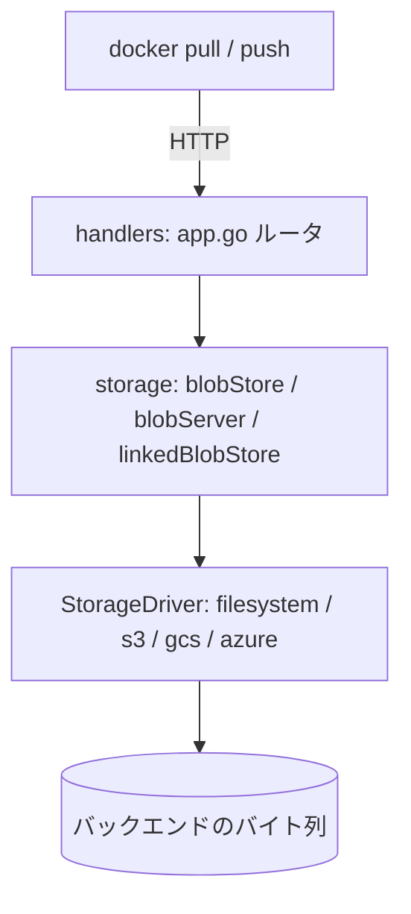

# アーキテクチャ

## 全体像

Distribution は互いに積み重なった 3 層である。最上層は、レジストリのリクエストをハンドラへ振り分ける HTTP API レイヤ (`registry/handlers`)。その下は、レジストリのディスク上レイアウトと content-addressable な規則を知るストレージ抽象 (`registry/storage`)。最下層は、ローカルファイルシステム・S3・GCS・Azure Blob など特定のターゲット向けの、ファイルシステム的な key/value バックエンドであるストレージドライバ群 (`registry/storage/driver`) だ。リクエストは最上層で入り、各層がそれを、設定されたバックエンドへの読み書きへと下へ翻訳していく。

## コンポーネント

### HTTP ルータとディスパッチャ

`registry/handlers/app.go` が HTTP レイヤの中枢だ。`App` は gorilla/mux ルータを持ち、ルート名ごとに 1 つのディスパッチャを登録する (`registry/handlers/app.go:106`)。ルート名は `registry/api/v2/routes.go:11` に定義される。`base`・`manifest`・`tags`・`blob`・`blob-upload`・`blob-upload-chunk`・`catalog` だ。ディスパッチャは、リクエストを読み、適切なハンドラを組み立て、HTTP メソッドをハンドラのメソッドに割り当てる関数である。

### ハンドラ群

各レジストリ操作は `registry/handlers/` 以下にハンドラファイルを持つ。blob GET/HEAD/DELETE の `blob.go`、push が使う blob upload セッションの `blobupload.go`、manifest GET/PUT の `manifests.go`、加えて `tags.go` と `catalog.go` だ。ハンドラは HTTP リクエストとストレージ層をつなぐ糊で、バイト列がどう保存されるかは自身では知らない。

### ストレージ抽象

`registry/storage/` が、レイアウトを知る層を持つ。`blobStore` と `blobStatter` (`registry/storage/blobstore.go:19`, `registry/storage/blobstore.go:156`) は、digest をキーにした、リポジトリ非依存のグローバルな blob ビューだ。`blobServer` (`registry/storage/blobserver.go:19`) は blob のバイト列を HTTP へ出す。`linkedBlobStore` (`registry/storage/linkedblobstore.go`) はリポジトリ単位のビューで、あるリポジトリがどの blob を含むかを小さな link ファイルで追跡する。content-addressability と所属チェックを担うのがこの層である。

### ストレージドライバ

`registry/storage/driver/` がバックエンドを持つ。`filesystem`・`inmemory`・`s3-aws`・`gcs`・`azure` だ。すべてが 1 つのインターフェース `StorageDriver` (`registry/storage/driver/storagedriver.go:56`) を満たし、これはファイルシステム的な key/value オブジェクトストアをモデル化する。`GetContent`・`PutContent`・`Reader`・`Writer`・`Stat`・`List`・`Move`・`Delete`・`RedirectURL`・`Walk` だ。バックエンドの差し替えはドライバの差し替えを意味し、このインターフェースより上は何も変わらない。

## リクエストの流れ

blob GET、すなわち `docker pull` の読み取り側を、HTTP リクエストからバイト列まで追う。

1. `blob` ルートは `blobDispatcher` で登録される (`registry/handlers/app.go:112`)。ディスパッチャは `blobHandler` を組み立て、GET と HEAD を `GetBlob` に割り当てる (`registry/handlers/blob.go:14`, `registry/handlers/blob.go:34`)。
2. `blobHandler.GetBlob` は `bh.Repository.Blobs(bh)` でリポジトリの blob サービスを取り、`blobs.Stat(bh, bh.Digest)` で存在を確認し (`registry/handlers/blob.go:55`, `registry/handlers/blob.go:58`)、成功すれば `blobs.ServeBlob` を呼ぶ (`registry/handlers/blob.go:68`)。
3. `Stat` の実体は `blobStatter.Stat` (`registry/storage/blobstore.go:165`)。digest から blob のデータパスを算出し `driver.Stat` を呼ぶ (`registry/storage/blobstore.go:166`, `registry/storage/blobstore.go:173`)。パスが無ければドライバの `PathNotFoundError` を `distribution.ErrBlobUnknown` に翻訳し (`registry/storage/blobstore.go:176`)、ハンドラがそれを正しい HTTP エラーに変える。
4. `ServeBlob` の実体は `blobServer.ServeBlob` (`registry/storage/blobserver.go:26`)。再度 blob を stat し、パスを算出し、`redirect` が有効ならドライバに `RedirectURL` を要求する (`registry/storage/blobserver.go:37`)。ドライバが空でない URL を返せば、レジストリは `307 Temporary Redirect` を返し、クライアントはオブジェクトストレージから直接バイト列を取得する (`registry/storage/blobserver.go:41`)。
5. リダイレクト URL が無ければストリーミングにフォールバックする。ドライバ上に `newFileReader` を開き、`http.ServeContent` でコンテンツを返す (`registry/storage/blobserver.go:50`, `registry/storage/blobserver.go:73`)。

## 主要な設計判断

**Content-addressable storage。** blob は digest から導いたパス (`blobs/<algorithm>/<digest>/data`) の下に一度だけ保存され、各リポジトリは 2 つ目のコピーではなく link ファイル経由でそれを参照する。レイアウトは `registry/storage/paths.go:24` のコメントブロックに記されている。多くのリポジトリで共有される blob は、バイト列 1 コピーとごく小さな link 数個で済む。整合性は無償だ。digest がアドレスなので、壊れた blob は自身のパスと一致しない。

**中継ではなくリダイレクト。** クラウドドライバでは、レジストリはデータ経路に居座らない。`blobServer.ServeBlob` は presigned なオブジェクトストレージ URL への `307` を返し、クライアントはストアから直接ダウンロードする (`registry/storage/blobserver.go:37`)。人気イメージを何千ノードが同時に pull するとき、レジストリプロセスがボトルネックになるのを防ぐ。`redirect` フラグでオフにでき、その場合はレジストリ自身がバイト列をストリームする。

**プラガブルなドライバ。** バックエンドは factory 経由で登録され、名前で生成される (`registry/storage/driver/storagedriver.go:50` のコメント)。どのドライバも 1 つのインターフェースの背後にあるファイルシステム的 key/value ストアにすぎないので、ストレージ層と HTTP 層はバックエンド非依存だ。

**リポジトリ間の blob mount。** blob が既に別のリポジトリにあれば、クライアントは再アップロードせず mount でき、アップロードを丸ごと短絡できる (`registry/storage/linkedblobstore.go:139`)。これは content-addressability の直接の見返りだ。バイト列は既に存在するので、mount は新しい link を張るだけである。

## 拡張ポイント

- **ストレージドライバ**: `StorageDriver` (`registry/storage/driver/storagedriver.go:56`) を実装し factory に登録すればバックエンドを足せる。in-tree のドライバ (`filesystem`・`s3-aws`・`gcs`・`azure`・`inmemory`) は同じインターフェースの実例だ。
- **ライブラリそのもの**: README は、各コンポーネントがより大きなレジストリを構築するためのライブラリとして消費されることを意図しており、それらライブラリインターフェースは unstable だと述べる (README)。Harbor はこの方法で構築された製品の代表例である。
