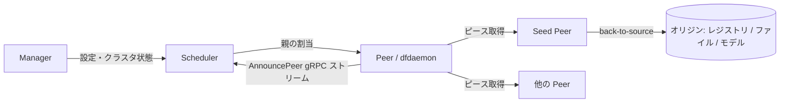

# アーキテクチャ

## 全体像

Dragonfly 2.0 はシステムを 4 つの役割に分割する。Manager と Scheduler はこのリポジトリに Go サービスとして存在する。Seed Peer と Peer はクライアント (`dfdaemon`) で、`dragonflyoss/client` リポジトリに Rust で実装され、実バイトを運ぶ。Scheduler はファイルデータに一切触れない。タスクごとのピアグラフを構築し、各ピアに対してどの親からピースを引くかを gRPC で伝えるだけだ。これは、中央ノードが固定サイズのチャンクを直接制御していた 1.x の supernode モデルからの重要な変更点である。

## コンポーネント

### Manager

manager (`manager/`) は設定・クラスタ管理のハブだ。他の役割へ配布する動的設定、コンソール UI、ロールベースアクセス制御 (`manager/permission/rbac`)、OAuth (`manager/auth/oauth`)、データベース層 (`manager/database`) を担う。他の役割は manager から設定を読む。

### Scheduler

scheduler (`scheduler/`) はスケジューリングの頭脳だ。ピアの登録を受け、子がどの親ピアからピースを引くかを決める。gRPC サービスは v1 (`scheduler/service/service_v1.go`) と v2 (`scheduler/service/service_v2.go`) が併存し、v2 が現行だ。ワイヤ API 型は `go.mod` で宣言された外部モジュール `d7y.io/api/v2` に由来する。

### Seed Peer と Peer

Seed Peer と Peer はデータプレーンだ。Peer はダウンロードを行うノード、Seed Peer はコンテンツを先行キャッシュしオリジンから取得 (back-to-source) できるノードだ。どちらも別リポジトリの Rust 製 `dfdaemon` クライアントとして動く。このリポジトリの scheduler は指示を返すだけなので、転送スループットはすべてこのコードベースの外にある。

## リクエストの流れ

代表的な操作は、ピアがタスクに登録して親を割り当てられる流れだ。以下のホップはすべて scheduler 内にある。

1. scheduler バイナリは `cmd/scheduler/main.go:23` で起動し、`cmd.Execute()` を呼ぶ。
2. ピアが双方向ストリーム `AnnouncePeer` を `scheduler/service/service_v2.go:121` で開く。ハンドラは `stream.Recv()` をループし、`service_v2.go:144` でリクエスト種別を switch する。
3. 登録リクエストの場合、switch は `service_v2.go:157` で `handleRegisterPeerRequest` (`service_v2.go:1300`) へ振る。host・task・peer リソースを解決し、`service_v2.go:1325` でジッタ付き指数バックオフにより登録の集中を抑える。seed peer はレイテンシ上の役割からこの遅延をスキップし、`service_v2.go:1324` でゲートされる。
4. ハンドラは `service_v2.go:1386` でタスクの `SizeScope` により分岐する。空タスクは即座に返り、normal・tiny・small・unknown スコープは `service_v2.go:1434` で `ScheduleCandidateParents` を呼ぶ。
5. `ScheduleCandidateParents` (`scheduler/scheduling/scheduling.go:113`) はリトライループを回す。`RetryBackToSourceLimit` (`scheduling.go:150`) または `RetryLimit` (`scheduling.go:175`) を超えると back-to-source 指示を返し、ピアはオリジンから取得する。
6. それ以外では `FindCandidateParents` (`scheduling.go:187`) が親を選び、scheduler が `AddPeerEdge` (`scheduling.go:199`) でタスク DAG に親→子エッジを追加し、`scheduling.go:219` で normal レスポンスをストリームへ送り返す。

## 主要な設計判断

scheduler は各タスクをピアの有向非巡回グラフとしてモデル化する (`scheduler/resource/standard/task.go:157`、フィールド `DAG dag.DAG[*Peer]`)。親エッジを追加する前に `CanAddEdge` (`pkg/graph/dag/dag.go:277`) で循環を検査し、循環があれば `ErrCycleBetweenVertices` (`dag.go:46`) を返す。これにより、2 つのピアが互いのピースを待ち合ってデッドロックするようなループ構造が構造的に防がれる。

親選定は全ピアを走査しない。`scheduling.go:497` の `LoadRandomPeers(filterParentLimit)` でランダムなサブセットをサンプリングし、それを filter する。巨大クラスタでもスケジューリングのコストはサンプル数で抑えられる。

## 拡張ポイント

scheduler は差し替え可能な評価器 (`scheduler/scheduling/evaluator/`) で親を選ぶ。`evaluatorDefault` が組み込みのスコアリング実装だ。manager は設定・RBAC・OAuth (`manager/auth/oauth`, `manager/permission/rbac`) の面を統合用に公開する。データプレーンでは、Dragonfly は containerd や Docker のレジストリミラーとして統合され、`hf://` や `modelscope://` を含むオリジンスキームに対応する。
