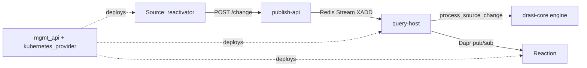

# アーキテクチャ

## 全体像

Drasi は Kubernetes にインストールされ、Dapr で結ばれた一連のサービスとして動く。ユーザーは 3 種類のリソース (Source・Continuous Query・Reaction) を YAML で宣言し、コントロールプレーンがそれぞれを稼働する Pod に変える。実行時には変更が一方向に流れる。Source が外部の変更を捕捉してクエリコンテナに POST し、クエリコンテナが影響を受ける継続的クエリをすべて評価して結果差分を発行し、Reaction がその差分を消費して動く。2 つのホップは異なるトランスポートを使う。Source からクエリへは Redis Stream、クエリから Reaction へは Dapr pub/sub である。

## コンポーネント

### コントロールプレーン

`control-planes/mgmt_api` (Rust) は宣言的リソースを受け取る管理 API である。`control-planes/kubernetes_provider` (Rust) はそれらのリソースを Kubernetes オブジェクトへ具現化する operator で、その `src/` に Source・Query・Reaction を Pod へ reconcile する controller・actor・spec-builder のコードが入っている。両者で「宣言された YAML が稼働ワークロードになる」段階を担う。

### Sources

`sources/` にはコネクタが入っている。Source は外部システムの change feed を監視し、各変更を Drasi の `SourceChange` に変換する。リレーショナル Source は Debezium を変更データキャプチャ (CDC) エンジンとして用いる (`sources/relational/debezium-reactivator`)。他のプリビルト Source は Cosmos DB・Dataverse・Event Hubs・Kubernetes をカバーする (`sources/cosmosdb`, `sources/dataverse`, `sources/eventhub`, `sources/kubernetes`)。共通の配管は `sources/shared` にあり (`change-router`, `change-dispatcher`, `query-api`)、捕捉した変更のルーティングとクエリ起動時に必要なブートストラップデータの供給を行う。Source の統合は `sources/sdk` の SDK (Rust・Java・.NET) に対して書ける。

### クエリコンテナ

`query-container/` (Rust) は継続的クエリのランタイムで、3 つのサービスに分かれる。

- `publish-api` は Source が POST する入口である。`/change` で変更を受け取り、Redis Stream に追記する (`query-container/publish-api/src/main.rs:59`)。
- `query-host` は各継続的クエリを Dapr 仮想アクターとして走らせ、ストリームから変更を消費し、増分評価し、結果差分を発行する。
- `view-svc` はクエリのマテリアライズされた結果ビューを永続化する (例: MongoDB へ)。Reaction やクライアントが現在の結果集合を読めるようにする。

評価そのものは vendored な `drasi-core` エンジンにあり、`query-container/query-host/drasi-core` の下にサブモジュールとして取り込まれている。

### Reactions

`reactions/` にはクエリ結果に対して動くコンポーネントが入っている。Reaction はクエリの結果トピックを購読し、行が追加・更新・削除されたときにアクションを実行する。プリビルトの Reaction には HTTP・SignalR・Gremlin・Dapr・Debezium・SQL・AWS・Azure・Power Platform・ベクトルストア同期・MCP がある (`reactions/http`, `reactions/signalr`, `reactions/gremlin` など)。Reaction の統合は `reactions/sdk` の SDK (Python・.NET・JavaScript) に対して書ける。

### CLI

`cli/` (Go) は `drasi` コマンドである。`drasi init` は現在の kubectl クラスタに Drasi をインストールし (`cli/cmd/init.go`)、`drasi apply` はリソースを作成・更新し (`cli/cmd/apply.go`)、残りの `cli/cmd/*.go` が list・describe・delete・tunnel・wait・uninstall をカバーする。

## 変更の流れ

リレーショナルな 1 行が更新され、継続的クエリの結果が変わり、Reaction が発火するまでを追う。各ホップに `file:line` アンカーを付ける。

1. **Source が変更を捕捉して POST する。** リレーショナル reactivator が Debezium 経由でデータベースの変更を読み、Drasi の `SourceChange` に変換して、クエリコンテナの `publish-api` へ POST する。`publish-api` は `/change` を公開している (`query-container/publish-api/src/main.rs:59`)。
2. **publish-api が Redis Stream に追記する。** ストリームのトピックは `{query_container_id}-publish` で (`query-container/publish-api/src/main.rs:45`)、`Publisher::publish` がそこへ `xadd` する (`query-container/publish-api/src/publisher.rs:78`)。
3. **query-host がストリームを消費する。** worker は `xgroup_create_mkstream` で作られた Redis consumer group を通して読む (`query-container/query-host/src/change_stream/redis_change_stream.rs:51`)。group は `qh` である (`redis_change_stream.rs:73`)。worker のループは `change_stream.recv::<ChangeEvent>()` で 1 件のイベントを受け取り (`query-container/query-host/src/query_worker.rs:363`)、別のクエリ宛のイベントは ack してスキップする (`query_worker.rs:383`)。
4. **エンジンが増分評価する。** `process_change` (`query-container/query-host/src/query_worker.rs:502`) が `continuous_query.process_source_change(source_change)` を呼び (`query_worker.rs:524`)、これがエンジンの `ContinuousQuery::process_source_change` に至る (`drasi-core/core/src/query/continuous_query.rs:89`)。更新の場合、`build_solution_changes` (`continuous_query.rs:165`) がインデックスから element の旧バージョンを引き (`continuous_query.rs:196`)、変更の前後両方の結果集合を計算し、差分から追加・更新・削除の行を出す。
5. **query-host が結果差分を発行する。** `process_change` が `publisher.publish(query_id, output)` を呼び (`query_worker.rs:576`)、`ResultPublisher::publish` が Dapr の HTTP publish API を通してトピック `{query_id}-results` へ送る (`query-container/query-host/src/result_publisher.rs:47`)。トレースコンテキストは `traceparent` ヘッダで伝播される (`result_publisher.rs:61`)。
6. **Reaction が消費して動く。** Reaction は `{query_id}-results` を購読し、追加・更新・削除の通知を受け取り、Reaction SDK の 1 つに対して実装されたアクションを実行する (`reactions/sdk/{python,dotnet,javascript}`)。

クエリ起動時には、初期データについて同じパスが逆向きに走る。`bootstrap` (`query_worker.rs:590`) が Source の `/subscription` エンドポイントに POST して Source を購読し (`query-container/query-host/src/source_client.rs:48`)、初期行を Insert としてエンジンに流し込む (`query_worker.rs:652`)。したがって初期結果集合もライブの変更ストリームも、同じ増分エンジンを通る。

## 主要な設計判断

**再クエリではなく増分評価。** エンジンは見たすべての element のインデックスを保持し、更新を element の旧バージョンと差分できるようにして、クエリ全体を再計算しない。これが、更新が新結果を計算する前に旧バージョンを引く理由であり (`continuous_query.rs:196`)、変更が届いても継続的クエリを安価に保つ仕組みである (Continuous Queries ドキュメント)。

**pull ではなく push。** Source は捕捉した変更を前へ押し出し、Reaction には結果差分が押し込まれる。タイマーでポーリングするものはない。2 つのトランスポートは意図的に異なる。at-least-once の Redis Stream が Source からクエリへ運ぶので変更は永続化され ack される。一方 Dapr pub/sub がクエリから Reaction へ運ぶ (`redis_change_stream.rs:73`; `result_publisher.rs:47`)。

**Dapr の上に構築。** 各継続的クエリは Dapr 仮想アクターとして走り、コンポーネント間は Dapr を通じて通信する。そのため Drasi は Dapr サイドカーの存在を前提とする。これによりアクターのライフサイクルと状態管理を自前で再実装せず Dapr から得ている (Azure ブログ)。

## 拡張ポイント

- **Sources**: Source SDK (`sources/sdk`、Rust・Java・.NET) に対して新しいコネクタを実装し、システムの change feed を Drasi に取り込む。
- **Reactions**: Reaction SDK (`reactions/sdk`、Python・.NET・JavaScript) に対して新しいアクションを実装し、クエリ結果差分に対して動かす。
- **インデックスバックエンド**: エンジンはインデックスをトレイトの背後に抽象化しており、バッキングストアを in-memory・Garnet (Redis 互換)・RocksDB から選べる (`drasi-core/core/src/interface/`、実装は `drasi-core/index-garnet` と `drasi-core/index-rocksdb`)。
- **クエリ middleware**: Source は評価前に変更を変換する middleware をエンジンの `middleware` パッケージで付けられる (`drasi-core/middleware`)。
