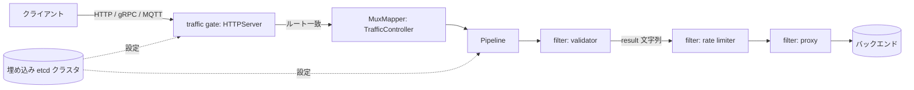

# アーキテクチャ

## 全体像

Easegress で管理されるものはすべて supervisor 配下のオブジェクトであり、各オブジェクトの設定は全ノードで共有される埋め込み etcd クラスタに格納される。オブジェクトは優先度順に起動するカテゴリに分かれる。まず system controller、次に business controller、続いて pipeline、最後に traffic gate だ (`pkg/supervisor/registry.go:102`)。HTTP サーバのような traffic gate がリクエストを受け、pipeline へルーティングし、pipeline がリクエストを順序付きの filter 列に通す。末尾の filter はたいていバックエンドへ転送する proxy である。

## コンポーネント

### Supervisor とオブジェクトモデル

`pkg/supervisor` があらゆるオブジェクトのライフサイクルを担う。`Object` インタフェース (`pkg/supervisor/registry.go:30`) は `Category`・`Kind`・デフォルト spec・status・close を要求する。トラフィックを扱うオブジェクトは加えて `TrafficObject` を実装し、`Init(superSpec, muxMapper)` を持つ (`pkg/supervisor/registry.go:61`)。カテゴリ定数と起動優先順位は同じ場所に定義され (`pkg/supervisor/registry.go:102`)、supervisor がオブジェクトを起動・停止する順序を固定する。

### Traffic gate

traffic gate はデータプレーンの入口だ。`HTTPServer` (`pkg/object/httpserver`) が HTTP のリスナーで、`GRPCServer` と `MQTTProxy` が他のプロトコルを担う。gate はルーティングから先はリクエストを自分で処理しない。ルートに突き合わせ、そのルートが名指すハンドラ (pipeline) を引くだけである。

### Pipeline と filter

`Pipeline` (`pkg/object/pipeline`) は filter のマップと順序付きの `flow` を保持する。各 filter は `pkg/filters/*` 配下にある。proxy・validator・ratelimiter・corsadaptor・opafilter・waf・aigatewayproxy などだ。filter の `Handle(ctx)` は result 文字列を返し、pipeline はその文字列で次のノードを決める。ここでトラフィックオーケストレーションが起きる。

### Controller

controller はコントロールプレーンとしてバックグラウンドで動く。`TrafficController` (`pkg/object/trafficcontroller`) は namespace 単位で HTTP サーバと pipeline を保持し、名前でハンドラを引ける (`pkg/object/trafficcontroller/trafficcontroller.go:123`)。ほかに `AutoCertManager`、サービスメッシュ向けの `MeshController`、各種サービスレジストリ (Eureka・Consul・Nacos・Zookeeper・etcd) がある。

### 埋め込み etcd クラスタ

`pkg/cluster` は `go.etcd.io/etcd/server/v3/embed` を各ノードに埋め込む (`pkg/cluster/cluster.go:31`)。`cluster` 構造体は `*embed.Etcd` サーバを保持し (`pkg/cluster/cluster.go:123`)、`embed.StartEtcd` で起動する (`pkg/cluster/cluster.go:586`)。Raft とリーダー選出で高可用性を得る。`Cluster` インタフェースは共有キー空間に対する Get・Put・Watch・Syncer・STM を公開する (`pkg/cluster/cluster_interface.go:33`)。設定は etcd に置かれ、全ノードで共有される。

## リクエストの流れ

1 つの HTTP リクエストをリスナーからバックエンドまで追う。アンカーはすべてコミット `3bdb192` で確認済み。

1. `mux.ServeHTTP` (`pkg/object/httpserver/mux.go:338`) が入口。`/.well-known/acme-challenge/` 配下の ACME チャレンジを特別扱いし (`pkg/object/httpserver/mux.go:344`)、それ以外は現行の `muxInstance.serveHTTP` へ転送する (`pkg/object/httpserver/mux.go:357`)。
2. `serveHTTP` 内で、リクエストボディを byte-count reader で包み (`pkg/object/httpserver/mux.go:452`)、トレーススパンを開き (`pkg/object/httpserver/mux.go:457`)、`context.New(span)` で内部コンテキストを作り (`pkg/object/httpserver/mux.go:459`)、`ctx.SetRequest` でリクエストをコンテキストに載せる (`pkg/object/httpserver/mux.go:467`)。
3. ルーティング: `routers.NewContext(req)` に続く `mi.search(routeCtx)` がルートを決め (`pkg/object/httpserver/mux.go:472`)、`ctx.SetRoute` が記録する (`pkg/object/httpserver/mux.go:474`)。ルート未一致なら失敗レスポンスを返す (`pkg/object/httpserver/mux.go:533`)。
4. バックエンド解決: `route.route.GetBackend()` (`pkg/object/httpserver/mux.go:539`) がハンドラ名を返し、`mi.muxMapper.GetHandler(backend)` が取得する (`pkg/object/httpserver/mux.go:540`)。`MuxMapper` の実体は `TrafficController` の `Namespace.GetHandler` (`pkg/object/trafficcontroller/trafficcontroller.go:123`) で、ハンドラは pipeline である。
5. リライトとペイロード: `route.route.Rewrite` (`pkg/object/httpserver/mux.go:548`) に続き `req.FetchPayload(maxBodySize)` (`pkg/object/httpserver/mux.go:557`)。ボディが上限を超えると 413 を返す。
6. 実行: global filter が無ければ `handler.Handle(ctx)` を呼び (`pkg/object/httpserver/mux.go:572`)、有れば `globalFilter.Handle(ctx, handler)` を呼ぶ (`pkg/object/httpserver/mux.go:574`)。`Handler` インタフェースは `Handle(ctx) string` だけだ (`pkg/context/context.go:35`)。
7. `Pipeline.Handle` (`pkg/object/pipeline/pipeline.go:357`) が `doHandle` を呼び (`pkg/object/pipeline/pipeline.go:371`)、flow を回して各 `node.filter.Handle(ctx)` を呼ぶ (`pkg/object/pipeline/pipeline.go:390`)。返る result 文字列で `JumpIf` を引いて次ノードを選ぶか、flow を終える (`pkg/object/pipeline/pipeline.go:399`)。
8. 末尾の filter はたいてい proxy だ。`Proxy.Handle` (`pkg/filters/proxies/httpproxy/proxy.go:343`) は mirror pool を非同期に発火し (`pkg/filters/proxies/httpproxy/proxy.go:346`)、match で candidate pool を選び (`pkg/filters/proxies/httpproxy/proxy.go:351`)、server pool 経由で転送する (`pkg/filters/proxies/httpproxy/proxy.go:358`)。
9. レスポンスは defer された `mi.sendResponse` で書き戻される (`pkg/object/httpserver/mux.go:367`)。`ctx.GetResponse` をライターへコピーし、アクセスログ・メトリクス・スパンを締める。

肝心なのはこうだ。pipeline は有向グラフの実行機である。result 文字列が空なら次の filter へ進み、非空かつ対応する `JumpIf` エントリが無ければ flow を終える (`pkg/object/pipeline/pipeline.go:399`)。

## 主要な設計判断

resilience は独立した filter ではなく proxy に注入される。v2.0 の刷新はサーキットブレーカ・リトライ・タイムリミッタを独立 filter から Proxy へ移し、Proxy は `InjectResiliencePolicy` で受け取って自分の pool へ配る (`pkg/filters/proxies/httpproxy/proxy.go:362`)。メンテナは以前の分離を、制御ロジックと業務ロジックを混ぜる誤りと呼んだ (MegaEase v2.0 発表)。

ハンドラの抽象は意図的に極小だ。HTTP サーバから見れば pipeline は文字列を返す 1 メソッドにすぎない (`pkg/context/context.go:35`)。この最小さこそ、1 つの pipeline モデルで HTTP・gRPC・MQTT を扱える理由である。gate のプロトコルは異なるが、pipeline の契約は変わらない。

etcd は外部ではなく埋め込みだ。各ノードは etcd サーバをライブラリとして同梱し (`pkg/cluster/cluster.go:31`)、別プロセスの etcd とは話さない。トレードオフは etcd を内包する分だけ大きくなるバイナリと、それと引き換えの、ほかに何もデプロイしなくてよい自己完結の HA クラスタである。

## 拡張ポイント

- **Filter**: `Filter` インタフェース (`pkg/filters/filters.go:54`) を実装し、パッケージの `init()` で `filters.Register` により `Kind` を登録する (`pkg/filters/registry.go:29`)。filter は返しうる result 文字列を宣言し、pipeline はそれを jump テーブルに対して検証する。
- **Object**: 新しい `Object` の kind を supervisor に登録すれば、controller や traffic gate の型を追加できる。
- **WebAssembly**: `wasmhost` filter は WebAssembly にコンパイルしたユーザコードを実行するので、拡張を Go で書く必要はない。
- **サービスレジストリ**: Eureka・Consul・Nacos・Zookeeper・etcd 向けの差し替え可能なバックエンドがサービスディスカバリをルーティングへ供給する。
