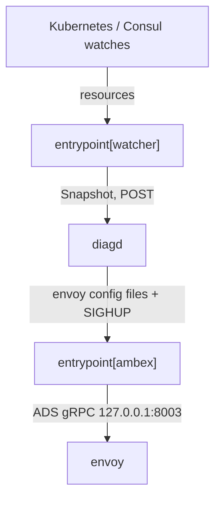

# アーキテクチャ

## 全体像

Emissary-Ingress は 1 つのコンテナとして動き、その中に 3 つのプロセスと 1 つのインプロセス goroutine が同居し、すべてが運命を共有する。この設計はソースコメントにデータフロー図としてそのまま書かれている (`cmd/entrypoint/entrypoint.go:26-78`)。Go の `entrypoint` プロセスが `diagd` (Python) と `envoy` を子プロセスとして起動し、`ambex` (Go) とクラスタ `watcher` を goroutine として動かす (`cmd/entrypoint/entrypoint.go:147-191`)。いずれか 1 つでも死ぬとプロセス全体が落ち、Kubernetes による再起動に委ねる (`cmd/entrypoint/entrypoint.go:74-78`)。

## コンポーネント

### entrypoint (Go)

プロセスマネージャ兼 watcher。`Main` (`cmd/entrypoint/entrypoint.go:80`) が CRD 変換 webhook の準備完了を待ち (`cmd/entrypoint/entrypoint.go:96`)、子プロセスと goroutine 群を `dgroup` として起動する (`cmd/entrypoint/entrypoint.go:147-191`)。到達経路は `cmd/busyambassador/main.go:36` の BusyBox 方式ディスパッチで、`os.Args[0]` が `entrypoint` / `kubestatus` / `version` を選ぶ。

### watcher (Go goroutine)

`WatchAllTheThings` (`cmd/entrypoint/watcher.go:26`) が `kates` クライアントで Kubernetes を watch する。監視対象は `GetInterestingTypes` (`cmd/entrypoint/interesting_types.go`) で決まり、起動時に RBAC でフィルタされる。Kubernetes・Consul・filesystem の更新を 1 個の一貫した `snapshot.Snapshot` に組み立てる。

### diagd (Python)

設定エンジン。snapshot を HTTP で受け取り、中間表現にコンパイルし、Envoy 設定を生成し、公開前に検証する。デフォルトでポート 8004 を listen する (`cmd/entrypoint/env.go:153`)。

### ambex (Go goroutine)

ADS サーバ。Envoy 設定を go-control-plane の `SnapshotCache` に保持し、`127.0.0.1:8003` の ADS gRPC ストリームで Envoy に push する (`cmd/entrypoint/entrypoint.go:164-167`)。役割はヘッダコメント `pkg/ambex/main.go:6-40` に説明がある。

### envoy

データプレーン。ADS で `ambex` に接続し、実トラフィックを捌く。Envoy バイナリはコンテナイメージに同梱されている。

## リクエストの流れ

`Mapping` リソースが Envoy のライブなルートになるまでの設定変更を追う。

1. watcher が変更を検知し `snapshot.Snapshot` を組み立てる (`cmd/entrypoint/watcher.go:201`)。
2. snapshot が `SnapshotReady` disposition に達すると (`cmd/entrypoint/watcher.go:106-118`)、`notify` クロージャが `notifyReconfigWebhooks` を呼ぶ (`cmd/entrypoint/watcher.go:62-67`)。
3. それが `GetEventUrl` (`cmd/entrypoint/env.go:244`) で組んだ watt 更新 URL へ `notifyWebhookUrl` 経由で POST する (`cmd/entrypoint/notify.go:42`)。
4. diagd の Flask ルート `handle_watt_update` (`python/ambassador-diag/src/ambassador_diag/diagd.py:916`) が `?url=` を読み取り設定をキューに入れる。
5. diagd は snapshot を `IR` にコンパイルし、`EnvoyConfig` を生成し、bootstrap/ADS/clustermap に分割する (`python/ambassador-diag/src/ambassador_diag/diagd.py:1585-1635`)。
6. 生成した設定を本物の `envoy --mode validate` で検証する (`python/ambassador-diag/src/ambassador_diag/diagd.py:1652`)。失敗時は現行設定を維持する。
7. 検証済み設定がディスクに書かれ、ambex が拾って ADS で Envoy に push する。

## 主要な設計判断

- **Kubernetes を source of truth に。** 専用 DB を持たず、watcher がクラスタから世界の状態を再構成する ([The New Stack](https://thenewstack.io/cncf-adopts-ambassadors-api-gateway-emissary-ingress/))。
- **プロセス間の運命共有。** どれか 1 つの死がポッド全体を落とし、再起動を Kubernetes に委ねる (`cmd/entrypoint/entrypoint.go:74-78`)。
- **swap 前に検証する。** 生成した Envoy 設定を Envoy 自身で検証してから反映するので、Emissary のバグが本番トラフィックを壊さない (`python/ambassador-diag/src/ambassador_diag/diagd.py:1652`)。
- **endpoint ファストパス。** Pod の endpoint 変化は重い Python 再コンパイルを飛ばして直接 ambex に渡る (`pkg/ambex/fastpath.go:7-11`)。

## 拡張ポイント

- **CRD** (`getambassador.io/v3alpha1`): `Listener`・`Host`・`Mapping` などのルーティングリソース (`pkg/api/getambassador.io/v3alpha1/crd_mapping.go:27`)。
- **変換 webhook** `emissary-apiext` (`cmd/apiext/main.go`、`pkg/apiext`) が `v1`/`v2`/`v3alpha1` の CRD を正規化し、設定エンジンは常に `v3alpha1` だけを見る。
- **Gateway API** リソース (`GatewayClass`・`Gateway`・`HTTPRoute`) は snapshot に載る (`pkg/snapshot/v1/types.go:84-87`)。
- **入力ソース**: Kubernetes・Consul・filesystem がいずれも同じ snapshot に流れ込む。
