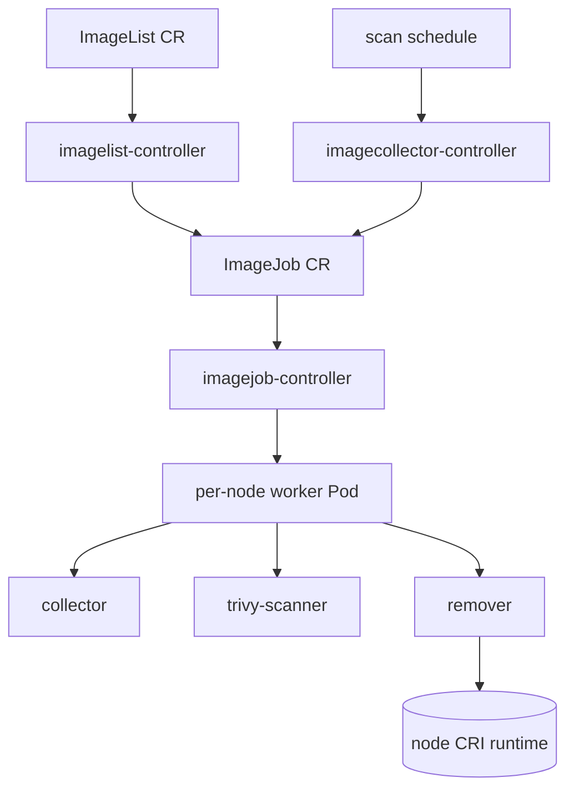

# アーキテクチャ

## 全体像

Eraser は 1 つの Go バイナリ (`main.go`) で、コンテナの起動方法に応じて別々のロールで動く。長命の `eraser-manager` がコントローラを回し、短命のワーカー Pod がノード単位の作業をして終了する。manager はクラスタスコープの 2 つの CRD、`ImageList` と `ImageJob` を watch し、クリーンアップ要求をノード数ぶんの Pod に fan-out する Job へ変換する。各ワーカー Pod は、そのノードのコンテナランタイムと CRI API で通信し、イメージを列挙し、実行中コンテナを列挙し、対象かつ非実行のイメージを削除する。

## コンポーネント

### eraser-manager (controller-manager)

常駐プロセス。同じ manager から 3 つのコントローラを登録して回す (`main.go`)。`imagelist-controller` は `ImageList` CRD を watch する (`controllers/imagelist/imagelist_controller.go`)。`imagejob-controller` は `ImageJob` を watch し、ノード単位のワーカー Pod を生成する (`controllers/imagejob/imagejob_controller.go`)。`imagecollector-controller` は定期スキャンの Job を作る (`controllers/imagecollector/imagecollector_controller.go`)。設定は CRD ではなく ConfigMap ベースの `EraserConfig` から読む。CRD は `ImageList` と `ImageJob` の 2 つだけである。

### ワーカー Pod (ノード単位)

クリーンアップごとに、manager はノード 1 台につき 1 つの Pod を、`NodeName` で固定し `RestartPolicy: Never` でスケジュールするので、1 回走って終了する。Pod 内には最大 3 つのコンテナがある。CRI からノード上の全イメージを列挙する collector (`pkg/collector`)、脆弱なイメージを検出する Trivy スキャナ (`pkg/scanners/trivy`)、対象かつ非実行のイメージを CRI 経由で削除する remover (`pkg/remover`) である。マニュアル (`ImageList`) モードでは remover 単体で動き、スキャンモードでは 3 つが動いて互いにデータを受け渡す。

### CRI クライアント

各ワーカーは `pkg/cri` の CRI クライアントを通じてノードのランタイムに到達する。ランタイム API バージョンをネゴシエートし、CRI `v1` を先に試して `v1alpha2` にフォールバックするので、古い containerd や CRI-O でも動く (`pkg/cri/client.go:47`)。remover はこのクライアントでイメージ列挙・実行中コンテナ列挙・イメージ削除を行う。

### CRD

両 CRD は `eraser.sh` グループで、クラスタスコープである。`ImageList` は削除対象を `spec.images []string` に持ち、`*` は非実行イメージ全部の prune を意味する。加えて success/failed/skipped/timestamp の status を持つ (`api/v1/imagelist_types.go:20-49`)。`ImageJob` は 1 回のクラスタ全体掃討を表す。`status.phase` は Running / Completed / Failed で、desired/succeeded/failed/skipped のカウントと、完了 Job の遅延削除用 `deleteAfter` タイムスタンプを持つ (`api/v1/imagejob_types.go:41-72`)。

## リクエストの流れ

マニュアルクリーンアップを、`ImageList` の apply からノードでの削除まで追う。

1. ユーザーが名前 `imagelist` の `ImageList` を apply する。imagelist-controller の `Reconcile` が発火するが、固定名 `imagelist` 以外の名前は無視する (`controllers/imagelist/imagelist_controller.go:139-144`)。
2. `Reconcile` は既存の子 `ImageJob` を owner 参照でフィルタする。0 件なら新規イベント経路 `handleImageListEvent` に入り、既に走行中の Job があれば 1 分後に requeue する (`controllers/imagelist/imagelist_controller.go:158-173`)。
3. `handleImageListEvent` は `spec.Images` を JSON 化し、それを保持する immutable な ConfigMap を作成し (`controllers/imagelist/imagelist_controller.go:257-273`)、イメージリストをマウントして `--imagelist` 引数を設定した remover の `PodTemplateSpec` を組み立てる (`controllers/imagelist/imagelist_controller.go:276-278`)。
4. `ImageList` を owner とする `ImageJob` と `PodTemplate` オブジェクトを作成し、ConfigMap の owner を Job に付け替えて、掃除を owner 参照で行えるようにする。
5. imagejob-controller の `Reconcile` が phase 空の新 Job を検知し、`handleNewJob` を呼ぶ (`controllers/imagejob/imagejob_controller.go:294`)。
6. `handleNewJob` は全ノードを list し、`status.desired` をノード数に設定し、NodeFilter の include/exclude セレクタを適用し、skip 数を記録する (`controllers/imagejob/imagejob_controller.go:294-300`)。
7. 選抜した各ノードについて `copyAndFillTemplateSpec` で PodSpec を複製して `NodeName` を固定し、`GenerateName: eraser-<node>-` の Pod を作成する (`controllers/imagejob/imagejob_controller.go:533`、`controllers/imagejob/imagejob_controller.go:582`)。
8. 各 remover Pod が起動し、`cri.NewRemoverClient` で CRI クライアントを作り、マウントされたイメージリストを parse し、`removeImages` を呼ぶ (`pkg/remover/remover.go:63`、`pkg/remover/remover.go:121`、`pkg/remover/remover.go:140`)。
9. `removeImages` は CRI から全イメージと全実行中コンテナを列挙し、running/nonRunning のイメージ map を構築し、非実行かつ除外外の各対象を削除する。実行中の対象はログ行を出して skip する (`pkg/remover/helpers.go:11`、`pkg/remover/helpers.go:66-96`)。
10. Pod が終わると imagejob-controller は Job を Completed か Failed にする。imagelist-controller が結果を `ImageList.status` に集計し、`deleteAfter` を設定し、後で Job / PodTemplate / ConfigMap を owner 参照で GC する。

## 主要な設計判断

DaemonSet ではなく push 型 fan-out。各ノードにエージェントを常駐させるのではなく、Eraser は Job からノード 1 台につき単発 Pod を作り、終わったら終了させる。削除作業はバースト的なので、これでノード単位の常駐コストを避けられる。代償として、コントローラが Job の寿命管理と遅延削除を担う (`controllers/imagelist/imagelist_controller.go:179-255`)。

実行中イメージの保護は kubelet ではなく CRI データから。remover は削除して安全なものを、CRI 経由でコンテナを列挙して得たノードの実 running set から判断し、上位の記録を信用しない (`pkg/remover/helpers.go:45-52`)。この map の構築方法は [内部実装](./internals) で追う。

スキャンは任意かつ差し替え可能。Trivy が既定のスキャナだが、スキャン工程はインターフェースで定義されるので別スキャナに置換でき、スキャンを無効化すると Eraser は単なる定期イメージクリーナになる (`pkg/scanners/template/scanner_template.go:21`)。

## 拡張ポイント

- **`ImageList` CRD**: マニュアルのインターフェース。削除するイメージ名/ダイジェストを列挙するか、`*` で非実行イメージを全 prune する (`api/v1/imagelist_types.go:20-49`)。
- **スキャナインターフェース**: `ImageProvider` (`ReceiveImages` / `SendImages` / `Finish`) を実装すれば Trivy をカスタムスキャナに差し替えられる (`pkg/scanners/template/scanner_template.go:21`)。
- **NodeFilter**: include/exclude セレクタで Job が対象とするノードを決め、Job status に skip として記録する (`controllers/imagejob/imagejob_controller.go:294-300`)。
- **除外 ConfigMap**: 除外 ConfigMap に列挙したイメージは、対象になっても決して削除しない (`pkg/remover/helpers.go:72-76`)。
