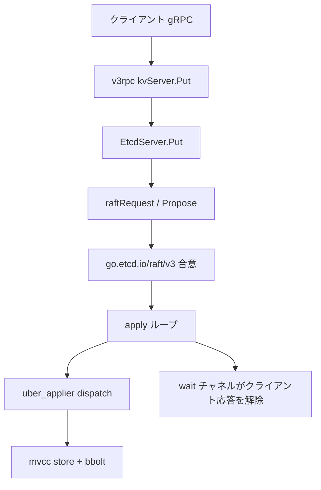

# アーキテクチャ

## 全体像

etcd のメンバーは Raft ログで駆動される状態機械です。クライアントは gRPC でサーバと話し、書き込みは Raft 提案 (proposal) に変換され、過半数のメンバーへ複製されてから初めてローカルストアに適用 (apply) されます。ストアは bbolt バックエンド上の MVCC でデータを保持します。そのコアの周りに lease、認証、watch 層が配置されます。

下の図は 1 メンバー内で書き込みがたどる経路を示します。

## コンポーネント

### server/etcdserver

コアの状態機械。クライアント向け API ハンドラ、Raft ループ、apply ループ、メンバーシップ管理をホストします。`EtcdServer.Put` と提案の機構は `server/etcdserver/v3_server.go` にあり、apply ループは `server/etcdserver/server.go` にあります。`raft.Node`・transport・ticker をまとめる Raft ノードのラッパは `raftNode` (`server/etcdserver/raft.go:81`) です。

### server/storage

永続化層です。`mvcc` がマルチバージョンストア、`backend` が bbolt のラッパ、`wal` が write-ahead ログ、加えて `schema` と `datadir` があります。ストアは bbolt をユーザキーではなく revision でキー付けします (`server/storage/mvcc/kvstore.go:53`)。

### server/lease と server/auth

`server/lease` は `lessor` を通じて TTL ベースのキー失効を管理します (`server/lease/lessor.go:145`)。`server/auth` はユーザ・ロール・権限の RBAC ストアを保持します。

### api, client, CLI

`api` は protobuf と gRPC の定義 (`go.etcd.io/etcd/api/v3`) を持ちます。`client` は Go クライアント (`clientv3`) です。`etcdctl` と `etcdutl` がコマンドラインツールです。Raft アルゴリズム本体は別モジュール `go.etcd.io/raft/v3` (`go.mod:37`) なので、etcd 以外のプロジェクトからも使えます。

## リクエストの流れ

クライアントの `Put` は端から端まで次のように進みます。

1. gRPC ハンドラ `kvServer.Put` がリクエストを検証してストアを呼びます (`server/etcdserver/api/v3rpc/key.go:90`)。
2. `EtcdServer.Put` がそれを内部 Raft リクエストに包み (`server/etcdserver/v3_server.go:295`)、`raftRequest` を呼びます (`server/etcdserver/v3_server.go:303`)。
3. `processInternalRaftRequestOnce` がリクエスト ID を採番してマーシャルし、`s.w.Register(id)` で wait チャネルを登録し (`server/etcdserver/v3_server.go:1106`)、`s.r.Propose(cctx, data)` で提案します (`server/etcdserver/v3_server.go:1113`)。その後、結果が来るまでチャネルでブロックします (`server/etcdserver/v3_server.go:1123`)。
4. Raft (外部の `go.etcd.io/raft/v3` モジュール) がログエントリを複製します。コミットされると、そのエントリは apply ループへ戻されます。
5. `applyEntryNormal` がコミット済みエントリを `apply.Apply` に通し (`server/etcdserver/server.go:1959`)、成功時に `s.w.Trigger(id, ar)` を呼んで (`server/etcdserver/server.go:1971`) 3 のブロックを解除し、応答を返します。
6. `dispatch` がリクエストをほどき、put なら `a.applyV3.Put(r.Put)` を呼びます (`server/etcdserver/apply/uber_applier.go:134`)。
7. backend applier が MVCC トランザクション層へ転送し (`server/etcdserver/apply/backend.go:50`)、write トランザクションを開いてキーを書きます (`server/etcdserver/txn/put.go:30`)。
8. `storeTxnWrite.put` が値をマーシャルして `tx.UnsafeSeqPut` で bbolt へ書き、その後 `kvindex.Put` で in-memory index を更新します (`server/storage/mvcc/kvstore_txn.go:259`)。

## 主要な設計判断

書き込みは常に Raft を通り、これが線形化可能性を生みます。読みは Raft を回避できます。シリアライザブル読みは `doSerialize` を介してローカル MVCC ストアから直接返され (`server/etcdserver/v3_server.go:1034`)、鮮度とレイテンシをトレードオフします。

ストアは永続データをユーザキーではなく revision でキー付けします (`server/storage/mvcc/kvstore_txn.go:259-260`)。ユーザキーから revision への対応は in-memory index だけが持ち、これが MVCC、履歴を意識した watch、compaction を可能にしています。この二重書きが効く理由は [内部実装](./internals) を参照してください。

再起動後に同じエントリを二度適用しないため、etcd は consistent index を永続化します。`applyEntryNormal` は defer ブロックで consistent index をそのエントリの index まで前進させます (`server/etcdserver/server.go:1939-1942`)。

## 拡張ポイント

最も明快な再利用ポイントは Raft モジュール `go.etcd.io/raft/v3` で、etcd 以外でも使われる独立した合意ライブラリとして設計されています。`api` の gRPC API はどの言語でもクライアントを生成できます。apply パスは corrupt・capped・quota・auth・backend のデコレータチェーンで、その順序は `server/etcdserver/apply/uber_applier.go:85-87` に説明があります。ここが apply 時の挙動を重ねる場所です。
