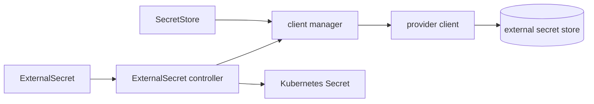

# アーキテクチャ

## 全体像

ESO は 1 つのバイナリとして、それぞれが 1 つのカスタムリソースを reconcile するコントローラ群を動かす。中心のループは `ExternalSecret` を読み、その `SecretStore` をプロバイダクライアントへ解決し、要求された値を取得して Kubernetes `Secret` を書き込む。`SecretStore` は 1 つのバックエンドへの接続と認証を持ち、`ExternalSecret` は何を同期するかを持つ。プロバイダは共通インタフェースを実装するため、reconciler は特定のバックエンドに依存しない。ルートコマンドは `external-secrets` で、既定のコントローラマネージャに加えて `webhook` と `certcontroller` のサブコマンドを持つ (`cmd/controller/root.go:126`, `cmd/controller/webhook.go:60`, `cmd/controller/certcontroller.go:48`)。

## コンポーネント

### ExternalSecret コントローラ (`pkg/controllers/externalsecret/`)

主役のループ。`ExternalSecret` を reconcile し、プロバイダから値を読んで Kubernetes `Secret` に書き込む。リフレッシュ間隔とターゲットの `deletionPolicy` を尊重する。エントリポイントは `Reconcile` (`pkg/controllers/externalsecret/externalsecret_controller.go:173`)。

### SecretStore / ClusterSecretStore コントローラ (`pkg/controllers/secretstore/`)

ストア設定を検証し、その status を持たせる。`ClusterSecretStore` はクラスタスコープなので、1 つのストア定義を namespace 横断で参照できる。ストアをライブなプロバイダクライアントに変えるクライアントマネージャもここにある (`pkg/controllers/secretstore/client_manager.go`)。

### PushSecret コントローラ (`pkg/controllers/pushsecret/`)

逆方向。Kubernetes `Secret` を取り、プロバイダへ書き出す。クラスタが値の起点で、バックエンドがそれを必要とするケース向け。

### クラスタスコープの fan-out (`pkg/controllers/clusterexternalsecret/`, `pkg/controllers/clusterpushsecret/`)

`ClusterExternalSecret` はセレクタで `ExternalSecret` を多数の namespace にテンプレート展開し、1 つの定義でフリート全体にシークレットを配置できる。`ClusterPushSecret` は `PushSecret` に対して同じことをする。

### プロバイダ (`providers/v1/<name>/`)

41 個のプロバイダ実装で、それぞれが独自の Go モジュールであり、`esv1.Provider` と `esv1.SecretsClient` のインタフェースを満たす。プロバイダは `pkg/register/` 配下のビルドタグ付きファイルで登録される (例: `pkg/register/aws.go:1` の `//go:build aws || all_providers`)。これによりビルドに 1 つのバックエンドだけを含めることも、すべてを含めることもできる。

### Generator (`generators/v1/<name>/`)

値を取得するのではなく生成する 17 個の generator (password・uuid・ecr・sts など)。`v1alpha1` でビルドタグなしに常時コンパイルされる。

## リクエストの流れ

1 つの `ExternalSecret` の reconcile を、プロバイダから Kubernetes `Secret` まで追う。

1. `Reconcile` が開始し、メトリクスを記録し、sync duration の計測を defer する (`pkg/controllers/externalsecret/externalsecret_controller.go:173`, `:182`)。オブジェクトを取得し、NotFound なら早期に終了する (`:188`)。
2. finalizer 処理。削除時は管理下の Secret をクリーンアップして finalizer を除去する。存命時は `ExternalSecretFinalizer` を Update ではなく Patch で付与し、`refreshInterval` のような spec フィールドの所有権を主張しないようにする (`externalsecret_controller.go:231-234`, `:244`)。
3. ターゲット `Secret` 名を決定し (未指定なら ExternalSecret 名)、既存 Secret を partial metadata cache から読む (`externalsecret_controller.go:296`, `:309`)。
4. リフレッシュ判定。`shouldRefresh` が false かつ `isSecretValid` が true なら処理をスキップして requeue する。判定にはリフレッシュ間隔・generation・data-hash annotation を使う (`externalsecret_controller.go:372`)。
5. プロバイダから値を取得する: `dataMap, err := r.GetProviderSecretData(ctx, externalSecret)` (`externalsecret_controller.go:417`)。
6. `GetProviderSecretData` の内部では、reconcile 用に `secretstore.Manager` を生成する (`externalsecret_controller_secret.go:44`, `:49`)。`spec.dataFrom` と `spec.data` を走査し、各要素を `cmgr.Get` でプロバイダクライアントに解決し、リモート参照ごとに `client.GetSecret` を呼ぶ (`externalsecret_controller_secret.go:80`, `:126`, `:132`)。結果をデコードし、ターゲットキーの下に格納する (`:138`, `:147`)。
7. `Reconcile` に戻り、値が 0 件なら、ターゲットの `deletionPolicy` (Delete・Retain・Merge) が Secret を削除・保持・部分更新のいずれにするかを決める。そうでなければ Secret の data・labels・template を組み立てて書き込む。

## 主要な設計判断

ストアとシークレットは別オブジェクト。`SecretStore` が接続と認証情報を持ち、`ExternalSecret` が何を同期するかを持つ。これは ESO が両者を混ぜていた KES に対して行った変更であり、1 つのストアが多数のシークレットを支えつつ、バックエンド認証情報を 1 箇所に収める (`apis/externalsecrets/v1/secretstore_types.go`, [Container Solutions](https://blog.container-solutions.com/the-birth-of-the-external-secrets-community))。

バックエンドは型タグではなく JSON 構造で選ばれる。`SecretStoreProvider` はプロバイダ設定の union で、コードはこれを JSON に marshal し、ちょうど 1 つのキーが設定されていることを要求する。それが選ばれたバックエンドである (`apis/externalsecrets/v1/provider_schema.go:104-124`)。2 つ以上、あるいは 0 個は検証エラーになる。

プロバイダクライアントは呼び出しごとでなく reconcile 単位で生きる。`secretstore.Manager` はストアごとにプロバイダクライアントをキャッシュし、`GetSecret` ごとに開閉するのではなく reconcile 終了時に一括 Close する。一部のプロバイダ (GCP) がクライアントを安価に再生成できないため、というコメントがある (`externalsecret_controller_secret.go:49-52`)。

push ではなくリフレッシュ間隔での pull。ESO は `refreshInterval` でバックエンドをポーリングして reconcile する。バックエンドから変更通知を受ける必要はない。変化がなければリフレッシュ判定が短絡する (`externalsecret_controller.go:372`)。

## 拡張ポイント

- **プロバイダ**: `esv1.Provider` と `esv1.SecretsClient` を実装し、`pkg/register/` 配下にビルドタグ付きで登録する (`apis/externalsecrets/v1/provider.go:53`, `pkg/register/aws.go:1`)。
- **Generator**: `generators/v1/` 配下に generator を実装し、値を取得する代わりにクラスタ内で生成する。
- **CRD**: `ExternalSecret`、`SecretStore` / `ClusterSecretStore`、`PushSecret`、`ClusterExternalSecret`、`ClusterPushSecret`、および generator リソースがサードパーティ向けの API である。
- **Webhook と cert コントローラ**: `webhook` と `certcontroller` サブコマンドが admission webhook とその証明書管理を動かす (`cmd/controller/webhook.go:60`, `cmd/controller/certcontroller.go:48`)。
