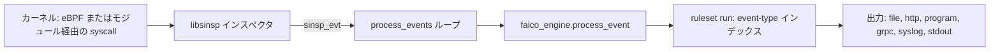

# Architecture

## 全体像

Falco は 1 つのバイナリ `falco` である。各ノードでカーネルイベントを読み、ルールと照合し、一致したものを出力へ送る。処理はいくつかのレイヤーに分かれる。CLI、設定、出力、イベントループを担うアプリケーション層 (`userspace/falco/`)、ルールをロードしフィルタを評価するルールエンジン (`userspace/engine/`)、そして syscall をキャプチャしイベントを `sinsp_evt` として抽象化しフィルタ式をコンパイル・実行する外部依存 `falcosecurity-libs` (`libsinsp`) である。libs のバージョンは `cmake/modules/falcosecurity-libs.cmake:45` で pin される。

## コンポーネント

### アプリケーション層 (`userspace/falco/`)

起動、設定、出力、webserver、metrics、イベントループを担う。エントリポイントは `userspace/falco/falco.cpp:59` (`main`)。起動はアクションの順序付きリストとしてモデル化される。`userspace/falco/app/app.cpp:56` が `run_steps` を宣言し、`load_config`、`load_plugins`、`init_inspectors`、`init_falco_engine`、`load_rules_files`、`init_outputs`、`start_webserver`、`process_events` を依存順に実行する。各アクションは `run_result` を返し `app.cpp:97` でマージされる。別の `teardown_steps` リスト (`app.cpp:87`) は失敗時もクリーンアップが飛ばされないよう必ず走る。

### ルールエンジン (`userspace/engine/`)

ルール YAML をロードし、条件をフィルタにコンパイルし、イベントを評価する。公開面は `falco_engine` クラス。イベント評価は `userspace/engine/falco_engine.cpp:364` (`process_event`) から入る。

### libsinsp (外部依存)

syscall をキャプチャし、各イベントを `sinsp_evt` として提示し、Falco のコンパイル済みルール条件が走るフィルタ AST と `sinsp_filter` 実行エンジンを提供する。Falco はこれを `sinsp` インスペクタとして駆動する。

### ルール (`rules/`)

既定のルール YAML。`falcosecurity-rules` サブモジュールで取り込まれる。

## リクエストの流れ

1 イベントが入って 1 アラートが出るまで:

1. `userspace/falco/app/actions/process_events.cpp:163` のイベントループが `while(1)` を回し、`:164` で `inspector->next(&ev)` を呼んで 1 件取得する。`SCAP_TIMEOUT` (`:198`) と `SCAP_EOF` (`:230`) で分岐し、シグナルもここで処理する。
2. ソース index を確定する。live capture では `:244` で `ev->get_source_idx()` を読む。drop の集計は `:298` の `sdropmgr.process_event` を通る。
3. イベントは `process_events.cpp:307` でエンジンへ渡る: `s.engine->process_event(source_engine_idx, ev, s.config->m_rule_matching)`。インスペクタ側ではフィルタしないので、全イベントがエンジンに来る。
4. `falco_engine::process_event` (`falco_engine.cpp:364`) は `:375` の `find_source(source_idx)` でソースを解決し、`:377` で `should_drop_evt()` が真なら早期 return する。続いて `:381` で matching 戦略により分岐する。`ALL` は全マッチを `source->m_rules` に収集し (`:386`)、`FIRST` は 1 件だけ保持する (`:394`)。
5. 実際の評価は `source->ruleset->run(...)`。ruleset はフィルタを走らせる前に event type で処理を絞る (Internals 参照)。
6. マッチした各ルールについて、エンジンは `falco_engine.cpp:402` で `rule_result` を構築し、イベント、ルール名、ソース、出力フォーマット、priority、tags、extra フィールドをコピーして vector を返す。
7. ループに戻り、`process_events.cpp:313` が各結果について `s.outputs->handle_event(...)` を呼び、設定済みの全出力へ fan-out する。capture (PCAP 相当のダンプ) も `m_capture_mode` 次第でここで走る (`:310`, `:322`)。

## 主要な設計判断

enforcement より検知: Falco はアラートを出すがブロックはしない。これによりホットパスが軽くなり、対応は下流ツールに委ねられる。

ruleset での event-type インデックス (`userspace/engine/indexable_ruleset.h`) は、イベントごとに全ルールを走査するのを避ける。syscall は毎秒数十万件来るので、エンジンは各ルールが関係する event type を事前算出し、該当バケットのみを評価する。詳細は Internals に記す。

プロセスを殺さないホットリスタート: `main` は `restart` フラグが立つ限り `falco_run` をループする (`falco.cpp:67`)。SIGHUP でアプリケーション層を作り直し、プロセスを再起動せずにルールと設定を読み直す。

## 拡張ポイント

プラグインフレームワークは syscall 以外のイベントソース (Kubernetes audit, CloudTrail, GitHub, Okta) を共有ライブラリとして追加する (出典 6, 7)。出力は差し替え可能なチャネル (file, http, program, stdout, syslog, grpc)。ルールとリストはユーザーが書く YAML で、起動時とリロード時にロードされる。
