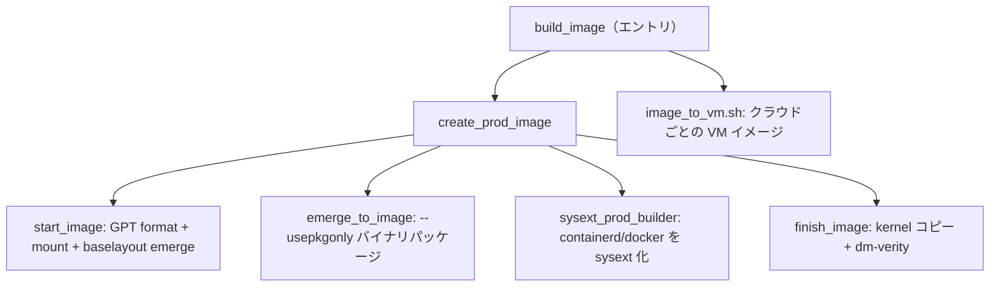

# アーキテクチャ

## 全体像

Flatcar はデーモンやサービスではなく OS イメージであり、その「アーキテクチャ」はおおむねイメージを生成するビルドパイプラインだ。パイプラインは SDK コンテナ内で動き、事前ビルド済みの Gentoo バイナリパッケージを root ファイルシステムへ emerge し、A/B の `/usr` パーティションを持つ GPT ディスクをレイアウトし、`/usr` を dm-verity で保護し、結果をクラウドごとの VM イメージへ変換する。

## コンポーネント

### `build_image`（エントリ）

トップレベルのスクリプト。chroot 内で動作していることを確認し（`src/build_image:22`）、依存順に `build_library/*.sh` ヘルパを source し（`src/build_image:108-116`）、イメージ種別の引数で分岐する。`prod` では `create_prod_image` を呼ぶ（`src/build_image:189`）。sysext として出荷される既定のコンテナランタイムは、`containerd` と `docker` の仕様文字列としてここで宣言される（`src/build_image:42`）。

### `build_library/`

実体。`prod_image_util.sh` が `create_prod_image` を持ち、`build_image_util.sh` が `start_image`・`emerge_to_image`・`finish_image` と verity 注入を持つ。`disk_layout.json` がパーティションテーブルを定義し、`disk_util`（Python）が GPT のフォーマット・マウント・verity を扱う。`vm_image_util.sh` が汎用イメージをクラウド固有フォーマットへ変換する。

### `sdk_container/src/third_party/`

ebuild オーバーレイ。存在するパッケージの source of truth だ。`portage-stable` は上流 Gentoo に整合させ、わずかな正当な例外を除き改変しない（`README.md:41`）。`coreos-overlay` には Flatcar が大幅に改変、または自作した ebuild が入る（`README.md:44`）。

### SDK コンテナのラッパー

`run_sdk_container`・`build_sdk_container_image`・`bootstrap_sdk_container` がコンテナ化された SDK の起動・生成・bootstrap を行う。OS イメージのビルドには `/dev` への特権アクセスが必要で、これはツールがイメージのパーティショニングに loop device を使うためだ（`README.md:89`）。

## リクエストの流れ

プロダクションイメージのビルドは end-to-end で次のように進む。

1. `build_image` が `create_prod_image` へ分岐し（`src/build_image:189`）、本体は `src/build_library/prod_image_util.sh:58` にある。
2. `create_prod_image` が `start_image` を呼ぶ（`src/build_library/prod_image_util.sh:92`、定義は `src/build_library/build_image_util.sh:494`）。`start_image` は GPT をフォーマットし（`disk_util format`、`src/build_library/build_image_util.sh:508-509`）、`/usr` を verity 用に書き込み可能でマウントし（`disk_util mount --writable_verity`、`src/build_library/build_image_util.sh:514-515`）、ファイルシステムの土台として `sys-apps/baselayout` だけを emerge する（`src/build_library/build_image_util.sh:519`）。
3. `create_prod_image` に戻り、`set_image_profile prod` でプロファイルを切り替え、`emerge_to_image` がベースパッケージ `coreos-base/coreos` を入れる（`src/build_library/prod_image_util.sh:95-97`）。`emerge_to_image` は `emerge --usepkgonly` を実行し、事前ビルド済みバイナリパッケージのみを使う（`src/build_library/build_image_util.sh:132-141`）。
4. `sysext_prod_builder` が containerd と docker を、ベース OS ではなく systemd-sysext の squashfs イメージとして合成する（`src/build_library/prod_image_util.sh:105-112`）。
5. SBOM・ライセンス・パッケージリストが書き出される（`src/build_library/prod_image_util.sh:116-123`）。
6. `finish_image`（`src/build_library/prod_image_util.sh:183`、定義は `src/build_library/build_image_util.sh:532`）が kernel を `/boot` へコピーし dm-verity を適用する（詳細は[内部実装](./internals)）。
7. `build_image` が `version.txt` を書き出し、`image_to_vm.sh` がターゲット VM イメージを生成する（`src/build_image:211-221`）。

## 主要な設計判断

- **バイナリのみのパッケージインストール。** イメージは `--usepkgonly` で事前ビルド済みバイナリパッケージから組み立てられ（`src/build_library/build_image_util.sh:132-141`）、ビルドはイメージへソースをコンパイルしない。これにより組み立てが再現可能かつ高速になる。
- **A/B `/usr` + verity。** base レイアウトは `USR-A` と `USR-B` パーティションを定義し、`USR-A` は `btrfs` + `zstd` 圧縮で `/usr` にマウントされ、`prioritize` と `verity` 機能を持つ（`src/build_library/disk_layout.json:25-37`）。片方が active な間にもう一方が更新を受ける。
- **ランタイムをベース OS でなく sysext に。** containerd と docker を sysext 仕様文字列として宣言することで（`src/build_image:42`）、コンテナランタイムをイミュータブルなベースイメージから分離できる。

## 拡張ポイント

- **systemd-sysext**: 機能やランタイムを読み取り専用 `/usr` に squashfs sysext として重ねる。
- **Ignition**: 宣言的な初回ブート構成（プロビジョニング、ユニット、ファイル）をシステム起動前に適用する。
- **ebuild オーバーレイ**: 下流のパッケージ変更は `coreos-overlay` へ、`portage-stable` は上流 Gentoo をミラーする（`README.md:41-44`）。
