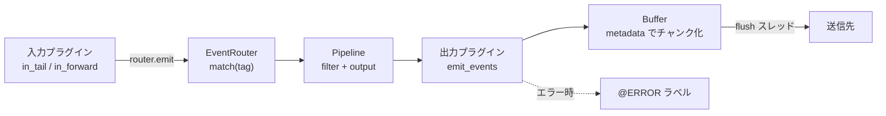

# アーキテクチャ

## 全体像

動作中の Fluentd は、1 つ以上のワーカープロセスを管理するスーパーバイザプロセスである (`lib/fluent/supervisor.rb:570`)。各ワーカーは設定ファイルからプラグインのツリーを構築し、それを実行する。ツリーの根にあるのが `RootAgent` (`lib/fluent/root_agent.rb:48`) で、`<source>`・`<filter>`・`<match>`・`<label>` ブロックを保持する。イベントは入力プラグインから入り、タグが付き、タグをフィルタ列と出力に対応づける `EventRouter` を通り、配送のためにバッファされる。

## コンポーネント

### スーパーバイザとワーカー

`Fluent::Supervisor` (`lib/fluent/supervisor.rb:570`) はプロセスのライフサイクル、設定リロード、ソケット継承を担う。`run_supervisor` (`lib/fluent/supervisor.rb:689`) は `Fluent::Engine.run_configure` で設定をロードし (`lib/fluent/supervisor.rb:721`)、各ワーカーは `run_worker` (`lib/fluent/supervisor.rb:758`) を呼び、configure 後に `Fluent::Engine.run` を呼ぶ (`lib/fluent/supervisor.rb:783`)。

### RootAgent とラベル

`RootAgent` (`lib/fluent/root_agent.rb:48`) はプラグインツリーの根である。入力・フィルタ・マッチを束ね、`<label>` ブロックでグループ化する。各ラベルは独立した `EventRouter` を持つ。組込みの `@ERROR` ラベル (`ERROR_LABEL`、`lib/fluent/root_agent.rb:49`) は下流で失敗したイベントを受け取る。`SourceOnlyMode` (`lib/fluent/root_agent.rb:51`) はゼロダウンタイム再起動向けの入力専用バッファモードである。

### EventRouter

`EventRouter` (`lib/fluent/event_router.rb:44`) はルーティングの中枢である。タグをコレクタ (出力、フィルタパイプライン、別ルーター) に対応づける。`Rule` リスト (`lib/fluent/event_router.rb:57`)、LRU の `MatchCache` (`lib/fluent/event_router.rb:140`) を持ち、マッチしたタグごとに `Pipeline` (`lib/fluent/event_router.rb:165`) を構築する。

### プラグインとバッファ

組込みプラグインは `lib/fluent/plugin/` 配下に `in_*.rb`・`out_*.rb`・`filter_*.rb`・`parser_*.rb`・`formatter_*.rb`・`buf_*.rb` として置かれる。出力のバッファリングは `Buffer` (`lib/fluent/plugin/buffer.rb:26`) が担い、`Metadata` (`lib/fluent/plugin/buffer.rb:72`) をキーにイベントをチャンクへまとめる。

## リクエストの流れ

1. 入力プラグインが emit する。`in_tail` は `router.emit(tag, time, record)` を呼び (`lib/fluent/plugin/in_tail.rb:705`)、`in_forward` は `router.emit_stream(tag, es)` を呼ぶ (`lib/fluent/plugin/in_forward.rb:322`)。
2. `EventRouter#emit` は単一レコードを `OneEventStream` に包み `emit_stream` へ委譲する (`lib/fluent/event_router.rb:104`)。
3. `emit_stream` は `match(tag).emit_events(tag, es)` を呼び、`Pipeline::OutputError` を `@ERROR` ハンドラへ流す (`lib/fluent/event_router.rb:114`)。
4. `match(tag)` は LRU の `MatchCache` を引き、ミスなら `find(tag)` を実行する (`lib/fluent/event_router.rb:133`)。`find` はルールを走査し、出力で終わる `Pipeline` を構築する (`lib/fluent/event_router.rb:287`)。
5. `Pipeline#emit_events` はフィルタチェインを通し、その結果を出力の `emit_events` に渡す (`lib/fluent/event_router.rb:192`)。
6. `Output#emit_events` (`lib/fluent/plugin/output.rb:876`) は `@buffering` で分岐する。非バッファは `emit_sync` (`lib/fluent/plugin/output.rb:885`)、バッファありは `emit_buffered` (`lib/fluent/plugin/output.rb:897`)。
7. バッファ出力は `metadata(tag, time, record)` (`lib/fluent/plugin/output.rb:912`) でチャンクキーを計算し、`Buffer#write` (`lib/fluent/plugin/buffer.rb:330`) でチャンクにイベントを追記する。満杯のチャンクは `enqueue_chunk` (`lib/fluent/plugin/buffer.rb:482`) でキューへ移り、flush スレッドが `dequeue_chunk` (`lib/fluent/plugin/buffer.rb:559`) で取り出してプラグインの `write` (`lib/fluent/plugin/output.rb:118`) を呼ぶ。

## 主要な設計判断

すべてがタグで駆動する。ルーティング、バッファのチャンクキー、エラー経路はメッセージ内容ではなくイベントのタグをキーにするため、ホットパスが単純に保たれる。配送はデフォルトで非同期である。バッファ出力はイベントをチャンクに書いた時点で戻り、別の flush スレッドが配送と指数バックオフ付き再送を担う。時刻はカスタムの MessagePack 拡張型でナノ秒精度のまま運ばれ、整数秒タイムスタンプとの後方互換も保たれる ([内部実装](./internals) 参照)。

## 拡張ポイント

挙動のあらゆるカテゴリがプラグインである。入力・出力・フィルタ・パーサ・フォーマッタ・バッファバックエンドはすべて `lib/fluent/plugin/` 配下にある。プラグイン作者は `lib/fluent/plugin_helper/` の共通ミックスイン (timer・server・socket・storage・thread・retry_state) を再利用する。バッファバックエンドは `buf_memory`・`buf_file`・`buf_file_single` として提供される。
