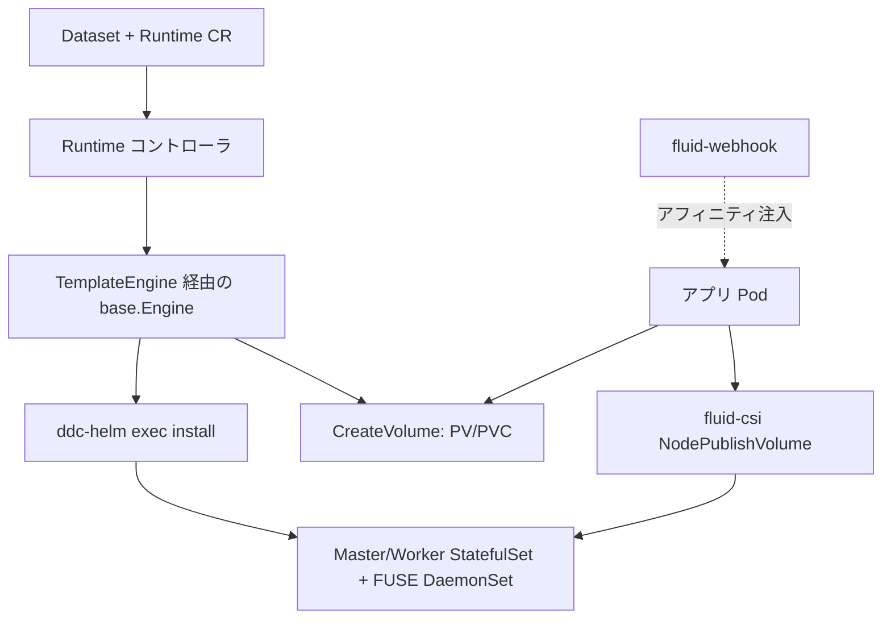

# アーキテクチャ

## 全体像

Fluid は Kubernetes コントローラ群に CSI ドライバと admission webhook を加えたもので、2 つの考えを軸に構成される。`Dataset` がどこか遠くにあるデータを記述し、`Runtime` がそのデータを計算の近くへ運ぶキャッシュエンジンを包む。リポジトリは `cmd/` から複数のバイナリをビルドする。`dataset-controller`、エンジンごとのコントローラ (`cmd/alluxio`・`cmd/juicefs`・`cmd/jindo`・`cmd/thin`・`cmd/vineyard`・`cmd/efc`・`cmd/cache`)、CSI ドライバ (`cmd/csi/main.go`)、webhook (`cmd/webhook/main.go`)、アプリケーションコントローラ (`cmd/fluidapp/main.go`) である。

## コンポーネント

### Runtime コントローラ

各キャッシュエンジンは専用のコントローラバイナリを持つが、共通の reconcile コアを共有する。例えば Alluxio コントローラの `Reconcile` (`pkg/controllers/v1alpha1/alluxio/alluxio_runtime_controller.go:75`) はランタイムをロードし、エンジン実装を選び、共通の `RuntimeReconciler.ReconcileInternal` (`pkg/controllers/runtime_controller.go:79`) に委譲する。`pkg/ctrl/` の共通ヘルパ (master・worker・fuse・affinity) が StatefulSet と DaemonSet のレプリカおよびノードアフィニティを扱う。

### エンジン抽象

Fluid の核心は `pkg/ddc/` にある。`base.Engine` インターフェース (`pkg/ddc/base/engine.go:32`) は各エンジンが備える粗い操作を定義する。`Setup`・`Sync`・`CreateVolume`・`DeleteVolume`・`Shutdown`・`Validate` である。より細粒度の `base.Implement` インターフェース (`pkg/ddc/base/engine.go:69`) はエンジンが供給すべきステップ (`CheckMasterReady`・`SetupWorkers`・`BindToDataset`・UFS 準備など) を並べる。`TemplateEngine` が `Implement` を埋め込み、これらのステップを固定順序で駆動する。具体的なエンジンは `pkg/ddc/alluxio`・`pkg/ddc/juicefs`・`pkg/ddc/jindocache` などにあり、`pkg/ddc/factory.go` がランタイム種別から選ぶ。

### CSI ドライバと webhook

`fluid-csi` ドライバはキャッシュをアプリ Pod にマウントする。その `NodePublishVolume` (`pkg/csi/plugins/nodeserver.go:67`) がキャッシュの FUSE エンドポイントを Pod のターゲットパスへ bind mount する。`fluid-webhook` は mutating admission webhook で、キャッシュを既に持つノードへ Pod がスケジュールされるようデータアフィニティを注入する。

## リクエストの流れ

`Dataset` と同名の `AlluxioRuntime` を作ると次の流れが起きる。

1. Alluxio ランタイムコントローラの `Reconcile` が `ReconcileRequestContext` を組み立て、`ddc.InferEngineImpl` (`pkg/controllers/v1alpha1/alluxio/alluxio_runtime_controller.go:102`) でエンジン実装を設定し、`ReconcileInternal` を呼ぶ。
2. `ReconcileInternal` (`pkg/controllers/runtime_controller.go:79`) がエンジンを取得または生成し (`:101`)、同名の `Dataset` を取得し (`:114`)、`CanbeBound` で他にバインド済みでないか確認し (`:150`)、Dataset が無ければ 5 秒後に requeue し (`:177`)、`ReconcileRuntime` へ渡す (`:181`)。
3. `ReconcileRuntime` (`pkg/controllers/runtime_controller.go:254`) が `Validate` を呼び、続いて `Setup` を呼ぶ。setup 未完なら 20 秒後に requeue し (`:283`)、その後 `CreateVolume` と `Sync` を呼ぶ。
4. `TemplateEngine.Setup` (`pkg/ddc/base/setup.go:25`) がテンプレートのステップを実行する。master を立て、ready を待ち、UFS を準備し、worker を立て、待ち、status を更新し、最後に `BindToDataset` が `Dataset` の `status.phase` を `Bound` に変える。

## 主要な設計判断

すべてを形づくる判断は、Fluid がどうキャッシュ Pod を展開するかにある。StatefulSet と DaemonSet を Go クライアントで直接 apply しない。代わりに各エンジンが `Runtime` spec から Helm の values を生成し、外部の `ddc-helm` バイナリを exec して同梱の chart を install する (`pkg/ddc/alluxio/master_internal.go:32`、`pkg/utils/helm/utils.go:44`)。chart は `charts/` にある。これでエンジンごとの複雑なマニフェストを chart に閉じ込められるので、エンジン追加は概ね「chart を書いて `base.Implement` を実装する」で済む。代償は外部バイナリ依存と、自前の出力パースおよびロールバックである (`pkg/utils/helm/utils.go:82`)。

## 拡張ポイント

- `ThinRuntime`: 組み込みエンジンなしに任意の FUSE ベースのストレージを統合できる汎用ランタイム。`v1.0.8` で 3FS と Curvine を追加したのがこれ。
- `base.Implement` (`pkg/ddc/base/engine.go:69`): このインターフェースと Helm chart を実装すれば新エンジンを追加できる。
- データ操作 CRD (`DataLoad`・`DataBackup`・`DataMigrate`・`DataProcess`) は `api/v1alpha1/` にある。
- カスタムなスケジューリング注入のための mutating admission webhook。
