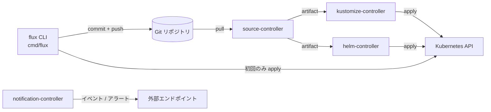

# アーキテクチャ

## 全体像

Flux は 2 層構造だ。`flux` CLI は day-0 の作業、すなわちクラスタのブートストラップとマニフェスト生成を担う。クラスタ内の GitOps Toolkit コントローラ群が継続的なリコンサイルを行う。CLI が一度ブートストラップすると、以後の操作はすべて Git への commit に集約され、定常運用では CLI は不要になる。

CLI は `cmd/flux/` にあり、ブートストラップのオーケストレーションは `pkg/bootstrap/`、マニフェスト生成は `pkg/manifestgen/` にある。コントローラ群は別リポジトリから提供され、`go.mod` で API モジュールとして参照される。デフォルトインストールは `source-controller`、`kustomize-controller`、`helm-controller`、`notification-controller` をデプロイし、追加で `image-reflector-controller`、`image-automation-controller`、`source-watcher` が利用できる (`pkg/manifestgen/install/options.go:46`)。

## コンポーネント

### flux CLI

Cobra ベースのバイナリで、全サブコマンド (`bootstrap`、`create`、`get`、`reconcile`、`build`) をカバーする。ルートコマンドは `cmd/flux/main.go:43`、`func main()` は `cmd/flux/main.go:191`、実行は `cmd/flux/main.go:204` で定義される。CLI は `//go:embed manifests/*.yaml` でバージョン付きマニフェストを同梱するため、ネットワークなしでもインストール用 base を組める (`cmd/flux/manifests.embed.go:27`)。

### ブートストラップのオーケストレーション

`pkg/bootstrap/` がブートストラップ手順を駆動する。`Reconciler` インタフェース (`pkg/bootstrap/bootstrap.go:56`) を定義し、`PlainGitBootstrapper` (素の Git リモート) と `GitProviderBootstrapper` (`pkg/bootstrap/provider/` 経由の GitHub / GitLab / Gitea / BitBucket) が実装する。

### マニフェスト生成

`pkg/manifestgen/` は Flux が Git に commit する YAML を生成する。`install` が `gotk-components.yaml` を作り (`pkg/manifestgen/install/install.go:40`)、`sync` が `gotk-sync.yaml` を作り (`pkg/manifestgen/sync/sync.go:36`)、`sourcesecret` が Git / OCI 認証 secret を作る。

### GitOps Toolkit コントローラ

クラスタ内のリコンサイラ群。`source-controller` は Git / Helm / OCI アーティファクトを取得、`kustomize-controller` は Kustomize overlay を適用、`helm-controller` は `HelmRelease` オブジェクトをリコンサイル、`notification-controller` は受信 Webhook と送信アラートを扱う。これらは外部モジュールで、`go.mod` 経由で依存され、本リポジトリにソースはない。

## リクエストの流れ

`flux bootstrap github` を端から端まで追う。

1. `bootstrapGitHubCmdRun` (`cmd/flux/bootstrap_github.go:109`) が `GITHUB_TOKEN` を読み (`cmd/flux/bootstrap_github.go:115`)、`install.Options` (`cmd/flux/bootstrap_github.go:193`)、`sourcesecret.Options` (`cmd/flux/bootstrap_github.go:216`)、`sync.Options` (`cmd/flux/bootstrap_github.go:238`) を組み立てる。provider クライアント (`cmd/flux/bootstrap_github.go:170`) と gogit クライアント (`cmd/flux/bootstrap_github.go:182`) を作り、`bootstrap.NewGitProviderBootstrapper` (`cmd/flux/bootstrap_github.go:296`) でブートストラッパを構築する。
2. `bootstrap.Run` (`pkg/bootstrap/bootstrap.go:98`) が順に呼ぶ。`ReconcileRepository` (reconciler が `RepositoryReconciler` のときだけ、リモートリポジトリを作る)、`ReconcileComponents`、`ReconcileSourceSecret`、`ReconcileSyncConfig`、その後にヘルスレポート。
3. `ReconcileComponents` (`pkg/bootstrap/bootstrap_plain_git.go:119`) はリポジトリを 1 回リトライ付きで clone し (`pkg/bootstrap/bootstrap_plain_git.go:127`)、`install.Generate` で `gotk-components.yaml` を生成し (`pkg/bootstrap/bootstrap_plain_git.go:155`)、メッセージ `Add Flux <version> component manifests` で commit し (`pkg/bootstrap/bootstrap_plain_git.go:168`)、stage された変更があれば push する。`git.ErrNoStagedFiles` は up to date として扱う (`pkg/bootstrap/bootstrap_plain_git.go:193`)。
4. 命令的 apply は初回だけ行う。`mustInstallManifests` (`pkg/bootstrap/bootstrap.go:140`) は `flux-system` Kustomization の `Status.LastAppliedRevision` が空のとき true を返し、そのとき `utils.Apply` がコンポーネントを直接クラスタへ適用する (`pkg/bootstrap/bootstrap_plain_git.go:198`)。
5. `ReconcileSyncConfig` は `sync.Generate` (`pkg/manifestgen/sync/sync.go:36`) で `gotk-sync.yaml` を生成する。`GitRepository` (`pkg/manifestgen/sync/sync.go:52`) と、`spec.path` をターゲットパスに持つ `Kustomization` (`pkg/manifestgen/sync/sync.go:82`) の 2 つだ。両方とも名前は `flux-system` (`pkg/manifestgen/sync/options.go:44`)。この commit が Flux に自分自身を管理させる。
6. apply 後、`bootstrap.Run` はヘルスをポーリングする。`hasRevision` (`pkg/bootstrap/bootstrap.go:268`) は Source 系は `status.artifact.revision`、Kustomization は `status.lastAttemptedRevision` を期待リビジョンと照合する。

## 主要な設計判断

Flux は pull 型だ。CLI は望む状態を Git に commit するが、フェッチして適用するのはクラスタのコントローラだ。命令的な apply はごく最初の 1 回だけで、`mustInstallManifests` でゲートされる (`pkg/bootstrap/bootstrap.go:140`)。これは明確な信頼境界を保つ。クラスタを変更する認証情報はクラスタ内に留まり、CI には置かれない。

Flux は自分自身を管理する。ブートストラップは自身のコンポーネントマニフェストと、同じリポジトリ/パスを指す `GitRepository` + `Kustomization` (名前 `flux-system`) を commit する (`pkg/manifestgen/sync/sync.go:52`, `pkg/manifestgen/sync/sync.go:82`)。初回 apply 後はクラスタ内の `kustomize-controller` が Flux 自身のコンポーネントを Git からリコンサイルするため、アップグレードは新しい `gotk-components.yaml` を commit するだけになる。空の `LastAppliedRevision` チェックが、初回とそれ以降を分ける蝶番だ。

CLI とコントローラは疎結合だ。コントローラは `go.mod` 経由で参照される別モジュールなので、CLI が抱えるのは API だけで、コントローラは独立してリリースできる。

## 拡張ポイント

- 主要な拡張面はカスタムリソースだ: `GitRepository`、`Kustomization`、`HelmRelease`、`OCIRepository`、および notification / image-automation 系の各種。
- `Reconciler` インタフェース (`pkg/bootstrap/bootstrap.go:56`) と `pkg/bootstrap/provider/` の provider 抽象により、Flux は GitHub / GitLab / Gitea / BitBucket を対象にできる。
- `notification-controller` は外部システム連携用の受信 Webhook レシーバと送信アラートプロバイダを公開する。
