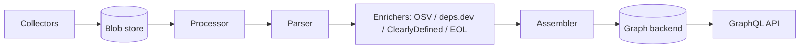

# アーキテクチャ

## 全体像

GUAC は非同期の取り込みパイプラインで、最終的にグラフDBに到達し、GraphQL でクエリされる。ドキュメントはソースから収集され、blob store に置かれ、pub/sub キュー経由で processor に pull され、型付きの証拠 (evidence) にパースされ、GraphQL ミューテーションでグラフへ組み立てられる。同じ 4 段階は、オールインワン CLI が使う同期・インプロセス版としても存在する。`Ingest()` が `processorFunc` → `ingestorFunc` (パーサ) → `collectSubEmitFunc` → `assemblerFunc` を組み、順に実行する (`pkg/ingestor/ingestor.go:52`, `pkg/ingestor/ingestor.go:59`)。

## コンポーネント

### Collector

`Collector` はソースからドキュメントを取得し、各ドキュメントを processor 向けにチャネルへ流す (`pkg/handler/collector/collector.go:36`、`RetrieveArtifacts(ctx, docChannel chan<- *processor.Document)` メソッド)。`pkg/handler/collector/` 配下の実装は file、GCS、S3、OCI、git、GitHub、deps.dev、Kubescape、blob をカバーする。collector は `RegisterDocumentCollector` でグローバル map に自己登録する (`pkg/handler/collector/collector.go:64`)。

### Processor

processor は生バイトを型付きで検証済みのドキュメントツリーに変える。非同期構成ではサブスクライバとして動く。`Subscribe` は pub/sub イベントを blob key にデコードし、blob store からバイトを読み、`processor.Document` に unmarshal し、取り込み成功後にだけメッセージを ack する (`pkg/handler/processor/process/process.go:85`, `pkg/handler/processor/process/process.go:138`)。中核ロジックは `Process` から `processDocument` (`pkg/handler/processor/process/process.go:168`, `pkg/handler/processor/process/process.go:197`)。

### Parser と enricher

パーサはドキュメントツリーを歩き、各ノードを `assembler.IngestPredicates` に変換する (`pkg/ingestor/parser/parser.go:84`)。対応するスキャンフラグが立っていれば、OSV、ClearlyDefined、endoflife.date、deps.dev へ並行に fan-out して証拠を追加する (`pkg/ingestor/parser/parser.go:109`)。

### Assembler とバックエンド

assembler は genqlient の GraphQL クライアント経由で predicate をグラフへバルク投入する (`pkg/ingestor/ingestor.go:177`)。グラフ自体は `Backend` インターフェース (`pkg/assembler/backends/backends.go:27`) の背後にあり、全ストレージバックエンドがこれを満たす必要がある: 読み取りクエリ、ページング版 `*List`、`Ingest*` ミューテーション、`Neighbors` や `Path` といったトポロジ操作 (`pkg/assembler/backends/backends.go:135`, `pkg/assembler/backends/backends.go:139`)。

## リクエストの流れ

1 ドキュメントを同期 `Ingest` パス (`pkg/ingestor/ingestor.go:39`) で端から端まで追う:

1. `processorFunc(d)` が `Process` を実行する。ドキュメント型を推定し、フォーマットを検証し、型スキーマに対して検証し、入れ子の envelope を `DocumentTree` に展開する (`pkg/ingestor/ingestor.go:59`, `pkg/handler/processor/process/process.go:197`)。
2. `ingestorFunc(docTree)` がツリーを predicate と識別子文字列にパースし、要求があれば enricher へ fan-out する (`pkg/ingestor/ingestor.go:64`, `pkg/ingestor/parser/parser.go:84`)。
3. `collectSubEmitFunc(idstrings)` が発見した識別子を collectsub サーバへ報告する。ここでの失敗はログのみで無視され、取り込みは中断しない (`pkg/ingestor/ingestor.go:69`)。
4. `assemblerFunc(predicates)` が証拠を GraphQL 経由でグラフバックエンドに書き込む (`pkg/ingestor/ingestor.go:73`)。

## 主要な設計判断

パイプラインは非同期かつ pull ベースである。collector はドキュメントを blob store に置いて pub/sub イベントを通知するだけで、processor がキューから仕事を pull し、取り込み成功後にだけメッセージを ack する (`pkg/handler/processor/process/process.go:138`)。これにより at-least-once 配信となり、processor がクラッシュしてもドキュメントを黙って落とさない。

署名検証と取り込みは意図的に分離されている。DSSE processor は envelope の payload を base64 デコードして子ドキュメントにするだけで、署名は検証しない (`pkg/handler/processor/dsse/dsse.go:55`)。検証は別パスの `VerifyIdentity` (`pkg/ingestor/verifier/verifier.go:71`) が担い、検証済みの identity ですら「信頼できる (trusted)」とは限らない旨が明記されている。`Identity` のコメントは、`Verified` は「署名が鍵と一致した」ことを意味するだけで、その identity を信頼すべきという意味ではないと述べる (`pkg/ingestor/verifier/verifier.go:46`)。信頼の判断はクエリ/ポリシー層に委ねられる。

ストレージは 1 つのインターフェースの背後で差し替え可能である。`keyvalue` (インメモリ) と `ent` (PostgreSQL) がサポート対象のバックエンドで、arangodb・neo4j・neptune も存在する。全バックエンドに同一の `Backend` インターフェースを実装させることで、ストアに関わらず GraphQL の契約が同一に保たれる (`pkg/assembler/backends/backends.go:27`)。

## 拡張ポイント

GUAC は `init()` ベースのプラグインパターンを使う。processor・parser・collector・verifier はすべてパッケージロード時にグローバル map へ自己登録する (`pkg/handler/processor/process/process.go:57`, `pkg/ingestor/parser/parser.go:42`, `pkg/handler/collector/collector.go:64`, `pkg/ingestor/verifier/verifier.go:61`)。新しいドキュメントフォーマットのサポート追加は実質 1 回の登録呼び出しで済む。トレードオフとして、登録が重複すると既存エントリを上書きしつつ error も返す (`pkg/handler/processor/process/process.go:74`)。
