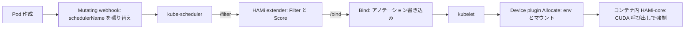

# アーキテクチャ

## 全体像

HAMi は「実効的な上限付きで GPU を共有する」という 1 つの仕事を、互いを完全には信用しない 3 つの層に分割する。コントロールプレーンのスケジューラが、Pod にどの物理 GPU を割り当てるかを決め、その決定を Pod のアノテーションに書く。各ノードの device plugin が、そのアノテーションを読んで実デバイスに解決し、環境変数とライブラリマウントを注入する。コンテナ内ライブラリ HAMi-core が全プロセスに preload され、メモリとコアの制限を CUDA 呼び出し時に強制する。スケジューラはデバイスに触れず、device plugin は制限を強制せず、HAMi-core は配置を決めない。README はこの連鎖を直接述べている (`README.md:57-66`)。

## コンポーネント

### Mutating webhook

`pkg/scheduler/webhook.go` は Kubernetes の admission webhook である。Pod 作成時に各コンテナを検査し、Pod が GPU リソースを要求していれば、Pod の `schedulerName` を HAMi スケジューラに向けて書き換える (`pkg/scheduler/webhook.go:53`)。privileged コンテナはスキップし、コンテナ 0 個の Pod は拒否し、要求を namespace のリソースクォータと照合したうえで JSON パッチを返す。これにより HAMi は、それ以外のすべてでデフォルトスケジューラを置き換えることなく、GPU Pod だけを捕捉する。

### スケジューラ extender

`cmd/scheduler` と `pkg/scheduler` は、kube-scheduler が extender として呼ぶ HTTP サーバを動かす。起動時に `/filter`・`/bind`・`/webhook` ルートを登録する (`cmd/scheduler/main.go:145-147`)。extender は候補ノードをフィルタし、fit でスコアリングし、最良ノードを選び、選んだデバイスを Pod のアノテーションに書く。「どのノードのどの GPU か」という決定を担う。

### Device plugin

`cmd/device-plugin/nvidia` と `pkg/device-plugin/nvidiadevice/nvinternal` は kubelet の device-plugin API を実装する。`Allocate()` で plugin はスケジューラのアノテーションを読み、実デバイスに解決し、CUDA 制限の環境変数を注入し、`libvgpu.so` と `ld.so.preload` エントリをコンテナにマウントする (`pkg/device-plugin/nvidiadevice/nvinternal/plugin/server.go:593`)。各ベンダに固有の plugin 経路があり、NVIDIA がリファレンスだ。

### HAMi-core (libvgpu.so)

HAMi-core は別リポジトリ Project-HAMi/HAMi-core の C/CUDA ライブラリで、ここでは `libvgpu` サブモジュールとして参照される (`.gitmodules`)。`LD_PRELOAD` で preload され、CUDA と NVML の呼び出しを横取りし、注入された `CUDA_DEVICE_MEMORY_LIMIT_*` と `CUDA_DEVICE_SM_LIMIT` を読み、メモリ上限を超える確保を拒否し、kernel launch をコア制限まで絞る。実行時隔離が実際に起きるのはここだ。このチェックアウトではサブモジュールは shallow clone で取得されるため、内部はここでは読んでいない。

### モニタとメトリクス

`cmd/vGPUmonitor`・`pkg/monitor`・`pkg/metrics` が Pod ごとの GPU 使用量を集計し Prometheus に出す。既定のモニタポートは `31993` (`README.md:158`)。

## リクエストの流れ

GPU 1 枚を 3000MB のメモリ上限付きで要求する Pod を追う (`README.md:71-79`):

1. **Admission**。Pod 作成が `/webhook` に来て、`webhook.Handle` がデコードする (`pkg/scheduler/webhook.go:53`)。コンテナ 0 個の Pod は拒否、privileged コンテナはスキップ (`pkg/scheduler/webhook.go:74`)。各コンテナでベンダの `MutateAdmission` を呼ぶ (`pkg/scheduler/webhook.go:80-81`)。NVIDIA 実装は `pkg/device/nvidia/device.go:345`。Pod が GPU 要求を持てば、webhook は `schedulerName` を HAMi スケジューラに設定し (`pkg/scheduler/webhook.go:93-94`)、`fitResourceQuota` で namespace クォータを確認し (`pkg/scheduler/webhook.go:100`)、パッチを返す。

2. **Filter**。kube-scheduler が候補ノードを `/filter` に POST し、body は 1MB 制限でデコードされ、`Scheduler.Filter` が呼ばれる (`pkg/scheduler/routes/route.go:50`、`pkg/scheduler/scheduler.go:741`)。Filter は `device.Resourcereqs` で要求を集計し、各ノードの現在の GPU 使用状況を取り、`calcScore` を回す。その中のベンダ別 `Fit` が、ノード上のどの物理 GPU が要求を収容できるかを決める。スコア順にノードをソートし、選んだデバイスをアノテーションに書き、最良の 1 ノードを返す。

3. **Fit**。`NvidiaGPUDevices.Fit` はノードのデバイスをスライス末尾から (`for i := len(devices) - 1; i >= 0; i--`) 走査し、各デバイスを順にチェックする。health、型一致、NUMA、UUID 制約、time-slicing 枚数、`Coresreq > 100` 補正、メモリ (絶対値または割合)、クォータ、空きメモリ、空きコア、排他と共有の競合だ (`pkg/device/nvidia/device.go:749`)。全チェックを通過した GPU が選ばれ、落ちたものは理由別に集計される。

4. **Bind**。kube-scheduler が `/bind` に POST し、`Scheduler.Bind` が割当を `allocating` とマークし、bind 時刻のアノテーションを押し、Kubernetes の bind API を呼ぶ (`pkg/scheduler/scheduler.go:670`)。

5. **Allocate**。ノード側で kubelet が plugin の `Allocate()` を呼ぶ (`pkg/device-plugin/nvidiadevice/nvinternal/plugin/server.go:593`)。対象の pending Pod を見つけ、アノテーションから割当デバイスを読み、非 MIG 経路では `CUDA_DEVICE_MEMORY_LIMIT_<i>` を `<usedmem>m` で注入し、`CUDA_DEVICE_SM_LIMIT` にコアのパーセントを設定し、`CUDA_DEVICE_MEMORY_SHARED_CACHE` をキャッシュファイルに向け、`libvgpu.so` と `/etc/ld.so.preload` をコンテナにマウントする (`server.go:661-711`)。

6. **実行時隔離**。preload された HAMi-core がそれらの変数を読み、CUDA 呼び出し時に強制する。配置はスケジューラの仕事、物理解決とマウントは device plugin の仕事、強制は HAMi-core の仕事だ (`README.md:57-66`)。

## 主要な設計判断

HAMi は kube-scheduler を置き換えず拡張する。webhook は GPU Pod だけを張り替えるので、デフォルトスケジューラがそれ以外をすべて処理し続け、HAMi の extender がデバイス対応の配置を上乗せする (`pkg/scheduler/webhook.go:93-94`)。既存のスケジューラ設定をそのまま保てる。

ノードと GPU の配置ポリシーは独立している。クラスタはノード横断で binpack しつつ GPU 横断で spread する、といった任意の組み合わせが選べ、GPU にはトポロジ対応ポリシーもある (`pkg/util/types.go:64-73`)。既定はノード binpack、GPU spread だ (`cmd/scheduler/main.go:70-71`)。

実行時の強制はコントロールプレーンの外にある。device plugin は環境変数とマウントを注入するだけで、実際のメモリ上限とコア絞りはコンテナ内に preload された C ライブラリが強制する (`server.go:661-711`)。これにより HAMi は、ドライバやカーネルの改変なしに「仮想 GPU」を見せられる。代償として、ワークロードが原理上は回避しうるライブラリに依存する。

## 拡張ポイント

- **ベンダデバイス**: 新しいアクセラレータ対応は、`pkg/device/<vendor>` 配下で `Devices` インターフェースを実装することだ (`pkg/device/devices.go:36`)。スケジューラと webhook は特定ベンダではなくインターフェースを呼ぶ。
- **スケジューリングポリシー**: ノードと GPU のポリシー (GPU は `binpack`・`spread`・`topology-aware`) がフラグと Pod ごとのアノテーションで選べる (`pkg/util/types.go:64-73`)。
- **admission webhook**: mutating webhook が GPU Pod の入口であり、要求の書き換えとクォータチェックを適用する場所だ (`pkg/scheduler/webhook.go:53`)。
- **バッチスケジューラ連携**: HAMi は Volcano や Koordinator と併用でき、これらはバッチスケジューリングモデルの下で HAMi ベースの共有を駆動する (HAMi ドキュメント、Koordinator ドキュメント)。
