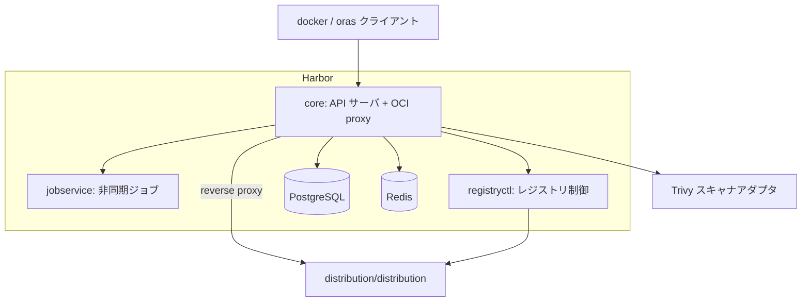

# アーキテクチャ

## 全体像

Harbor は 3 つの独立した Go バイナリと Angular の UI からなり、すべてが実際の blob / manifest 保管を担う Docker Distribution バックエンドの前段に立ちます。core バイナリが OCI レジストリ API と REST API を終端し、jobservice が非同期処理を回し、registryctl がバックエンドレジストリを制御します。各レイヤは `server/` (HTTP ルーティングと middleware)、`controller/` (ビジネスロジック)、`pkg/` (`dao/` で DB アクセスするドメイン manager) に分かれます。

## コンポーネント

### core

API サーバ。エントリポイントは `src/core/main.go:15` の `package main` で、Beego v2 web フレームワーク上に構築されます (`github.com/beego/beego/v2/server/web`, `src/core/main.go:30`)。OCI レジストリルート、REST API、token service、認証バックエンドをホストします。バックエンドは blank import で自身を登録します。authproxy・db・ldap・oidc・uaa です (`src/core/main.go:42-46`)。`main()` は cache・config・DB とマイグレーション・スキャナ・通知を初期化してから serve します (`src/core/main.go:138-327`)。

### jobservice

レプリケーション・GC・スキャン・retention の非同期ワーカ。`src/jobservice/main.go` として動き、Redis ベースのキューからジョブを引きます。core はジョブをインラインで実行せず jobservice に渡してスケジュールします。

### registryctl

バックエンドの Distribution レジストリを制御するサイドカー的コントローラで、GC 起動などの操作に使われます。`src/registryctl/main.go` として動きます。

### 補助バイナリ

`src/cmd/exporter/main.go` は Prometheus exporter、`src/cmd/standalone-db-migrator/main.go` は単体の DB マイグレータです。`portal/` ディレクトリに Angular の Web UI が入ります。

## リクエストの流れ

Harbor を特徴づける判断は、blob も manifest も自分で保存しないことです。それらをバックエンドの Distribution レジストリに reverse proxy し、前段にゲートを差し込みます。proxy 実体は `httputil.NewSingleHostReverseProxy` 1 個 (`src/server/registry/proxy.go:29-42`) で、その Director が転送リクエストごとにバックエンド向けの basic auth を付与します (`src/server/registry/proxy.go:44-52`)。

OCI v2 ルートは `RegisterRoutes` で登録されます (`src/server/registry/route.go:34-129`)。`/v2` 配下のすべてのルートでまず `v2auth.Middleware()` が走り (`src/server/registry/route.go:37`)、操作ごとに独自の middleware を積みます。manifest pull (GET `/v2/<repo>/manifests/<ref>`) は metric 注入、次に `repoproxy.ManifestMiddleware` (proxy-cache project 用)、`contenttrust.ContentTrust` (署名ポリシー)、`vulnerable.Middleware` (脆弱性ゲート)、最後に `getManifest` ハンドラの順です (`src/server/registry/route.go:52-59`)。manifest push (PUT) は immutable・quota・Cosign 署名・subject・blob の middleware を直列に積みます (`src/server/registry/route.go:74-84`)。pull の全パスは [Internals](./internals) で追います。

## 主要な設計判断

Harbor はバックエンドレジストリに tag を保存しません。reference が tag の manifest push では body を読み、`digest.FromBytes(data)` を計算し、転送前に proxy 先 URL を tag から digest に書き換えます (`src/server/registry/manifest.go:192-206`)。tag から digest の対応は Harbor の DB だけが持ちます (`src/server/registry/manifest.go:189-191`)。これにより immutable tag・retention・tag 単位の RBAC をバックエンドレジストリの制約から独立に実装できます。

存在確認は proxy より先に DB で行います。pull ハンドラはまず `artifact.Ctl.GetByReference` で artifact を解決してから proxy します (`src/server/registry/manifest.go:55`)。非同期処理は API をブロックせず jobservice にオフロードされ、レプリケーション・GC・スキャン・retention はキューされたジョブとして走ります。

## 拡張ポイント

- **認証バックエンド**: db・LDAP/AD・OIDC・UAA・auth proxy。pluggable で起動時に登録されます (`src/core/main.go:42-46`)。
- **スキャナアダプタ**: Trivy がデフォルトで同梱され (`src/core/main.go:331-346`)、他のスキャナはスキャナアダプタ API で接続します。
- **レプリケーションアダプタ**: 他のレジストリ種別との間でポリシー駆動のレプリケーション。
- **Webhook**: `PullArtifactEventMetadata` などのイベントが通知を発火します (`src/server/registry/manifest.go:131-139`)。
- **REST API**: 外部連携用の OpenAPI/Swagger 記述の v2.0 API。
