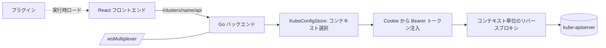

# アーキテクチャ

## 全体像

Headlamp は 1 つの製品として出荷される 2 つの半分から成る。Go バックエンドはシングルページのフロントエンドを配信し、kubeconfig コンテキストを保持し、ブラウザからのあらゆる Kubernetes API 呼び出しを、Bearer トークンを付けて適切なクラスタへリバースプロキシする。React フロントエンドは UI を描画し、クラスタと直接通信しない。常にバックエンドを経由する。同じバックエンドとフロントエンドは Electron シェル内でデスクトップアプリとしても動く。プラグインシステムはフロントエンドに追加の JavaScript を実行時に読み込み、サードパーティが fork せずにページを追加できるようにする。

## コンポーネント

### Go バックエンドサーバ

`backend/cmd/` が `gorilla/mux` ベースの HTTP サーバである。エントリポイントは `main` (`backend/cmd/server.go:47`) で、`StartHeadlampServer` (`backend/cmd/headlamp.go:1374`) を呼ぶ。担う役割は 6 つ。フロントエンドを静的な SPA として配信すること、各クラスタの Kubernetes API へのリバースプロキシ、認証 (OIDC とトークン Cookie)、プラグイン配信、補助 API (Helm、port-forward、drain)、そして WebSocket マルチプレクサ。ルート登録は `headlamp.go` にあり、全ルートを配線する巨大なファイルだ。

### React フロントエンド

`frontend/src/` が TypeScript + React のアプリである (コンポーネントは MUI、ルーティングは react-router v5)。Kubernetes リソースを一覧・詳細・編集する。API アクセスは `frontend/src/lib/k8s/` にあり、v1 層 (`api/v1/clusterRequests.ts`) と新しい v2 層 (`api/v2/fetch.ts` + React Query hooks) に分かれる。どちらもリクエストをクラスタではなくバックエンドへ送る。

### プラグインシステム

フロントエンド側の `frontend/src/plugin/` と SDK の `plugins/headlamp-plugin` が、UI を実行時に拡張可能にする。バックエンドがインストール済みプラグインを HTTP エンドポイントで一覧配信し、各プラグインのファイルを静的配信する。フロントエンドは各プラグインの `main.js` を取得して実行し、`Registry` オブジェクトを通じて UI への登録を許す。

### デスクトップアプリ

`app/` が同じバックエンドとフロントエンドを Electron で梱包し、同一コードから Linux/macOS/Windows のデスクトップアプリを出荷する。

## リクエストの流れ

ブラウザでのクリックから kube-apiserver への往復まで、リソース取得を追う。

1. フロントは `request(path)` (`frontend/src/lib/k8s/api/v1/clusterRequests.ts:95`) を呼び、これが `clusterRequest` (`clusterRequests.ts:123`) を呼ぶ。現在のクラスタ名で `fullPath = /clusters/{cluster}/{path}` を組み立て (`clusterRequests.ts:155`、`CLUSTERS_PREFIX` を使用)、`fetch(url, { credentials: 'include' })` を送る (`clusterRequests.ts:165`)。`credentials: 'include'` によりトークン Cookie がリクエストに同送される。
2. バックエンドのルータが `PathPrefix("/clusters/{clusterName}/{api:.*}")` にマッチする (`backend/cmd/headlamp.go:1884`、`handleClusterAPI` が登録)。キャッシュ有効時は `CacheMiddleWare` がハンドラを包む。
3. `clusterRequestHandler` (`headlamp.go:1772`) が `getContextKeyForRequest(r)` で kubeconfig コンテキストキーを解決し、`c.KubeConfigStore.GetContext(contextKey)` で `*kubeconfig.Context` を取得する (`headlamp.go:1788`, `headlamp.go:1794`)。
4. 宛先 URL を組み立てる。`url.Parse(kContext.Cluster.Server)` (`headlamp.go:1805`) の後、`r.URL.Host`・`r.URL.Scheme`・`r.URL.Path = mux.Vars(r)["api"]` を設定してリクエストをクラスタ向けに書き換え、`/clusters/{name}/` プレフィックスを剥がす (`headlamp.go:1828-1830`)。
5. 認証を注入する。`auth.GetTokenFromCookie(r, clusterName)` がトークンを読み、`Authorization: Bearer <token>` を設定する (`headlamp.go:1845`, `headlamp.go:1849`)。
6. `kContext.ProxyRequest(w, r)` (`headlamp.go:1857`) に引き渡す。実体は `backend/pkg/kubeconfig/kubeconfig.go:387` にある。初回は `SetupProxy` (`kubeconfig.go:431`) が `httputil.NewSingleHostReverseProxy(URL)` を生成し (`kubeconfig.go:437`)、その transport を Headlamp の User-Agent を付ける `userAgentRoundTripper` で包む (`kubeconfig.go:34-51`)。以後 `c.proxy.ServeHTTP` が kube-apiserver へ転送する (`kubeconfig.go:395`)。
7. 応答はプロキシ経由でフロントへ戻る。キャッシュ有効時は `k8cache` が GET 応答を保存し、非 GET で無効化する (`server.go:285`)。

## 主要な設計判断

すべてバックエンドを経由する。フロントは自力で kube-apiserver に届かない。トークンはサーバ側 Cookie に置かれ、プロキシがそれを `Authorization` ヘッダへ移す。これにより CORS が絵から消え、トークンはブラウザから見える JavaScript の外に保たれ、1 インスタンスが同時に多数のクラスタの前面に立てる。

リバースプロキシはコンテキスト単位でキャッシュされる。各 `kubeconfig.Context` は遅延生成される `proxy *httputil.ReverseProxy` フィールドを持ち (`kubeconfig.go:71`)、クラスタのプロキシは一度作られてリクエスト間で再利用される。呼び出しごとに作り直さない。

認可はクラスタ側に残る。Headlamp は素通しプロキシであり、許可・拒否は kube-apiserver が決める。フロントはアクセスレビュー相当のチェックで、ユーザが使えないと分かる UI を隠すが、実際の強制は API サーバで行われる。ゆえに隠されたボタンは配慮であってセキュリティ境界ではない。

## 拡張ポイント

- **フロントエンドプラグイン**: プラグインはフロントが取得して実行する JavaScript である。`Registry` オブジェクトを通じて UI に登録し、サイドバー項目 (`registerSidebarEntry`, `frontend/src/plugin/registry.tsx:301`)、ルート (`registerRoute`, `registry.tsx:445`)、詳細ビューのセクション (`registerDetailsViewSection`, `registry.tsx:606`)、アプリバーのアクション、オブジェクトグランスのカードを追加する。バックエンドがプラグインファイルを配信し、フロントがそれを実行する。
- **ステートレスモード**: `backend/cmd/stateless.go` は kubeconfig をサーバ側に保存せず、リクエストヘッダで受け取る。フロントは kubeconfig を持つとき `opts.headers['KUBECONFIG']` を設定する (`clusterRequests.ts:151`)。サーバがクラスタ資格情報を持たないマルチテナント配信に向く。
- **クラスタインベントリ**: `backend/pkg/clusterinventory` は静的な kubeconfig ではなく `ClusterProfile` リソースからクラスタを動的に検出する。
- **Helm・port-forward・テレメトリ**: `backend/pkg/helm`・`backend/pkg/portforward`・`backend/pkg/telemetry` (OpenTelemetry) が素のプロキシを超える補助 API を足す。
