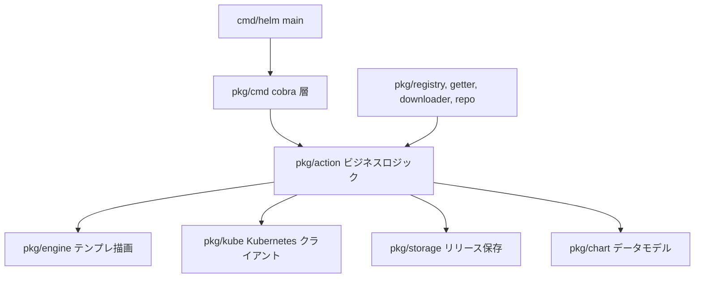

# アーキテクチャ

## 全体像

Helm は層構造の CLI。薄い `main` がルートコマンドを組み立て、cobra コマンド層がフラグを解釈し、action 層が各サブコマンドのビジネスロジックを持ち、補助パッケージ群がテンプレート描画・チャートのデータモデル・Kubernetes クライアント・リリース保存・チャート配布を担う。共有の `action.Configuration` がクラスタクライアント・リリース保存・検出したクラスタ capabilities を運ぶので、すべての action が同じ状態から動く。

## コンポーネント

### エントリポイント: `cmd/helm`

薄い `main`。バイナリ名を変えても field manager 名が変わらないよう `kube.ManagedFieldsManager = "helm"` を設定し、ルート cobra コマンドを組み立てて実行する (`cmd/helm/helm.go:36`、`cmd/helm/helm.go:38`)。

### コマンド層: `pkg/cmd`

ユーザが叩く cobra コマンド (`root.go`、`install.go`、`uninstall.go` など)。フラグを解釈し、チャートと値を解決し、action へ渡す。`newInstallCmd` が install コマンドを組み立て、その `RunE` が `runInstall` を呼ぶ (`pkg/cmd/install.go:132`、`pkg/cmd/install.go:159`)。ルートコマンドは `HELM_DRIVER` を読んで保存バックエンドを選ぶ (`pkg/cmd/root.go:65`)。

### action 層: `pkg/action`

各サブコマンドのビジネスロジック: Install / Upgrade / Rollback / Uninstall / List / Pull / Push / Lint など。`Configuration` が共有コンテキストで、`KubeClient`・`Releases` storage・`Capabilities`・`RESTClientGetter` を持つ (`pkg/action/action.go`)。

### テンプレートエンジン: `pkg/engine`

Go `text/template` を使ってチャートのテンプレートを描画する (`pkg/engine/engine.go:82`)。

### チャートモデル: `pkg/chart`

チャートのデータモデル。v2 型は `pkg/chart/v2/chart.go:38`、新しい v3 モデルは `internal/chart/v3` 配下。

### 保存: `pkg/storage` と `pkg/storage/driver`

リリースの永続化層。driver がリリース状態の置き場所 (secret / configmap / memory / sql) を抽象化する (`pkg/storage/driver/driver.go:99`)。

### Kubernetes クライアント: `pkg/kube`

描画済みマニフェストから Kubernetes オブジェクトを組み、create / update / wait を行うクライアントラッパ。

### 配布: `pkg/registry`・`pkg/getter`・`pkg/downloader`・`pkg/repo`・`pkg/pusher`・`pkg/provenance`

OCI レジストリを含むチャートの取得と公開。加えて `pkg/provenance` の OpenPGP provenance による署名と検証。

## リクエストの流れ

`helm install` を端から端まで追う。

1. cobra コマンドが引数を解釈し、その `RunE` が `runInstall` を呼ぶ。`runInstall` はチャート解決と値マージの後、`client.RunWithContext(ctx, chartRequested, vals)` を呼ぶ (`pkg/cmd/install.go:159`、`pkg/cmd/install.go:347`)。
2. action は dry-run でなければクラスタ到達性を確認し (`pkg/action/install.go:296`)、リリース名を検証し (`pkg/action/install.go:308`)、サブチャート依存を解決する (`pkg/action/install.go:313`)。
3. クラスタ capabilities を取得し (`pkg/action/install.go:352`)、最終 values を組んで JSON Schema 検証する (`pkg/action/install.go:366`)。
4. revision 1 の `Release` を生成し (`pkg/action/install.go:375`)、テンプレートを hooks・manifest・NOTES に分けて描画する (`pkg/action/install.go:378`)。
5. manifest 文字列を Kubernetes オブジェクトへ組み (`pkg/action/install.go:394`)、install は既存リソースを (ownership を取らない限り) 拒否する (`pkg/action/install.go:415`)。dry-run はここで return する (`pkg/action/install.go:423`)。
6. リリースを storage に保存し (`pkg/action/install.go:465`)、`performInstallCtx` がクラスタへ適用する (`pkg/action/install.go:472`)。

## 主要な設計判断

Helm 3 以降、リリース状態はデフォルトで対象 namespace の Kubernetes Secret としてクラスタ内に置かれる。storage セレクタは空の driver と `"secret"`/`"secrets"` を同じに扱い secret driver を組む (`pkg/action/action.go:675`)。保存されるペイロードは JSON エンコードしたリリースを `gzip.BestCompression` で gzip し base64 で包んだもの (`pkg/storage/driver/util.go:38`) で、`helm.sh/release.v1` 型の Secret に入る (`pkg/storage/driver/secrets.go:284`)。これは Tiller 後の設計で、状態を専用サーバではなく管理対象のワークロードの隣に置く。driver は `HELM_DRIVER` で secret / configmap / memory / sql に差し替え可能 (`pkg/cmd/root.go:65`)。

## 拡張ポイント

- `Driver` インターフェース越しの storage driver (`pkg/storage/driver/driver.go:99`)。
- OCI レジストリと HTTP リポジトリによるチャート配布 (`pkg/registry`、`pkg/repo`)。
- provenance による署名と検証 (`pkg/provenance`)。
- エンジンへのカスタムテンプレート関数。`Configuration.CustomTemplateFuncs` で渡す (`pkg/action/action.go:307`)。
