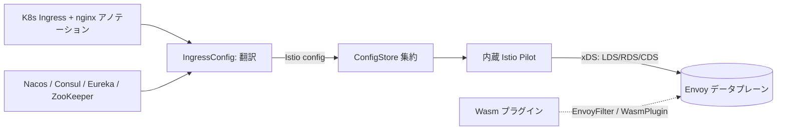

# アーキテクチャ

## 全体像

Higress はフォークした Istio Pilot と Envoy データプレーン、そして Wasm プラグイン層からなる。コントロールプレーンは Kubernetes Ingress から Envoy を直接プログラムしない。代わりに Ingress (と nginx 互換アノテーション、Gateway API) を Istio 設定へ翻訳し、内蔵の Istio Pilot がそれを Envoy の xDS へ compile する。構造上の要点は、Higress の Ingress ストアが Pilot にとって単なる `ConfigStoreController` として登録される点だ。したがって Pilot からは、翻訳された Istio config はユーザが直接適用した config と区別がつかない。

## コンポーネント

### エントリと server 組み立て

`cmd/higress/main.go` がバイナリである。`main` は cobra root command を実行する (`cmd/higress/main.go:26`, `cmd/higress/main.go:28`)。server の組み立ては `pkg/bootstrap/server.go` にある。`NewServer` (`pkg/bootstrap/server.go:152`) が起動タスクを配線し、そこに `initConfigController` (`pkg/bootstrap/server.go:220`) を含む。server は Istio の xDS `DiscoveryServer` を `xds.NewDiscoveryServer` (`pkg/bootstrap/server.go:344`) で内蔵し、GVK ごとにカスタム generator を登録する (`pkg/bootstrap/server.go:346` 以降)。各 generator は `pkg/ingress/mcp/generator.go` にある。

### Ingress 翻訳層

`pkg/ingress/` が中核であり、Kubernetes オブジェクトを Istio config に変える層だ。`translation/translation.go` は `IngressTranslation` を持ち、Ingress v1 と Knative ingress をまとめる薄いラッパである。`config/ingress_config.go` は `IngressConfig` を持ち、約 2,300 行の翻訳本体だ。`kube/annotations/` は nginx 互換アノテーションのパーサ群を、アノテーション種ごとに 1 ファイルで持つ (cors・canary・rewrite・retry・timeout・auth・ip_access_control など約 25 ファイル)。`kube/gateway/` が Gateway API を扱う。

### サービスディスカバリ

`registry/` は外部サービスレジストリを watch し、Istio `ServiceEntry` を生成する。これが Higress をマイクロサービスゲートウェイとして機能させる。`nacos`・`consul`・`eureka`・`zookeeper`・`direct` のプロバイダを持ち、`registry/reconcile` で reconcile される。

### Wasm プラグイン

`plugins/wasm-go/` と `plugins/wasm-rust/` が、Envoy の HTTP フィルタチェーン内で動く Wasm 拡張を持つ。基準コミットでは `plugins/wasm-go/extensions/` に 59 個の拡張がある (`ai-proxy`・`ai-cache`・`jwt-auth`・`ext-auth`・`waf`・`oidc`・`mcp-server`・`mcp-router` など)。`ai-proxy` 拡張は 37 個の LLM プロバイダ初期化子を 1 つの map に登録する (`plugins/wasm-go/extensions/ai-proxy/provider/provider.go:224`)。

### Istio フォーク

`istio/` はフォークした Istio (`api`・`client-go`・`istio`・`pkg`・`proxy`) を持つ。Higress は upstream Istio をそのまま vendor せず、改造版を in-tree で抱えることで、自前の Ingress ストアを Pilot の config 機構へ差し込む。

## リクエストの流れ

Kubernetes Ingress が Envoy ルートになるまでを end-to-end で追う。

1. `main` が cobra root command を実行し (`cmd/higress/main.go:26`)、`NewServer` (`pkg/bootstrap/server.go:152`) とその `initConfigController` (`pkg/bootstrap/server.go:220`) に至る。
2. `initConfigController` が Ingress ストアを構築する。`translation.NewIngressTranslation(...)` が `IngressConfig` 裏付けのストアを生成し (`pkg/bootstrap/server.go:239`)、`s.configStores` に append し (`pkg/bootstrap/server.go:242`)、`configaggregate.MakeCache` で集約し (`pkg/bootstrap/server.go:245`)、`s.environment.ConfigStore` にセットする (`pkg/bootstrap/server.go:252`)。ここから Pilot は Ingress ストアを単なる config ソースとして扱う。
3. xDS が特定 GVK の config を要求すると `ConfigStore.List` が呼ばれ、`IngressTranslation.List` (`pkg/ingress/translation/translation.go:163`) を経て `IngressConfig.List` (`pkg/ingress/config/ingress_config.go:288`) に至る。
4. `IngressConfig.List` は要求型が Gateway・VirtualService・DestinationRule・EnvoyFilter・ServiceEntry・WasmPlugin のいずれでもなければ即 return し (`pkg/ingress/config/ingress_config.go:289`)、`listFromIngressControllers` (`pkg/ingress/config/ingress_config.go:324`) を呼ぶ。
5. `listFromIngressControllers` は各クラスタのコントローラから生 Ingress を list し (`pkg/ingress/config/ingress_config.go:352`)、`SortIngressByCreationTime` で作成時刻順にソートし (`pkg/ingress/config/ingress_config.go:357`)、`createWrapperConfigs` でラッパを作り (`pkg/ingress/config/ingress_config.go:358`)、GVK で分岐する (`pkg/ingress/config/ingress_config.go:361`)。
6. VirtualService なら分岐は `convertVirtualService` (`pkg/ingress/config/ingress_config.go:486`) を呼ぶ。各 Ingress について `ingressController.ConvertHTTPRoute` で HTTP ルートを構築し (`pkg/ingress/config/ingress_config.go:522`)、`annotationHandler.ApplyRoute` で nginx 互換アノテーションを適用し (`pkg/ingress/config/ingress_config.go:530`)、`applyCanaryIngresses` で canary Ingress を統合し (`pkg/ingress/config/ingress_config.go:536`)、weighted cluster の合計が 100 になるよう正規化する (`pkg/ingress/config/ingress_config.go:542`)。
7. 返る `[]config.Config` は Istio の VirtualService・Gateway・DestinationRule・EnvoyFilter・ServiceEntry・WasmPlugin である。Pilot の GVK ごとの generator (`pkg/bootstrap/server.go:346` 以降) がこれを Envoy xDS (LDS/RDS/CDS) に compile し、Envoy データプレーンへ push する。

## 主要な設計判断

中心的な判断は、Ingress-to-Envoy コンパイラを書くのではなく Istio のコントロールプレーンを再利用したことだ。`IngressConfig` に `istiomodel.ConfigStoreController` を実装し (`pkg/ingress/config/ingress_config.go:79`)、config ソースとして登録することで、Higress は Pilot の xDS 生成・増分 push・Envoy 管理をただで得る一方、Istio の CRD を Ingress とアノテーションの裏に隠す。トレードオフは重さだ。Higress はフォークした Istio Pilot と Envoy を同梱し、単体ゲートウェイより大きい。

2 つ目の判断は、nginx アノテーション互換を第一級の関心事としたことだ。`kube/annotations/` は約 25 種の nginx-Ingress アノテーション群を個別パーサとして再実装しており、既存の nginx-Ingress 構成がルーティングオブジェクトを書き換えずに Higress へ移れる。これは marketing でなくコードで表現された移行支援である。

3 つ目は、経路変更がプロキシ reload でなく xDS を通じて伝播することだ。だから経路が変わっても Envoy データプレーンは提供し続ける。これが「reload 不要」の主張と、Sealos 移行記事が報告した高速化の裏にある機構だ (README; Sealos ブログ)。

## 拡張ポイント

- **Wasm プラグイン**: WebAssembly にコンパイルされた拡張が Envoy の HTTP フィルタチェーンで動く。`convertWasmPlugin` (`pkg/ingress/config/ingress_config.go:838`) と `convertIstioWasmPlugin` (`pkg/ingress/config/ingress_config.go:1123`) が Higress の `WasmPlugin` CRD を Istio の `extensions.WasmPlugin` に変え、EnvoyFilter 経由で注入する。プラグインは higress-group の Go SDK (`github.com/higress-group/wasm-go`) で書く。
- **nginx 互換アノテーション**: アノテーション群の追加は `kube/annotations/` にパーサを足すことを意味する。
- **サービスレジストリ**: `registry/` は Nacos・Consul・Eureka・ZooKeeper・direct ディスカバリに対応し、いずれも ServiceEntry を生成する。
- **Gateway API**: `kube/gateway/` が Ingress と並んで Gateway API リソースを扱う。
