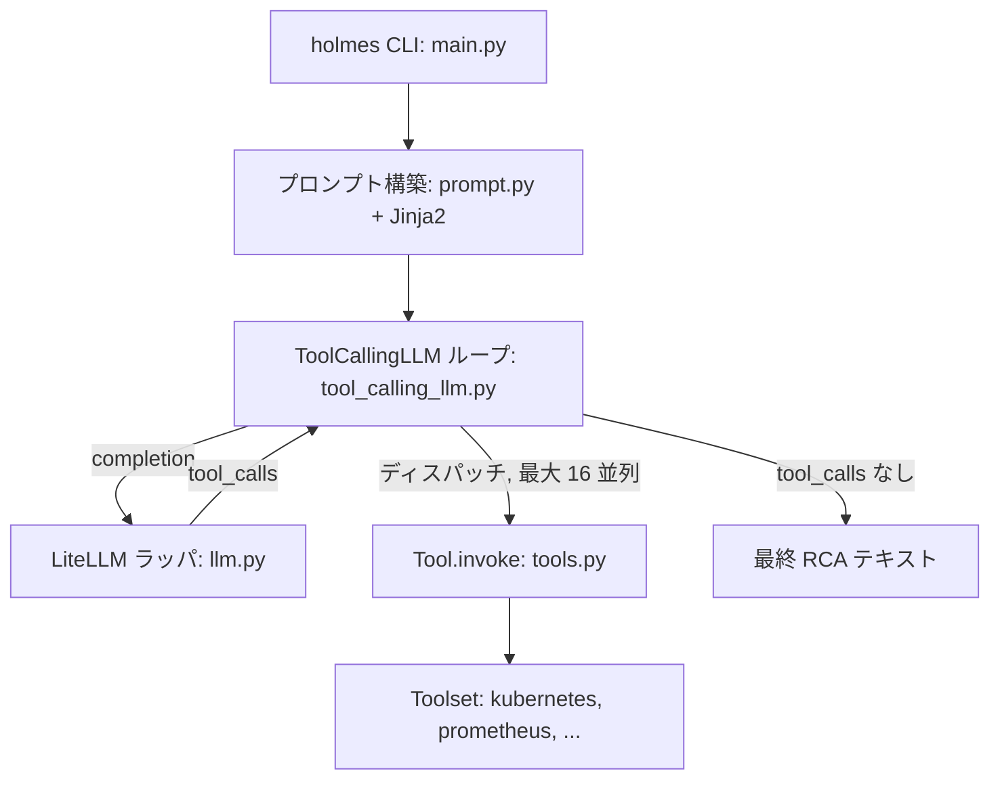

# アーキテクチャ

## 全体像

HolmesGPT は 1 つのループを中心に組まれた Python プログラムである。CLI エントリポイントが設定をロードし、アラートや質問から system prompt と user prompt を組み立てる。次にエンジン (`ToolCallingLLM`) がモデルを呼び、モデルがツールを要求すればそれを実行して結果を戻し、モデルが止まるかステップ上限に達するまで反復する。モデルは toolset を通じてデータソースに届き、LiteLLM ラッパを通じてモデルプロバイダに届く。ラッパはバックエンドが OpenAI・Anthropic・Azure・Bedrock・Gemini のどれかを隠す。モデルがすることはすべて Python によるオーケストレーションの上にあり、Python がすることはすべてモデルの選択を取り巻く安全弁と配管である。

## コンポーネント

### CLI と設定

`holmes/main.py` は `ask`・`investigate`・`toolset` サブコマンドを持つ Typer CLI である。設定をロードしてコマンドをルーティングする。`holmes/config.py` は `~/.holmes/config.yaml` からモデル・API キー・有効な toolset を読み、アラート源 (AlertManager・Jira・PagerDuty・OpsGenie) のファクトリでもある。この層はエンジンが何で走るかを決めるが、ループ自体は回さない。

### プロンプト構築

`holmes/core/prompt.py` は `holmes/plugins/prompts/` の Jinja2 テンプレートから system prompt と user prompt を組み立てる。`generic_ask.jinja2` が system prompt で、on/off できるコンポーネント (`intro`, `cluster_name`, `todowrite`, `toolset_instructions`, `style_guide`) から構築される (`prompt.py:12` `PromptComponent`, `prompt.py:97` `is_component_enabled`、環境変数 `ENABLED_PROMPTS` で制御)。runbook やガイドはここで、プロンプトのテキストとしてモデルに入る。

### エンジン

`holmes/core/tool_calling_llm.py` にループの本体 `ToolCallingLLM` がある (`tool_calling_llm.py:196`)。`tool_executor`・`max_steps`・LLM ハンドルを持つ。`call` (`tool_calling_llm.py:575`) は同期エントリで、ループ本体 `call_stream` (`tool_calling_llm.py:1031`) を drain する。名前に反して `call_stream` は LLM のトークンをストリームしない。Holmes のイテレーションを 1 回ずつ yield するもので、各モデル呼び出しは `stream=False` で走る (コメントが `tool_calling_llm.py:1044` に明記)。

### LLM 抽象

`holmes/core/llm.py` に `DefaultLLM` があり、LiteLLM 経由でプロバイダを呼ぶ。だから 1 本のコードパスで OpenAI・Anthropic・Azure・Bedrock・Gemini を扱える。トークン計算と context window のサイジングもここにあり、後段の圧縮ステップはこれに依存する。

### ツールと toolset

`holmes/core/tools.py` は `Tool.invoke` (`tools.py:353`) と、統一出力型 `StructuredToolResult` (`tools.py:96`) を定義する。その `status` enum は `success`・`error`・`no_data`・`approval_required`・`frontend_pause` を区別する (`tools.py:64`)。`holmes/plugins/toolsets/` には 46 個のデータソース統合 (Kubernetes・Prometheus・Grafana・Datadog・AWS・Docker・Elasticsearch・MCP ほか) があり、YAML 定義と Python 実装が混在する。`holmes/plugins/sources/` はアラートを取り込み (GitHub・Jira・OpsGenie・PagerDuty・Prometheus AlertManager)、`holmes/plugins/destinations/` は findings を書き戻す。

## リクエストの流れ

アラートを端から端まで分析する `holmes investigate` を追う。

1. `_investigate_issue` (`main.py:163`) が `build_system_prompt` で system prompt を (`main.py:173` → `prompt.py:177`)、`generate_user_prompt` で user prompt を (`main.py:181` → `prompt.py:161`) 組み立てる。investigation 用の指示は `main.py:172` で追加される (「Provide a terse analysis of the following ... alert/issue and why it is firing.」)。`messages = system + user` を組み、`ai.call(messages, ...)` を呼ぶ (`main.py:189`)。
2. `ToolCallingLLM.call` (`tool_calling_llm.py:575`) が `call_stream` を drain する。ループは `while i < max_steps` (`tool_calling_llm.py:1101`)。
3. 各イテレーションはモデルを 1 回呼ぶ。`self.llm.completion(messages=..., tools=tools, tool_choice="auto", temperature=TEMPERATURE, stream=False, drop_params=True)` (`tool_calling_llm.py:1163`)、LiteLLM 経由 (`llm.py`)。
4. 応答に `tool_calls` が無ければ、ループは `ANSWER_END` を emit して返す (`tool_calling_llm.py:1262`)。message の content がモデルの書いた最終的な根本原因分析だ。
5. `tool_calls` があれば `ThreadPoolExecutor(max_workers=16)` で実行し (`tool_calling_llm.py:1295`)、各呼び出しは `Tool.invoke` (`tools.py:353`) に達して実データソースを叩く。結果は `messages` に追記され、ループが反復する。`i` が `max_steps` に達すると tools を外し、モデルに結論させる (`tool_calling_llm.py:1101`)。

## 主要な設計判断

決定的な判断は「判断がどこに宿るか」である。決定的な Python はループ制御と `max_steps`、ツールのディスパッチ、重複呼び出しセーフガード (`safeguards.py:24`)、承認ゲート (`tools.py:363`)、context 圧縮と巨大出力の退避、トークン計上とトレースを担う。モデルはどのツールをどの引数で呼ぶか、いつ止めるか、分析の文章化を担う。ハードコードされた診断決定木は無い。runbook はプロンプトに差し込むテキストなので、実行判断は依然モデルのものだ (recon; `84cb39c` のソース)。結果として、推論が完全にモデルのものであり、Python はツールを安全に走らせて出力を context に収まる形で返すことに徹するエージェントになる。

2 つ目の判断はイテレーション内並行だ。1 ステップで複数ツールを同時に投げ、最大 16 並列で走らせ、まとめて返せる。独立した多数の参照を要する調査の実時間コストを削る (`tool_calling_llm.py:1295`)。

3 つ目は、ビルトインツールが設計上すべて read-only であることだ。だから重複呼び出しセーフガードが成立する。同一の重複呼び出しの拒否は、ツールが状態を変更しないからこそ安全であり、もしそれが崩れたらセーフガードは変える必要があると、ソースのコメントが断っている (`safeguards.py:24`)。

## 拡張ポイント

- **toolset**: 新しいデータソースは `holmes/plugins/toolsets/` 配下の新 toolset で、YAML か Python で定義し、モデルが呼べる read-only コマンドを公開する。
- **MCP**: toolset は Model Context Protocol 経由で外部ツールに届く。GitHub・GitLab・各クラウドプロバイダといった統合はこの仕組みで組み込まれる (README)。
- **アラート源**: `holmes/plugins/sources/` は AlertManager・PagerDuty・OpsGenie・Jira などからの取り込みを足す。一部は findings を受け取ることもできる。
- **プロンプトコンポーネント**: system prompt は on/off 可能なコンポーネントから組み立てられ (`prompt.py:12`, `prompt.py:97`)、`ENABLED_PROMPTS` で制御されるので、エンジンに触れずにガイドや runbook を差し替えられる。
