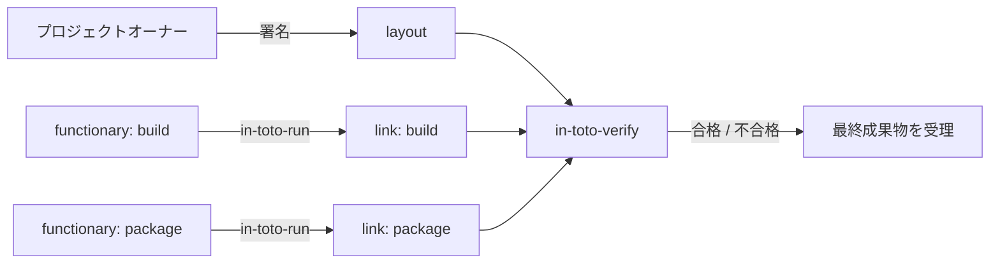

# アーキテクチャ

## 全体像

システム全体は 2 つの登場人物で説明できる。**layout** はポリシーで、サプライチェーンの順序付きステップ、各ステップへの署名を許可された鍵、各ステップが消費・生成してよいファイル (artifact) のルールを表す。**link** は証拠で、あるステップが実際に実行された記録であり、入力された materials、出力された products、実行コマンドを列挙する。生成側 (`in_toto/runlib.py`) が link を作り、検証側 (`in_toto/verifylib.py`) が link 群を集めて layout に照らす。

## コンポーネント

### CLI 層

6 本の薄いエントリポイントが pyproject.toml:50 に登録されている。`in-toto-run` と `in-toto-record` が証拠を生成し、`in-toto-verify` が検証、`in-toto-sign` が署名を扱い、`in-toto-mock` が鍵なしの試走、`in-toto-match-products` が products を比較する。いずれも引数をパースしてライブラリを呼ぶだけで、たとえば in_toto/in_toto_verify.py:222 は layout と鍵を読み込んで `verifylib` に渡す。

### 生成エンジン: `runlib.py`

`runlib.py` が link を組み立てる。`record_artifacts_as_dict` (in_toto/runlib.py:69) が materials/products をハッシュ化し、`execute_link` (in_toto/runlib.py:293) がステップコマンドを subprocess で実行して byproducts を捕捉し、`in_toto_run` (in_toto/runlib.py:406) が link を組み立てて署名する。複数パートのステップでは `in_toto_record_start` (in_toto/runlib.py:622) と `in_toto_record_stop` (in_toto/runlib.py:791) が materials と products の記録を分離する。

### 検証エンジン: `verifylib.py`

`verifylib.py` が検証器である。`in_toto_verify` (in_toto/verifylib.py:1484) が docstring に列挙された 11 段の手順 (in_toto/verifylib.py:1495-1511) をオーケストレーションする。`verify_match_rule` (in_toto/verifylib.py:645) のような個別ルール検査はその近くにある。

### モデルとルール

`in_toto/models/` がデータ型を保持する。`layout.py` (Layout, Step, Inspection)、`link.py` (Link)、`metadata.py` (署名コンテナ抽象) である。`in_toto/rulelib.py` は `unpack_rule` (in_toto/rulelib.py:43) で artifact rule 文字列を dict 化し、MATCH/CREATE/DELETE/MODIFY/ALLOW/DISALLOW/REQUIRE を扱う (in_toto/rulelib.py:51-58)。

### artifact リゾルバ

`in_toto/resolver/_resolver.py` が URI スキーマ別に artifact をハッシュ化する。`Resolver.for_uri` (in_toto/resolver/_resolver.py:28) がスキーマでディスパッチし、未知のスキーマは file リゾルバにフォールバックする (in_toto/resolver/_resolver.py:32-35)。登録済みリゾルバは `FileResolver` (スキーマ `file`、in_toto/resolver/_resolver.py:51)、`OSTreeResolver` (`ostree`、in_toto/resolver/_resolver.py:210)、`DirectoryResolver` (`dir`、in_toto/resolver/_resolver.py:280)。

## リクエストの流れ

`in-toto-verify` を端から端まで追う:

1. CLI が `Metadata.load(args.layout)` で layout を読み込み (in_toto/in_toto_verify.py:222)、各検証鍵をロードし (in_toto/in_toto_verify.py:227-234)、`verifylib.in_toto_verify(...)` を呼ぶ (in_toto/in_toto_verify.py:236)。
2. `in_toto_verify` (in_toto/verifylib.py:1484) が手順を順に実行する:
   - `verify_metadata_signatures` が layout 署名を渡された鍵で検証 (in_toto/verifylib.py:1584)。
   - `metadata.get_payload()` が署名コンテナから Layout を取り出す (in_toto/verifylib.py:1590)。
   - `verify_layout_expiration` が有効期限を確認 (in_toto/verifylib.py:1593)。
   - `load_links_for_layout` が `STEP-NAME.KEYID-PREFIX.link` ファイルをディスクから読む (in_toto/verifylib.py:1601)。
   - `verify_link_signature_thresholds` がステップごとに閾値ぶんの正当な functionary 署名を要求 (in_toto/verifylib.py:1604)。
   - `verify_sublayouts` が入れ子の layout があれば再帰検証 (in_toto/verifylib.py:1607)。
   - `verify_all_steps_command_alignment` が報告コマンドと期待コマンドを照合 (in_toto/verifylib.py:1612)。
   - `verify_threshold_constraints` のあと `reduce_chain_links` が一致する link を畳み込む (in_toto/verifylib.py:1615-1616)。
   - `verify_all_item_rules(layout.steps, ...)` がステップの artifact rule を適用 (in_toto/verifylib.py:1622)。
   - `run_all_inspections` が inspection コマンドを実行し link を生成 (in_toto/verifylib.py:1625)。
   - `verify_all_item_rules(layout.inspect, ...)` が inspection ルールを適用 (in_toto/verifylib.py:1634)。
   - `get_summary_link` がチェーン全体の materials/products 要約を返す (in_toto/verifylib.py:1642)。

## 主要な設計判断

- **検証は隔離して走る。** in-toto は鍵の生成時刻・失効状態・用途フラグといった外部属性を意図的に無視する。docstring (in_toto/verifylib.py:1513-1521) と CLI ヘルプ (in_toto/in_toto_verify.py:85-88) が明言している。鍵を失効させたければオーナーが新しい layout に署名する。
- **ステップルールは inspection 実行より先に検査する。** コメントが理由を述べる。inspection コマンドが改竄済みファイル上で走るのを防ぐためで、その代償として、ステップの match rule は inspection の artifact を参照できない (in_toto/verifylib.py:1618-1620)。
- **コマンド不一致は soft fail。** 仕様に従い、報告コマンドと期待コマンドの差は警告ログにとどまり検証は続行する (in_toto/verifylib.py:1504-1507)。

## 拡張ポイント

artifact リゾルバのレジストリが主なサードパーティの接続口である。リゾルバは `RESOLVER_FOR_URI_SCHEME` に URI スキーマで自身を登録し (in_toto/resolver/_resolver.py:21)、`Resolver` 抽象基底クラスを実装する (in_toto/resolver/_resolver.py:24)。メタデータ層もエンベロープ形式をまたいで差し替え可能で、DSSE の `Envelope` も旧来の `Metablock` も `Metadata` 抽象を継承している (in_toto/models/metadata.py:144, in_toto/models/metadata.py:220)。
