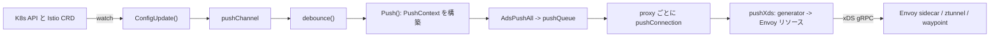

# アーキテクチャ

## 全体像

Istio は 2 層構成である。制御プレーンは `istiod`、`pilot/cmd/pilot-discovery` からビルドされる `pilot-discovery` バイナリ (`Makefile.core.mk:213`)。Kubernetes API と Istio の設定 CRD を監視し、Envoy 用設定を組み立て、xDS (gRPC のディスカバリプロトコル) でデータプレーンへ push する。データプレーンは Envoy である。従来モデルでは Pod ごとのサイドカー、ambient モードでは L4 用の per-node ztunnel と L7 用の任意の waypoint Envoy。単一の制御ループは「設定が変わる、再計算する、接続中の全プロキシへ push する」である。

## コンポーネント

### istiod (pilot)

制御プレーンの中核は `pilot/` にある。エントリポイントは `pilot/cmd/pilot-discovery/main.go:27` で、`app.NewRootCommand()` (`pilot/cmd/pilot-discovery/app/cmd.go:41`) を呼ぶ。内部の xDS サーバが `DiscoveryServer` (`pilot/pkg/xds/discovery.go:65`) で、設定モデル・service registry・xDS の生成と配信を担う。

### istioctl

CLI は `istioctl/`、`istioctl/cmd/istioctl` からビルドする (`Makefile.core.mk:212`)。install・`analyze`・`proxy-config` 検査などを扱う。

### security (CA)

`security/` は CA。mTLS を支える ID である SPIFFE ベースのワークロード証明書を発行する。

### istio-cni

`cni/` は CNI plugin、`cni/cmd/istio-cni` からビルドする (`Makefile.core.mk:219`)。Pod のトラフィックをサイドカー、または ambient ではノードの ztunnel へ向けるリダイレクトを設定する。

### 共有ライブラリ

`pkg/` は共有コードを持ち、`pkg/xds/server.go` に汎用 xDS サーバの骨格がある。`operator/` と `manifests/` は Helm chart と install profile を持つ。

## リクエストの流れ

代表操作は「設定変更が全 Envoy に伝播する」流れ。`pilot/pkg/xds` を追う。

1. 設定変更 (例: `VirtualService`) が `DiscoveryServer.ConfigUpdate(req)` に届く。Address kind なら xDS cache を clear し、`req` を `pushChannel` に流して戻る (`pilot/pkg/xds/discovery.go:326-343`)。
2. `handleUpdates` が `debounce()` に委譲する (`pilot/pkg/xds/discovery.go:351-352`)。debounce は最小静穏時間と最大遅延の窓で連続イベントを 1 本に集約し、`PushRequest` を merge する (`pilot/pkg/xds/discovery.go:355`)。push の thundering herd を防ぐ要。
3. debounce 後に `Push(req)` が走る (`pilot/pkg/xds/discovery.go:288-307`)。旧 `PushContext` を退避し、`NextVersion()` で版を採番し、`initPushContext` で新しい不変スナップショット `PushContext` を構築し、`req.Push` に載せて `AdsPushAll(req)` を呼ぶ。
4. `AdsPushAll` は `StartPush` を呼び、接続中の全 client を走査して request を enqueue する (`pilot/pkg/xds/ads.go:566-592`)。
5. 別 goroutine が queue を排出する。`concurrentPushLimit` セマフォで一度に push する proxy 数を絞る。
6. 各接続で `pushConnection(con, ev)` が走る (`pilot/pkg/xds/ads.go:478-503`)。proxy 状態を更新し、`ProxyNeedsPush` を尋ねる。proxy の scope が変更に依存しなければ skip。必要なら watched resource を `PushOrder` 順 (cluster, endpoint, listener, route, secret, そして ambient の address/workload 型) で push する (`pilot/pkg/xds/ads.go:505-516`)。
7. `pushXds(con, w, req)` (`pilot/pkg/xds/xdsgen.go:112`) が resource の TypeUrl に対応する generator を `findGenerator` で引き、`gen.Generate(...)` を呼び、`DiscoveryResponse` を組んで gRPC stream に書き込む。

ACK / NACK は逆方向。Envoy は nonce 付き request を返し、`processRequest` (`pilot/pkg/xds/ads.go:139`) と `Stream` (`pilot/pkg/xds/ads.go:187`) が処理する。`WatchedResource.NonceSent` と `NonceAcked` が、直前の応答が受理されたかを追う。

## 主要な設計判断

Istio は共有状態を mutate せず、設定変更ごとに `PushContext` 全体を作り直す。`Push()` は旧 context を退避し、新しい不変スナップショットを構築する (`pilot/pkg/xds/discovery.go:288-306`)。以後の per-proxy 計算はその単一スナップショットだけを読む。これにより push 中に設定が動いて proxy 間で整合が崩れることを防ぎ、単一の版 (PushVersion) を Envoy へ伝播できる。コストは毎回のインデックス再構築で、だからこそ手前に debounce を置いて頻度を抑える (`pilot/pkg/xds/discovery.go:355`)。さらに `ProxyNeedsPush` と `PushRequest.ConfigsUpdated` が、変更に依存しない proxy を skip する。この組み合わせが超大規模 proxy 数での convergence time と CPU/memory 圧への答えである ([eBay case study](https://istio.io/latest/about/case-studies/ebay/))。

ambient は別のデータプレーン経路。L4 は per-node の ztunnel (Rust, `istio/ztunnel`) が担い、ノード上の Pod 間で mTLS とルーティングを共有する。L7 機能が要るときだけ namespace/service 単位で waypoint Envoy を立てる。同じ `istiod` が xDS で両方を駆動し、workload/address 型の追加 TypeUrl を扱う (`pilot/pkg/xds/ads.go:511-516`)。

## 拡張ポイント

- 設定 CRD: `VirtualService`、`DestinationRule`、`Gateway`、`Sidecar`、認証・認可ポリシー、`Telemetry`。すべて push context に索引化される。
- 生成された Envoy 設定を直接パッチする `EnvoyFilter`。
- ワークロードをメッシュに組み込む注入 Webhook と `istio-cni` plugin。
- TypeUrl をキーにする `DiscoveryServer.Generators` の xDS generator レジストリ。独自リソース生成用。
