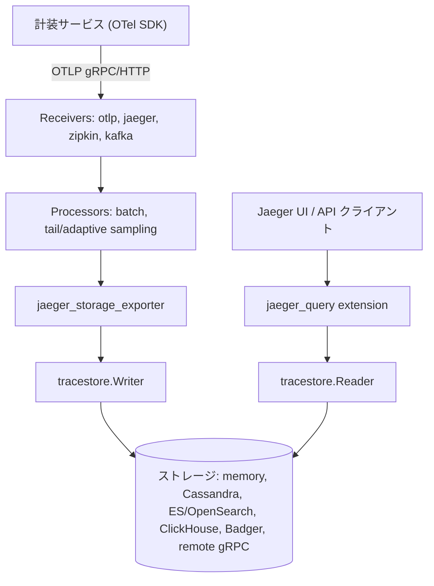

# アーキテクチャ

## 全体像

Jaeger v2 のプロセスは、Jaeger コンポーネントを組み込んだ OpenTelemetry Collector である。エントリポイント `main()` (`cmd/jaeger/main.go:17`) は `Command()` (`cmd/jaeger/internal/command.go:29`) から cobra コマンドを構築する。`Command()` は `otelcol.CollectorSettings` を `Factories: Components` 付きで作り、`otelcol.NewCommand` に渡す (`cmd/jaeger/internal/command.go:51`)。以降は Collector ランタイムがライフサイクルを握り、YAML 設定を解析し、構成された pipeline を組み立てて実行する。

## コンポーネント

### Collector コアとコンポーネントレジストリ

利用可能なコンポーネント集合は `cmd/jaeger/internal/components.go` で組み立てられる。`builders` 構造体 (`cmd/jaeger/internal/components.go:50`) がファクトリマップをまとめ、`build()` (`cmd/jaeger/internal/components.go:68`) がすべてを登録する。`Components()` (`cmd/jaeger/internal/components.go:152`) が Collector に渡される関数である。ここが汎用 Collector との違いで、標準コンポーネントに加えて Jaeger 固有の extension / receiver / exporter を追加する。

### Receiver

標準の `otlp` (`cmd/jaeger/internal/components.go:98`) と `nop`、加えてアドオンの `jaeger` / `kafka` / `zipkin`。OTLP が主経路である。`zipkin` と `jaeger` の receiver は旧来のクライアントからの送信を維持させ、`kafka` は Kafka バッファからスパンを取り込ませる。

### Extension

Jaeger 固有のサーバ機能はトレースパイプラインではなく extension として存在する。`jaeger_query` はクエリ API と UI を提供し (`cmd/jaeger/internal/components.go:84`)、`jaeger_storage` はストレージファクトリを保持し (`cmd/jaeger/internal/components.go:85`)、`remote_sampling` はサンプリング戦略を配信し、`jaeger_mcp` は Model Context Protocol サーバを公開する。標準の `healthcheckv2` / `pprof` / `zpages` / `expvar` も登録される。

### Exporter とストレージ

`jaeger_storage_exporter` はスパンを Jaeger ストレージバックエンドに書き込む exporter である (`cmd/jaeger/internal/components.go:116`、ソースには "generic exporter to Jaeger v1 spanstore.SpanWriter" とコメントされている)。起動時に `jaeger_storage` extension から `tracestore.Writer` (`internal/storage/v2/api/tracestore/writer.go:13`) を解決する。対応する読み取り側は `tracestore.Reader` (`internal/storage/v2/api/tracestore/reader.go:16`) で、`jaeger_query` extension が利用する。

## リクエストの流れ

1 つのスパンを取り込みからストレージまで追う:

1. サービスが OTLP でスパンを送る。`otlp` receiver がそれを `ptrace.Traces` にデコードし、`traces` パイプラインへ流す。
2. 構成された processor が走る。デフォルト設定では `batch`。
3. パイプラインがバッチを `jaeger_storage_exporter` に渡す。その `pushTraces` が解決済みの writer を呼ぶ (`cmd/jaeger/internal/exporters/storageexporter/exporter.go:52`)。
4. exporter がデータをサニタイズし、`tracestore.Writer` の `WriteTraces` を呼ぶ (`internal/storage/v2/api/tracestore/writer.go:18`)。これは選択したバックエンドが実装する。

読み取り側では Jaeger UI が `jaeger_query` extension を呼び、`tracestore.Reader.GetTraces` または `FindTraces` を使う (`internal/storage/v2/api/tracestore/reader.go:29`, `:50`)。どちらも Go のイテレータ (`iter.Seq2[[]ptrace.Traces, error]`) を返すため、結果セット全体をバッファせずチャンク単位でストリームする。

## 主要な設計判断

決定的な判断は、v2 を単独サーバではなく OpenTelemetry Collector ディストリビューションとして作ったことだ。これにより OTLP がファーストクラスになり、Collector の receiver や processor を再利用できる。その帰結が `Command()` に現れる。Collector には設定ファイル無しで起動するフックが無いため、Jaeger は cobra の `RunE` を差し替え、`--config` フラグが無ければ埋め込みの `all-in-one.yaml` を `yaml:` 設定として注入する (`cmd/jaeger/internal/command.go:68`)。これが `docker run jaegertracing/jaeger` をゼロ設定で動かす仕組みである。

ストレージ書き込みパスは意図的に単純で冪等である。メソッドは `WriteTraces(ctx, ptrace.Traces)` 1 つだけ (`internal/storage/v2/api/tracestore/writer.go:14`)。exporter は Collector の呼び出し単位タイムアウトを無効化し (`WithTimeout{Timeout: 0}`)、代わりに retry と queue の設定に頼る (`cmd/jaeger/internal/exporters/storageexporter/factory.go:47`)。

## 拡張ポイント

- **ストレージバックエンド**: `tracestore.Writer` と `tracestore.Reader` を実装する (`internal/storage/v2/api/tracestore/`)。組み込みには memory / Cassandra / Elasticsearch / OpenSearch / ClickHouse / Badger / リモート gRPC ストアがある。
- **Collector コンポーネント**: 任意の OpenTelemetry receiver / processor / connector / exporter を、`cmd/jaeger/internal/components.go:68` と同じファクトリ登録で追加できる。
- **サンプリング**: `remote_sampling` extension が配信するファイルベースまたはアダプティブの戦略。
