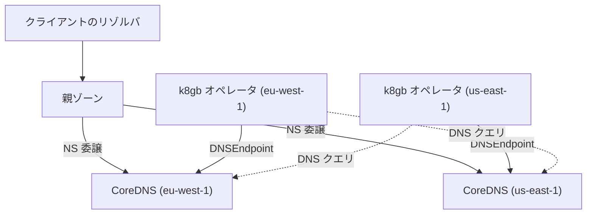

# アーキテクチャ

## 全体像

k8gb にグローバルなコンポーネントは 1 つも無い。どのクラスタも同じ 3 つのものを動かし、互いに直接ではなく DNS の仕組みを通じて協調する。

親ゾーン、たとえば `example.com` が、`cloud.example.com` のようなサブゾーンを各 k8gb クラスタの CoreDNS に委譲する。つまり、それらの CoreDNS はすべて同じゾーンの権威サーバになる。`app.cloud.example.com` を尋ねたリゾルバはそのうちのどれかに届き、そのクラスタが持つ「いま艦隊全体でどのエンドポイントが健全か」という見解を受け取る。

点線 2 本がクラスタ間の話のすべて。各オペレータが相手クラスタの CoreDNS に `localtargets-` レコードを、ごく普通の DNS クエリで尋ねる。詳細は [内部実装](./internals) にある。

## コンポーネント

### オペレータ

`main.go` と `controllers/`。`sigs.k8s.io/controller-runtime v0.24.1` の上に載る (`go.mod`)。`Gslb` リソースを reconcile し、ローカルのアプリケーションのヘルスを読み、他クラスタが何を広告しているかを調べ、各ホスト名の最終的な答えを決め、それを DNS レコードとして書き出す。

### `k8s_crd` プラグイン入りの CoreDNS

各クラスタは k8gb 専用の CoreDNS ビルドを動かす。クラスタ本来の CoreDNS ではない。Helm チャートの既定イメージは `registry.k8gb.io/k8gb-io/k8s_crd` (`chart/k8gb/values.yaml:119`)。このプラグインにより CoreDNS が `DNSEndpoint` カスタムリソースから直接ゾーンを提供するので、オペレータの出力は Kubernetes オブジェクト 1 つで済み、ゾーンファイルの reload も要らない。

`DNSEndpoint` は k8gb の型ではない。external-dns 由来 (`sigs.k8s.io/external-dns v0.21.0`、`go.mod`) で、「コントローラが管理する DNS レコード」の既存かつ十分に理解された表現をそのまま借りている。

### external-dns と DNS プロバイダ

親ゾーンに置くレコード、つまりサブゾーンを各クラスタへ委譲する NS レコードは、external-dns が組織の実際の DNS へ書き込む。バックエンドの選択は `controllers/providers/dns/factory.go:48`。`DNSTypeExternal` が external-dns の対応するものすべて (Route 53、Azure DNS、NS1、Cloudflare、RFC 2136、Windows DNS。それぞれ `docs/deploy_*.md` にページがある) を覆い、`DNSTypeInfoblox` は専用クライアント (`controllers/providers/dns/infoblox-client.go`) を使う。

### CRD

ユーザーが書くのは `Gslb`。その `Strategy` (`api/v1beta1/gslb_types.go:31`) が持つのは以下。

| フィールド | 意味 |
| --- | --- |
| `Type` | `roundRobin` / `geoip` / `failover` |
| `PrimaryGeoTag` | どのクラスタが primary か。`failover` では必須 |
| `Weight` | リージョンから重みへの map |
| `DNSTtlSeconds` | k8gb が発行するレコードの TTL |
| `SplitBrainThresholdSeconds` | 他クラスタが裏付けなくなった見解をどれだけ信じ続けるか |

`ZoneDelegation` は委譲されたゾーンを表す。`k8gb.absa.oss` グループの旧 `Gslb` も、[歴史](./history) で述べた移行のため残っている。

## リクエストの流れ

重要な流れは 2 つあり、混同しやすい。1 つはリクエスト時のクライアントの名前解決。もう 1 つはオペレータの reconcile で、その名前解決が何を返すかを決めるほう。

reconcile は `controllers/gslb_controller_reconciliation.go:77` (`Reconcile`)。

1. `:83` クラスタにまだ公開 IP が無ければ早々に抜ける。広告するアドレスが無いなら公開するものも無い。
2. `:105` 戦略を解決する。
3. `:118-130` `Gslb` に `resourceRef` が無ければ、`Gslb` 自体から Ingress を作る。これが embedded モードで、もう一方は既存の Ingress を指すやり方。
4. `:140` 参照先から server (ホスト名とバックエンド) を取り、`:146-151` で委譲済みゾーンに入っていないホストを落とす。誰も委譲していないゾーンのレコードを提供しても何も起きない。
5. `:165` このクラスタが外から到達可能な IP を解決する。
6. `:181` ローカルのエンドポイントからアプリケーションのヘルスを計算する。
7. `:190-217` `DNSEndpoint` カスタムリソースを組み立てて保存する。クラスタ間の問い合わせと戦略の適用はここで起きる。どちらも [内部実装](./internals) で扱う。
8. `:220` `Gslb` の status を更新し、`:231` で requeue する。

8 番目がこの設計の縮図になっている。他クラスタへの watch は無い。接続そのものが無いからだ。ループはただタイマーで回り直す。コードもそう言っている。"Everything went fine, requeue after some time to catch up with external Gslb status" (`:227-229`)。

## 主要な設計判断

**コントロールプレーンも、クラスタ間 API も無い。** クラスタは互いの Kubernetes API サーバと会話しない。唯一の経路は DNS で、それはどのみち経路上にある。これによりマルチクラスタの通常の前提条件、つまりネットワーク到達性・資格情報・信頼の構成がすべて不要になり、「協調レイヤは落ちているがアプリケーションは無事」という典型的な故障モードも消える。代償として、あるクラスタが持つ他クラスタの知識は、ポーリング間隔の分だけ古く、DNS の正しさの分だけしか正しくない。

**各クラスタが独立に判断する。** どのオペレータも、自分の視点だけで全ホスト名の答えを計算する。合意も、リーダーも、共有状態も無い。2 つのクラスタの見解が食い違うことはあり、短時間なら実際に起きる。`SplitBrainThresholdSeconds` (`api/v1beta1/gslb_types.go:41`) が存在するのは、それを防ぐのではなく受け入れているから。

**イベントの push ではなくタイマーの pull。** `:231` の requeue が同期機構のすべてで、隣の TODO が「外部イベントへのより賢い反応」が望ましいことを認めている。

**DNS レイヤを自作せず external-dns を再利用する。** 内部表現に `DNSEndpoint` を使うことで、external-dns が既に対応しているプロバイダがそのまま使え、CoreDNS のプラグインも同じオブジェクトを読む。

**IPv4 のみ、意図的に。** `localtargets-*` レコードも最終的なレコードも A レコードで、設定の help 文がその理由で IPv6 を拒否すると書いている (`controllers/resolver/config.go:59`)。reconciler はアドレスをバージョンで分けて IPv4 だけ残す (`gslb_controller_reconciliation.go:173`)。

## 拡張ポイント

- **DNS プロバイダ**: `controllers/providers/dns/` に `Provider` インタフェースとファクトリ (`factory.go:48`) がある。独自実装は Infoblox のみで、他は external-dns 経由。
- **geo タグ**: 各クラスタに geo タグを付ける。`controllers/geotags/` は動的な導出にも対応している (`docs/dynamic_geotags.md`)。インストールごとに固定値を焼き込まなくてよい。
- **参照の解決**: `Gslb` は Ingress でも Service でも指せる (`controllers/refresolver/`)。アプリケーションが既に使っている公開方法の上に重ねられる。
- **可観測性**: Prometheus メトリクス (`controllers/providers/metrics/`)、`grafana/` のダッシュボード、OpenTelemetry トレース (`controllers/tracing/`)。
