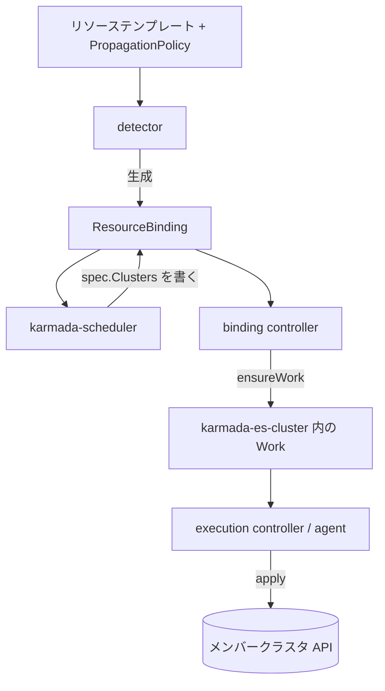

# アーキテクチャ

## 全体像

Karmada は独立したコントロールプレーンである: 専用の `karmada-apiserver` と etcd が、素の Kubernetes リソーステンプレートと Karmada の CRD の両方を保持する。メンバークラスタは `Cluster` オブジェクトとして登録される。コントローラ群とスケジューラが、1 つのテンプレートと `PropagationPolicy` を、クラスタごとの `Work` オブジェクトに変換する。`Work` はコントロールプレーン (Push) かメンバー内のエージェント (Pull) によってメンバークラスタへ適用される。各コンポーネントは `cmd/` 配下の cobra アプリで、`func main` が `app.NewXxxCommand` を呼ぶ。

## コンポーネント

### karmada-controller-manager

中核プロセス。リソース detector と、`ResourceBinding` および `Work` を構築するコントローラ群を駆動する。エントリポイントは `cmd/controller-manager/controller-manager.go:30`。

### karmada-scheduler

各 `ResourceBinding` にクラスタを割り当てる。filter/score/select/assign パイプラインを動かし、結果を binding の `spec.Clusters` に書き戻す。`cmd/scheduler` と `pkg/scheduler` 配下。

### karmada-agent

Pull モード用。メンバークラスタ内で動作し、コントロールプレーンへ外向きに接続して `Work` をローカルに適用する。`cmd/agent` 配下。

### 補助コンポーネント

- `karmada-aggregated-apiserver` (`cmd/aggregated-apiserver`): `cluster/proxy` などの集約 API。
- `karmada-search` (`cmd/karmada-search`): クラスタ横断のリソース検索とキャッシュ。
- `karmada-descheduler` と `karmada-scheduler-estimator` (`cmd/descheduler`, `cmd/scheduler-estimator`): 再スケジュールとメンバークラスタの実残容量見積もり。
- `karmada-metrics-adapter` (`cmd/metrics-adapter`): federated HPA 向けにクラスタ横断でメトリクスを集約。
- `karmada-webhook` (`cmd/webhook`): admission。
- `karmadactl` / `kubectl-karmada` (`cmd/karmadactl`, `cmd/kubectl-karmada`): CLI。`init` がコントロールプレーンを構築する (`pkg/karmadactl/cmdinit/cmdinit.go:121`)。
- `operator/`: Karmada インスタンスを `Karmada` CRD で宣言管理する。

## リクエストの流れ

1 個の `Deployment` をメンバークラスタへ配布する流れ:

1. detector が `pkg/detector/detector.go:231` (`Reconcile`) でテンプレート変更を拾い、`PropagationPolicy` をマッチさせ `ApplyPolicy` (`detector.go:441`) を適用する。`BuildResourceBinding` (`detector.go:822`) が `ResourceBinding` を生成し、その `spec.Resource` がテンプレートを参照、`spec.Placement` がポリシーの配置ルールを持つ。
2. スケジューラが `pkg/scheduler/scheduler.go:359` (`scheduleNext`) で反応し、`doScheduleBinding` (`scheduler.go:395`) から `scheduleResourceBinding` (`scheduler.go:571`)、affinity ベースの配置では `scheduleResourceBindingWithClusterAffinity` (`scheduler.go:590`) を経て `s.Algorithm.Schedule(...)` (`scheduler.go:600`) を呼ぶ。
3. スケジューリングアルゴリズム本体は `pkg/scheduler/core/generic_scheduler.go:71` (`Schedule`)。filter プラグイン (`findClustersThatFit`, `generic_scheduler.go:119`)、score プラグイン (`prioritizeClusters`, `generic_scheduler.go:166`)、`selectClusters` (`generic_scheduler.go:196`, `core/common.go:34` の `SelectClusters`)、`assignReplicas` (`generic_scheduler.go:201`, `core/common.go:51` の `AssignReplicas`) を順に走らせる。スケジューラは結果を binding の `spec.Clusters` に patch する (`patchScheduleResultForResourceBinding`, `scheduler.go:610`)。
4. binding コントローラが `pkg/controllers/binding/binding_controller.go:70` (`Reconcile`) で `syncBinding` (`binding_controller.go:110`)、続いて `ensureWork` (`pkg/controllers/binding/common.go:53`) を呼ぶ。対象クラスタごとに workload を DeepCopy し、レプリカ数をスケジュール結果で上書きし、override ポリシーを適用 (`common.go:109`) し、per-cluster の実行 namespace `karmada-es-<cluster>` に `Work` を生成する。
5. execution コントローラが `pkg/controllers/execution/execution_controller.go:82` (`Reconcile`) で `syncWork` (`execution_controller.go:151`)、`syncToClusters` (`execution_controller.go:266`) を呼び、各マニフェストを `ObjectWatcher.Create`/`Update` (`execution_controller.go:324`, `:332`) でメンバー API に適用し、成功で `Work` に Applied を立てる (`execution_controller.go:302`)。

`pkg/controllers/status` 配下の status コントローラ群が逆向きに走り、各メンバーの実状態を `Work` から `ResourceBinding`、テンプレートへ集約する。

## 主要な設計判断

- **Push と Pull**: Push はコントロールプレーンがメンバー API を直接叩く。Pull は `karmada-agent` が外向きに接続するため、NAT やファイアウォール背後のクラスタでも動く ([karmada.io](https://karmada.io/))。
- **テンプレートは触らず、レプリカはスケジューリングが所有**: `ensureWork` は workload のレプリカ数を常にスケジュール結果で上書きし、テンプレートを信用しない。手で書き換えたテンプレートがスケジューラの quota や queue 計上を迂回できないようにするためである (`pkg/controllers/binding/common.go:80-96`)。
- **クラスタごとの実行隔離**: 各メンバークラスタの `Work` は専用 namespace `karmada-es-<cluster>` に置かれ (`pkg/util/names/names.go:80,92`)、配布状態を宛先ごとに分離する。

## 拡張ポイント

- **PropagationPolicy / ClusterPropagationPolicy と OverridePolicy** CRD で配置とクラスタごとのカスタマイズを制御する (`pkg/apis/policy/v1alpha1/propagation_types.go:52`)。
- **Resource Interpreter Framework**: インターフェース (`pkg/resourceinterpreter/interpreter.go:50`) と、Lua スクリプト実装 (`ResourceInterpreterCustomization` CRD) により、任意の CRD についてレプリカの読み取り・改訂・status 集約を Karmada に教える。
- **スケジューラフレームワークのプラグイン**: filter と score プラグイン。スコアは 0..100 に制限される (`pkg/scheduler/framework/interface.go:39-42`)。
- **Admission webhook** (`cmd/webhook`)。
