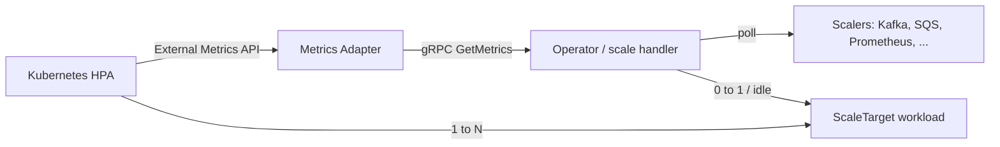

# アーキテクチャ

## 全体像

KEDA は `make build` が生成する 3 バイナリ、operator (manager)・metrics adapter・admission webhooks として動く ([2], `Makefile:211`)。operator は reconcile・scaler のポーリング、そして HPA にできない 0→1 / idle スケールを担う。adapter は Kubernetes External Metrics API を実装するが自分では何も計算せず、すべてのメトリクス問い合わせを gRPC で operator に転送する。KEDA が作成・管理する HPA は依然として 1→N のスケールを決める。

## コンポーネント

### Operator (controller manager)

エントリポイントは `cmd/operator/main.go` (`func main` は `:69`)。`ScaledObject`・`ScaledJob`・`TriggerAuthentication` を reconcile し、scaler をポーリングし、activation/deactivation を実行する。同じプロセス内で gRPC の Metrics Service サーバを起動する: `metricsservice.NewGrpcServer(&scaledHandler, ...)` ([2], `cmd/operator/main.go:355`)。

### Metrics Adapter

エントリポイントは `cmd/adapter/main.go` (`func main` は `:226`)。custom-metrics-apiserver の上に External Metrics API を実装し HPA の問い合わせに答える。スケーリング状態は持たず、operator への gRPC クライアントを `metricsservice.NewGrpcClient(...)` で開き ([2], `cmd/adapter/main.go:115`)、`kedaprovider.NewProvider(...)` で包む ([2], `cmd/adapter/main.go:126`)。

### Admission Webhooks

エントリポイントは `cmd/webhooks/main.go`。`ScaledObject`・`ScaledJob` を admit 前に検証する。

## リクエストの流れ

HPA からメトリクス値が返るまでの 1 クエリを追う:

1. HPA が External Metrics API を叩き `KedaProvider.GetExternalMetric` に届く ([2], `pkg/provider/provider.go:75`)。provider は label selector から所有 ScaledObject 名を `selector.Get(kedav1alpha1.ScaledObjectOwnerAnnotation)` で取り出す ([2], `pkg/provider/provider.go:99`)。
2. adapter は値を計算しない。gRPC で転送する: `p.grpcClient.GetMetrics(ctx, scaledObjectName, namespace, info.Metric)` ([2], `pkg/provider/provider.go:107`)。接続が未確立なら `WaitForConnectionReady` でブロックする ([2], `pkg/provider/provider.go:87`)。
3. operator 側では gRPC ハンドラが `scaleHandler.GetScaledObjectMetrics` を呼ぶ ([2], `pkg/scaling/scale_handler.go:585`)。`getScalersCacheForScaledObject` で scalers cache を引き ([2], `pkg/scaling/scale_handler.go:590`)、トリガごとに fan-out して scaler 単位で goroutine を足す (`:635`/`:666` の `wg.Add(1)`)。
4. 各 scaler は `Scaler` インターフェースを実装する ([2], `pkg/scalers/scaler.go:44`)。具体 scaler は trigger type 文字列をキーにした `buildScaler` の switch から生成される ([2], `pkg/scaling/scalers_builder.go:123`)。
5. 結果は `external_metrics.ExternalMetricValueList` として adapter 経由で HPA に返り、HPA が 1→N のスケールを決める。

別系統で operator は 0→1 と idle のパスを自分で駆動する。HPA の下限が 1 レプリカだからだ。reconcile 起点の scale loop が `scaleExecutor.RequestScale` を呼び ([2], `pkg/scaling/executor/scale_scaledobjects.go:40`)、active なら zero/idle から上げ、inactive なら zero/idle へ下げる方向に分岐する ([2], `pkg/scaling/executor/scale_scaledobjects.go:73-117`)。

`ScaledObject` の reconcile 本体は `reconcileScaledObject` ([2], `controllers/keda/scaledobject_controller.go:231`) で、`Reconcile` から到達する ([2], `controllers/keda/scaledobject_controller.go:155`)。pause 判定 (`:240`)、`checkTargetResourceIsScalable` でターゲットが scalable か確認 (`:280`)、トリガ検証 (`:290`)、`ensureHPAForScaledObjectExists` で HPA を保証 (`:301`)、generation 変化時に `requestScaleLoop` で scale loop を起動する (`:318`)。

## 主要な設計判断

- **operator と adapter の分離 + gRPC 委譲。** adapter は External Metrics API を名乗るが値を持たず、すべての読み取りを `GetMetrics` で operator に委ねる ([2], `pkg/provider/provider.go:107`)。スケーリング状態を operator に一元化し、adapter をステートレスに保つ。
- **0→1 は HPA でなく operator の仕事。** HPA は 1 レプリカ未満に落とせないため、KEDA は activation/deactivation を `RequestScale` の分岐で行い ([2], `pkg/scaling/executor/scale_scaledobjects.go:73-117`)、1→N を HPA に任せる。この役割分担が KEDA の肝だ。

## 拡張ポイント

- **CRD**: `apis/keda/v1alpha1/` で定義される `ScaledObject`・`ScaledJob`・`TriggerAuthentication`・`ClusterTriggerAuthentication` ([2])。
- **Scaler インターフェース**: サードパーティと内蔵 scaler が `Scaler` を実装する ([2], `pkg/scalers/scaler.go:44`)。プッシュ型の `PushScaler` は `Run(ctx, active chan<- bool)` を足す ([2], `pkg/scalers/scaler.go:57`)。
- **認証プロバイダ**: `TriggerAuthenticationSpec` が Pod Identity・Kubernetes secret・HashiCorp Vault・Azure Key Vault などから認証情報を解決する ([2], `apis/keda/v1alpha1/triggerauthentication_types.go:75`)。
