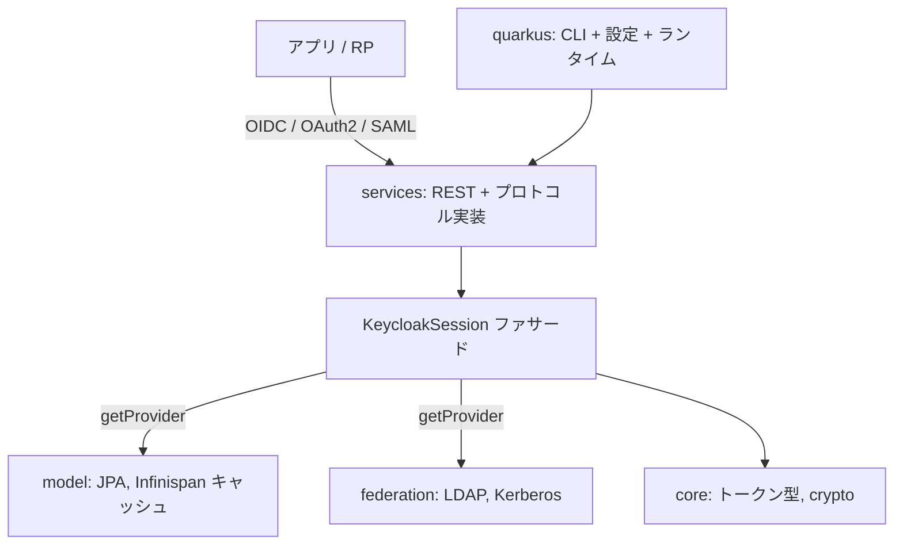

# アーキテクチャ

## 全体像

Keycloak は Maven マルチモジュールの Java プロジェクトで、単一の Quarkus サーバ配布物にビルドされる。ルートの `pom.xml` がモジュール群を集約し、`maven.compiler.release` を 17 に固定する (`pom.xml:36`)。動作するサーバは `@QuarkusMain` を付けた Quarkus エントリポイントから起動する (`quarkus/runtime/src/main/java/org/keycloak/quarkus/runtime/KeycloakMain.java:58-71`)。

設計の軸は SPI + ProviderFactory パターンである。ほぼすべての機能が実行時に解決される interface であり、ストレージバックエンド・プロトコル・認証ステップを呼び出し側に触れずに差し替えられる。中心となるファサードが `KeycloakSession` である (`server-spi/src/main/java/org/keycloak/models/KeycloakSession.java:35`)。

## コンポーネント

### server-spi / server-spi-private

拡張ポイントの interface 群。`KeycloakSession` は全 Provider とコンテキストへ到達するファサードである (`server-spi/src/main/java/org/keycloak/models/KeycloakSession.java:35`)。ドメインモデルの interface (`RealmModel`, `ClientModel`, `UserModel`, `UserSessionModel`) は `server-spi/src/main/java/org/keycloak/models/` 配下にある。

### services

サーバの本体。OIDC・SAML・admin REST API・認証フローの REST エンドポイントとプロトコル実装が入る。OIDC トークンエンドポイントもここにある (`services/src/main/java/org/keycloak/protocol/oidc/endpoints/TokenEndpoint.java:121`)。

### model

永続化バックエンドの実装。リレーショナルストレージ向けの JPA、キャッシュとセッション状態向けの Infinispan。

### core

`AccessToken` や `IDToken` などの共有トークン表現と暗号プリミティブ (`core/src/main/java/org/keycloak/representations/AccessToken.java:40`)。

### quarkus

実際に動く配布物。picocli の CLI、Quarkus 統合、設定マッパー。エントリポイントは `quarkus/runtime/src/main/java/org/keycloak/quarkus/runtime/KeycloakMain.java:58-71`。

### crypto, saml-core, authz, federation, operator, js, themes, adapters

補助モジュール群。暗号、SAML core、Authorization Services / UMA (`authz`)、LDAP/Kerberos ユーザフェデレーション (`federation`)、Kubernetes Operator (`operator`)、React 製 Admin/Account コンソールと adapters (`js`)、テーマ (`themes`)。

## リクエストの流れ

OIDC トークン交換 (`POST /realms/{realm}/protocol/openid-connect/token`) を追う。

1. `TokenEndpoint.processGrantRequest()` が JAX-RS のエントリ。まず RFC 6749 に従い `Cache-Control: no-store` と `Pragma: no-cache` をセットする (`services/src/main/java/org/keycloak/protocol/oidc/endpoints/TokenEndpoint.java:121,133-134`)。
2. `checkSsl()`・`checkRealm()`・`checkGrantType()` を実行する (`TokenEndpoint.java:136-138`)。
3. grant 種別を SPI provider として解決する: `session.getProvider(OAuth2GrantType.class, grantType)`。未知の grant は `unsupported_grant_type` になる (`TokenEndpoint.java:220-223`)。
4. 制御は `grant.process(context)` へ渡る (`TokenEndpoint.java:171`)。authorization_code フローでは `AuthorizationCodeGrantType.process()` がそれにあたる (`services/src/main/java/org/keycloak/protocol/oidc/grants/AuthorizationCodeGrantType.java:76`)。
5. grant は共有基底クラス `OAuth2GrantTypeBase.createTokenResponseBuilder()` を通じてレスポンスを構築する (`services/src/main/java/org/keycloak/protocol/oidc/grants/OAuth2GrantTypeBase.java:114`)。

## 主要な設計判断

全機能は `KeycloakSession.getProvider(Class<T>, String id)` で解決される SPI である (`KeycloakSession.java:52,64`)。`session.users()`・`session.sessions()`・`session.realms()` といったショートカットも同じ SPI 解決のラッパである (`KeycloakSession.java:148,192,224`)。`KeycloakSession` はリクエスト 1 本につき 1 つ生き、realm・client・HTTP のコンテキストを保持する。

realm がテナント境界、user session が SSO セッション、client が relying party にあたる。これらは `server-spi/src/main/java/org/keycloak/models/` のモデル interface として現れるため、永続化の実装は差し替え可能である。

## 拡張ポイント

SPI 面そのものが拡張モデルである。サードパーティは provider interface (ストレージ、authenticator、protocol mapper、grant 種別) を実装し、Keycloak が id で解決する。grant 種別自体も SPI provider であり、`authorization_code`・`refresh_token`・`client_credentials`・`password`・`token-exchange`・CIBA・device・JWT bearer・UMA・pre-authorized があり、`services/src/main/java/org/keycloak/protocol/oidc/grants/` 配下に実装される。
