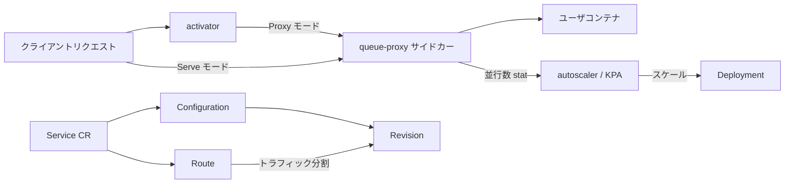

# アーキテクチャ

## 全体像

Knative Serving はコントロールプレーンとデータプレーンに分かれる。コントロールプレーンはカスタムリソースを監視し、Kubernetes オブジェクトを desired state へ寄せる reconciler 群である。データプレーンは実際のリクエストトラフィックを運び、負荷の計測値を autoscaler に返す。コントロールプレーンは `cmd/` 配下の複数プロセスとして動き、各々が個別の Pod としてデプロイされる。

## コンポーネント

### コントロールプレーン: cmd/controller

単一バイナリが複数の reconciler を相乗りで起動する。常に動く一式は `ctors` スライスに登録される (`cmd/controller/main.go:56`): `configuration`、`labeler`、`revision`、`route`、`serverlessservice`、`service`、`gc`、`nscert`、`domainmapping`。cert-manager の CRD が存在すると `certificate` reconciler が実行時に追加される (`cmd/controller/main.go:80`)。`main()` はこれらすべてを `sharedmain.MainWithConfig` で配線する (`cmd/controller/main.go:92`)。

### コントロールプレーン: autoscaler

`cmd/autoscaler` は Knative Pod Autoscaler (KPA) を動かし、並行数または RPS の計測値から desired レプリカ数を計算する。`cmd/autoscaler-hpa` は、代わりに HPA オートスケーリングクラスを選んだ Revision を橋渡しする。

### データプレーン: activator

`cmd/activator` はゼロスケールを成立させる要素である。Revision のレプリカが 0 のとき、リクエストは activator にルーティングされ、activator がそれをバッファして接続を保持しつつ autoscaler に Revision の増設を要求し、Pod が ready になると転送する。

### データプレーン: queue-proxy

`cmd/queue` は全ユーザ Pod にサイドカーとして注入される。ユーザコンテナの手前に座り、Revision 単位の並行数上限を強制し、ライブの並行数を autoscaler に報告する。この報告が autoscaler の主要な入力シグナルである。

### Webhook

`cmd/webhook` は Serving CRD の admission / defaulting / conversion webhook を提供する。Service の spec は、inline した Route フィールドで表現できる内容をこの webhook で制限する (`pkg/apis/serving/v1/service_types.go:71`)。

## リクエストの流れ

代表的なコントロールプレーン操作は、`Service` を apply して Revision と Route が生まれる様子を追うことである。

1. `service` reconciler が `ReconcileKind` を受け (`pkg/reconciler/service/service.go:72`)、`pkgreconciler.DefaultTimeout` で ctx を区切る (`pkg/reconciler/service/service.go:73`)。
2. 子の `Configuration` を取得または生成する (`pkg/reconciler/service/service.go:78`)。生成は `resources.MakeConfiguration` を呼ぶ (`pkg/reconciler/service/service.go:203`)。
3. Configuration の generation が status でまだ observed されていなければ、Service は `MarkConfigurationNotReconciled` で保留される (`pkg/reconciler/service/service.go:85`)。BYO-Revision 名指定時はここで return して reconcile を直列化する。
4. 別の `configuration` reconciler が走り (`pkg/reconciler/configuration/configuration.go:59`)、現在のテンプレートに対応する Revision が無ければ immutable な Revision を新規生成する (`pkg/reconciler/configuration/configuration.go:69`)。
5. Service reconciler に戻り、`route` 経由で `Route` を取得または生成する (`pkg/reconciler/service/service.go:152`)。
6. `checkRoutesNotReady` (`pkg/reconciler/service/service.go:175`) が Route の spec トラフィックと status トラフィックを比較し、差分があれば Service を not-ready にマークする。

Revision が Ready になると、`revision` と `serverlessservice` reconciler が Deployment と ServerlessService を立ち上げ、データプレーンが稼働する。

## 主要な設計判断

Service / Configuration / Revision / Route の分割は、変更のたびに immutable な Revision を生み、Route が Revision 群へ百分率でトラフィックを移せるようにするためにある。`Service` オブジェクトは制限のない `ConfigurationSpec` と、webhook で制限された `RouteSpec` を inline する (`pkg/apis/serving/v1/service_types.go:71`)。だからこそ Service は完全な Configuration を表現できるが、Route は制約付きでしか表現できない。

ゼロスケールは固定スケジュールではなくデータプレーン側から駆動される。`ServerlessService` (SKS) が、activator をリクエストパスに残すか (Proxy モード)、Pod へ直結するか (Serve モード) を選ぶ。2 つのモードは vendor 化されたネットワーキング API で定義される (`vendor/knative.dev/networking/pkg/apis/networking/v1alpha1/serverlessservice_types.go:86`)。autoscaler がバースト余力に基づいてこれを切り替える点は [内部実装](./internals) で扱う。

## 拡張ポイント

- カスタムリソース: `Service`、`Configuration`、`Revision`、`Route`、`DomainMapping` が公開 API 面である。
- ネットワーキング層: Serving は ingress を差し替え可能な層 (Istio、Contour、Kourier、または Gateway API 実装) に委譲する。
- 証明書: cert-manager の CRD がインストールされていると、オプションの `certificate` reconciler が統合する (`cmd/controller/main.go:80`)。
- オートスケーリングクラス: Revision は KPA を使うか、`cmd/autoscaler-hpa` 経由で Kubernetes HPA へ委譲できる。
