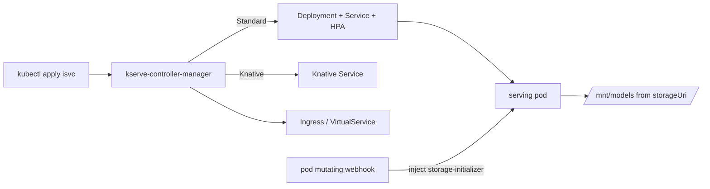

# アーキテクチャ

## 全体像

KServe は 2 面構成。control plane は Go の `kserve-controller-manager` で、CRD を素の Kubernetes オブジェクトに reconcile する controller-runtime バイナリ。`main()` は `cmd/manager/main.go:99` にあり、Manager を構築し、`InferenceServiceReconciler` などを登録し、admission webhook を提供する。leader 選出された単一プロセスとして動く (`LeaderLockName = "kserve-controller-manager-leader-lock"`, `cmd/manager/main.go:56`)。

data plane は実際に推論する pod 群。Python の KServe ランタイム、または Triton / TorchServe といったサードパーティサーバである。各 serving pod にはモデルを共有ボリュームへ落とす `storage-initializer` init container と、任意の agent / router / batcher / logger サイドカーが付く。

## コンポーネント

### control plane: kserve-controller-manager

中核 CRD を実行オブジェクトに reconcile する。`InferenceServiceReconciler.Reconcile` ループは `pkg/controller/v1beta1/inferenceservice/controller.go:121`。デプロイモード解決、finalizer、component reconciler、ingress、model config、status を担う。他のバイナリは `cmd/` 配下に `agent`、`router`、`llmisvc`、`localmodel`、`localmodelnode` がある。

### 中核 CRD

- `InferenceService` (`isvc`): メイン API。`v1beta1` が storage version (`pkg/apis/serving/v1beta1/inference_service.go:147`)。`Predictor` 必須、`Transformer` / `Explainer` は任意 (`inference_service.go:24-35`)。
- `ServingRuntime` / `ClusterServingRuntime` (`pkg/apis/serving/v1alpha1/servingruntime_types.go:222`, `:248`): モデルフォーマットごとの pod テンプレートと自動選択。
- `InferenceGraph` (`pkg/apis/serving/v1alpha1/inference_graph.go:35`): 複数モデルのルーティング/アンサンブルを DAG で記述。
- `LLMInferenceService` (`pkg/apis/serving/v1alpha1/llm_inference_service_types.go:60`): 生成 AI 向けリソース。

### data plane: serving pod とサイドカー

`python/kserve/kserve` 配下の Python サーバが V1 / V2 (Open Inference Protocol) API を喋る。`storage-initializer` init container、agent、router、batcher、logger が serving pod に付き、モデルダウンロード・ルーティング・マイクロバッチ・リクエストログを担う。

## リクエストの流れ

`kubectl apply -f isvc.yaml` から推論 pod が立つまで:

1. 入口。`InferenceServiceReconciler.Reconcile` が `isvc` を取得。NotFound なら finalizer 駆動の GC のため early return (`controller.go:121`)。
2. 設定とモード。`GetInferenceServiceConfigMap` で `inferenceservice-config` ConfigMap を読み (`controller.go:133`)、`GetDeploymentMode` でデプロイモードを解決 (`controller.go:154`)。
3. finalizer。`inferenceservice.finalizers` が無ければ merge patch で付与 (`controller.go:176-187`)。`DeletionTimestamp` があればクリーンアップ後に finalizer を外す。
4. component。`Standard`/`Knative` なら `components.NewPredictor` を追加し、spec にあれば Transformer / Explainer も追加して各 reconciler を実行 (`controller.go:273`)。
5. Predictor 分岐。`Predictor.Reconcile` (`pkg/controller/v1beta1/inferenceservice/components/predictor.go:85`) がモードで分岐。`Standard` は `reconcileRawDeployment` から `raw.NewRawKubeReconciler` で Deployment + Service + HPA (`predictor.go:204`, `:771`)、`Knative` は `knative.NewKsvcReconciler` で Knative Service (`predictor.go:836`)。
6. ingress。ファクトリがモード別の ingress reconciler を `CreateIngressReconciler` で生成 (`controller.go:362`)。
7. status。`modelconfig.NewModelConfigReconciler(...).Reconcile` を実行 (`controller.go:394`) し、`updateStatus` で URL・conditions・components を書く (`controller.go:402`)。

## 主要な設計判断

- webhook による storage-initializer 注入。モデルはサーバイメージに焼かず、mutating webhook が init container を追加して `storageUri` から共有 `emptyDir` の `/mnt/models` に落とす (`pkg/webhook/admission/pod/storage_initializer_injector.go:441`, `:483`)。汎用ランタイムイメージ 1 つで任意のモデルを配れる。
- ランタイム自動選択。`isvc` がモデルフォーマットを指定すると、`AutoSelect=true` かつ `Priority` 最大の `ServingRuntime` が選ばれる (`pkg/apis/serving/v1alpha1/servingruntime_types.go:31`)。ランタイムイメージを直接指定しなくてよい。
- デフォルトモードは素の Kubernetes である `Standard` (`pkg/constants/constants.go:554`)。Knative は scale-to-zero と canary が要る時だけの opt-in で、初期の Knative 必須という前提を反転させた。
- status は Knative の condition duck type を採用。`InferenceServiceStatus` が `duckv1.Status` を inline する (`pkg/apis/serving/v1beta1/inference_service_status.go:42`)。KFServing の Knative 由来の名残で、Knative モード時のみ `PropagateCrossComponentStatus` が readiness を集約する (`controller.go:339-340`)。

## 拡張ポイント

- 新しいモデルフォーマット/サーバ向けの `ServingRuntime` / `ClusterServingRuntime` (`servingruntime_types.go:222`, `:248`)。
- 公開 API としての CRD: `InferenceService`、`InferenceGraph`、`TrainedModel`、`LLMInferenceService`。
- Manager の webhook サーバに登録される admission webhook (mutating / validating)。
- 任意のサーバイメージが実装できる data plane の V1/V2 プロトコル契約 (`python/kserve/kserve`)。
