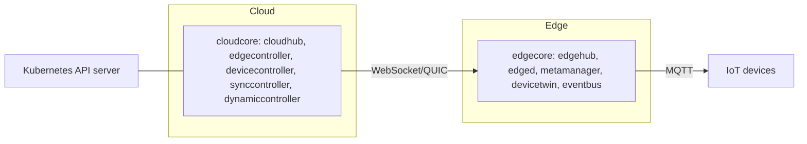

# アーキテクチャ

## 全体像

KubeEdge は互いに鏡写しの 2 プロセスを動かす。クラウド側の `cloudcore` (`cloud/cmd/cloudcore`) はエッジ接続を終端し、Kubernetes オブジェクトをエッジへ射影する。エッジ側の `edgecore` (`edge/cmd/edgecore`) はワークロードとローカルのデバイスロジックを動かす。各プロセスは Beehive 上に登録されたモジュールの集合だ。Beehive は `staging/src/github.com/kubeedge/beehive` 配下の内蔵メッセージフレームワークである。モジュールは互いを直接呼ばず、バスにメッセージを送る。2 プレーン間のリンクは単一の WebSocket または QUIC 接続だ。クラウドの `cloudhub` がそれを受け、エッジの `edgehub` がダイヤルする。

## コンポーネント

### cloudcore

`registerModules` で登録される (`cloud/cmd/cloudcore/app/server.go:165-178`)。主要モジュール: `cloudhub` はエッジ接続を終端する (`cloud/pkg/cloudhub`)。`edgecontroller` は Pod・ConfigMap・Secret をエッジへ下ろす (`cloud/pkg/edgecontroller`)。`devicecontroller` は Device/DeviceModel CRD を扱う (`cloud/pkg/devicecontroller`)。`synccontroller` はクラウドとエッジの状態を突き合わせ信頼性を保つ (`cloud/pkg/synccontroller`)。`dynamiccontroller` はエッジ側の list/watch を裏で支え、authorization と連動する (`cloud/pkg/dynamiccontroller`)。authorization は一度計算され `dynamiccontroller.Register` に渡される (`cloud/cmd/cloudcore/app/server.go:166-177`)。他に `router`・`cloudstream`・`csidriver`・`policycontroller`・`taskmanager` がある。

### edgecore

`registerModules` で登録される (`edge/cmd/edgecore/app/server.go:202-219`)。主要モジュール: `edged` はノード上で Pod ライフサイクルを管理する軽量化した kubelet (`edge/pkg/edged`)。`edgehub` は `cloudhub` への WebSocket クライアントで、クラウドリンクとローカルバスの橋渡しをする (`edge/pkg/edgehub`)。`metamanager` は gorm 経由で SQLite に置くローカルメタデータストア (`edge/pkg/metamanager`)。`devicetwin` はデバイスの desired/reported 状態を保持する (`edge/pkg/devicetwin`)。`eventbus` は IoT デバイス向けの MQTT ブローカ接続 (`edge/pkg/eventbus`)。`servicebus`・`edgestream`・`taskmanager` も登録される。

### Beehive

両プロセスが共有するフレームワークで、`staging/src/github.com/kubeedge/beehive` 配下にある。`Module` は `Name`・`Group`・`Enable`・`Start`・`RestartPolicy` を持つインターフェース (`staging/src/github.com/kubeedge/beehive/pkg/core/module.go:47-61`)。`Register` は `Enable()` が false のモジュールを `disabledModules` に入れるので、無効なモジュールは起動しない (`module.go:76-95`)。`StartModules` はモジュールごとに 1 つの goroutine を起こし、channel と Unix socket の両トランスポートに対応する (`staging/src/github.com/kubeedge/beehive/pkg/core/core.go:17-55`)。

## リクエストの流れ

クラウドから来て Pod 起動に至るメッセージを追う。

1. `edgehub.routeToEdge` が WebSocket クライアントから 1 メッセージを読む。読み取りエラー時は `reconnectChan` に通知して return し、再接続を促す (`edge/pkg/edgehub/process.go:42-61`)。
1. それを `dispatch` に渡し、`dispatch` は `msghandler.ProcessHandler` を呼ぶ (`edge/pkg/edgehub/process.go:38-40`)。
1. `ProcessHandler` は登録済みハンドラを順に辿り、最初に `Filter` が true になったものを実行する。どれも一致しなければエラーを返す (`edge/pkg/edgehub/messagehandler/handler.go:61-74`)。
1. ハンドラは `RegisterHandlers` が meta・twin・bus・task の順で登録する (`edge/pkg/edgehub/messagehandler/handler.go:51-58`)。この順序が優先度になる。
1. meta 経路のメッセージは `metamanager` に届き、DAO 経由で SQLite に永続化される。`edged` がその desired state を読んで Pod を起動する。
1. 逆方向: `routeToCloud` が `beehiveContext.Receive` でローカルバスから取り出し、rate limiter (`tryThrottle`) を通して `sendToCloud` を呼ぶ (`edge/pkg/edgehub/process.go:75-104`)。
1. リンクが生きている間、`keepalive` が `Heartbeat` 秒ごとに ping を送る (`edge/pkg/edgehub/process.go:106-128`)。

## 主要な設計判断

中心はエッジ自律性だ。`metamanager` は desired state のローカルコピーを SQLite に保つので、クラウドリンクが切れてもエッジノードは直近のワークロードを動かし続ける。メッセージヘッダは `ResourceVersion` を運ぶ。コード内コメントによれば、これは保存済み Kubernetes オブジェクトの resource version に裏打ちされ、信頼できる伝送のために使われる (`staging/src/github.com/kubeedge/beehive/pkg/core/model/message.go:77-80`)。first-match のハンドラ連鎖は、メッセージ処理の優先度がルーティングテーブルではなく登録順であることを意味する (`edge/pkg/edgehub/messagehandler/handler.go:51-74`)。

## 拡張ポイント

デバイスは Kubernetes CRD としてモデル化され、クラウドの `devicecontroller` とエッジの `devicetwin` が扱う。`eventbus` の MQTT ブリッジ (`edge/pkg/eventbus`) が物理デバイスを接続する。Beehive の `Module` 自体が拡張単位だ。インターフェースを実装して登録すればよい (`staging/src/github.com/kubeedge/beehive/pkg/core/module.go:47-61`)。`staging/src/github.com/kubeedge/mapper-framework` 配下の mapper フレームワークで、新しいプロトコル向けのデバイス mapper を生成できる。
