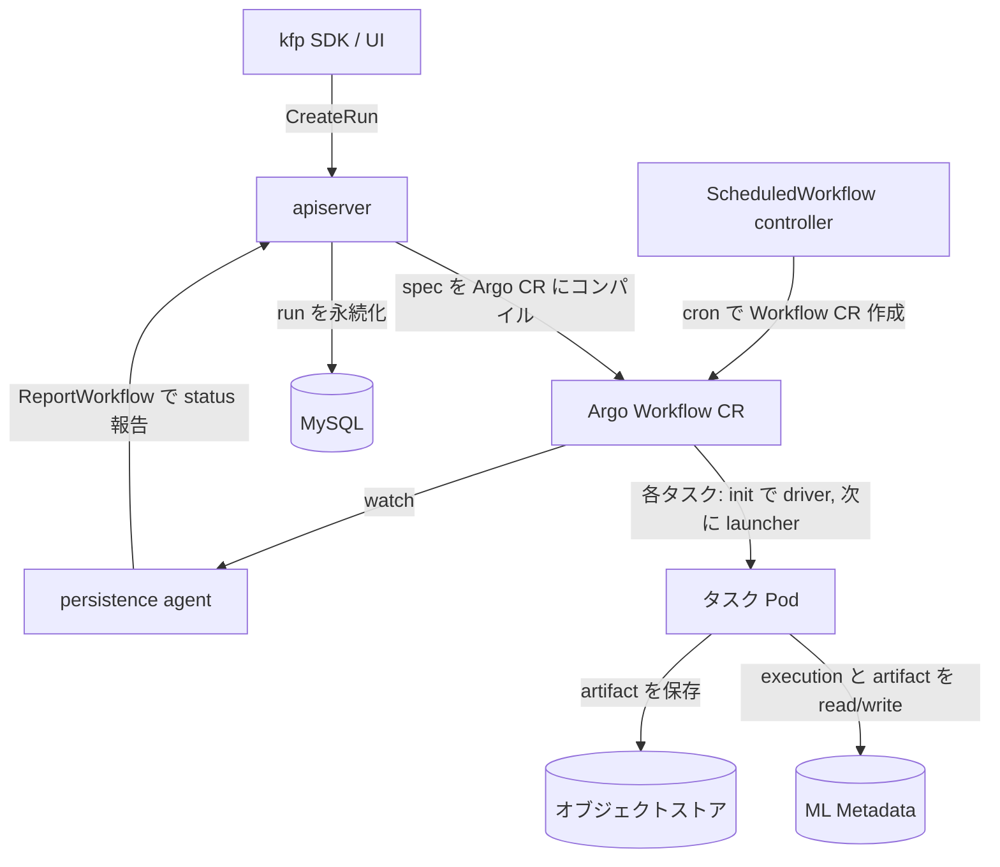

# アーキテクチャ

## 全体像

Kubeflow Pipelines はコントロールプレーンと実行プレーンに分かれる。コントロールプレーンは run・experiment・recurring run を管理する API サーバで、各パイプライン spec を Argo Workflow カスタムリソースにコンパイルする。実行プレーンは Argo Workflows で、DAG を実行し、各タスクは注入された driver と launcher に駆動される。ML Metadata (MLMD) が実行状態・キャッシュ・リネージの真実の源を握り、Persistence Agent が Workflow の status を watch して API サーバのデータベースに書き戻す。トップレベルのコンポーネントは `backend/src/` 配下にある。

## コンポーネント

### API サーバ

`backend/src/apiserver/` 配下の REST/gRPC コントロールプレーン。run・pipeline・experiment・recurring-run リソースを管理し、run 作成時に保存済み pipeline spec を Argo Workflow にコンパイルしてカスタムリソースを作る。エントリポイントは gRPC を `:8887` で提供し (`backend/src/apiserver/main.go:73`, `:340`)、grpc-gateway の REST proxy を `:8888` で提供する (`backend/src/apiserver/main.go:74`)。

### Persistence Agent

`backend/src/agent/persistence/` 配下。Argo Workflow カスタムリソースを watch し、`pipelineClient.ReportWorkflow(wf)` (`backend/src/agent/persistence/worker/workflow_saver.go:72`) で status を API サーバに報告する。これがデータベース上の run 状態を更新する。

### ScheduledWorkflow コントローラ

`backend/src/crd/controller/scheduledworkflow/` 配下の ScheduledWorkflow (SWF) CRD コントローラ。`syncHandler` (`backend/src/crd/controller/scheduledworkflow/controller.go:433`) が cron スケジュールを評価し、recurring run のための Workflow カスタムリソースを周期的に作る。

### v2 driver と launcher

`backend/src/v2/` 配下の v2 エンジン。compiler が IR を Argo Workflow に変換し、各タスクは driver (入力解決、キャッシュ判定、pod spec patch 生成) を実行してから launcher (ユーザコンテナ実行、artifact I/O、MLMD への publish) を実行する。コンテナタスクの driver エントリポイントは `Container` (`backend/src/v2/driver/container.go:47`)、launcher は `backend/src/v2/cmd/launcher-v2/` にある。

### キャッシュサーバ

`backend/src/cache/` 配下のステップ結果キャッシュサーバ。driver はタスクを実行するか判定する前にこれを参照する。

### 外部の構成要素

`frontend/` は React の UI、`sdk/` は Python の `kfp` パッケージ、`api/` は protobuf IR 定義を持つ。実行は Argo Workflows と MySQL に依存し、メタデータは MLMD に置かれる (`README.md` の compatibility matrix)。

## リクエストの流れ

run を 1 本作る処理を端から端まで:

1. gRPC ハンドラ `RunServer.CreateRun` (`backend/src/apiserver/server/run_server.go:514`) がリクエストを受け、resource manager に委譲する。
2. `ResourceManager.CreateRun` (`backend/src/apiserver/resource/resource_manager.go:651`) が `fetchTemplateFromPipelineSpec` (`:665`) で保存済み spec から Template を読み込み、`tmpl.RunWorkflow(...)` が ExecutionSpec (Argo Workflow) を生成し (`:696`)、`executionSpec.Validate` で検証する (`:700`)。
3. namespace と owner-reference の設定、plugin hook `OnBeforeRunCreation` (`:750`) の後、workflow client が Argo Workflow カスタムリソースを作成し (`:769`)、`runStore.CreateRun` が run をデータベースに永続化する (`:799`)。run は `Pending` で始まる。
4. Argo が DAG を実行する。各タスクは driver から始まる。`Container` (`backend/src/v2/driver/container.go:47`) が MLMD から pipeline と DAG を読み (`:66`, `:70`)、入力を解決し (`:79`)、出力を provision し (`:116`)、キャッシュ fingerprint と過去の execution ID を算出し (`:173`)、MLMD に Execution を作成する (`:190`)。
5. キャッシュヒット時 (`:216` 以降) は driver が過去の出力を再利用して `Execution_CACHED` を publish し (`:234`)、launcher をスキップする。ミス時は launcher (`backend/src/v2/cmd/launcher-v2/`) がユーザコンテナを実行し、artifact をオブジェクトストアと MLMD に publish する。
6. Persistence Agent が Workflow の変化を検知し、`ReportWorkflow` (`backend/src/agent/persistence/worker/workflow_saver.go:72`) を呼んでデータベース上の run 状態を更新する。
7. recurring run については、SWF コントローラの `syncHandler` (`backend/src/crd/controller/scheduledworkflow/controller.go:433`) がスケジュールに従って Workflow カスタムリソースを作る。

## 主要な設計判断

- **push 型コントロールプレーン + watch 型 status 同期**。API サーバが能動的に Workflow カスタムリソースを作り、Persistence Agent がそれを watch して非同期にデータベースを更新する。この 2 段の非同期設計は `backend/src/apiserver/resource/resource_manager.go:670` 付近の TODO コメントが説明する。
- **実行エンジン中立な ExecutionSpec 抽象**。Argo は `ExecutionSpec` interface (`backend/src/common/util/execution_spec.go:77`) の背後に隠される。プロジェクトの `CLAUDE.md` の architectural boundary policy は `*util.Workflow` への downcast と Argo 固有挙動を common パッケージに入れることを禁止している。
- **MLMD を真実の源にする**。Argo は単なる実行基盤であり、タスクごとの実行記録・キャッシュ判定・artifact リネージは MLMD の Execution と Context が握る。
- **recurring run の冪等化**。recurring run から作られた run は決定論的 UUID を持つ (`backend/src/apiserver/resource/resource_manager.go:682`)。これにより複数の SWF コントローラ replica が同じ primary key に収束し、重複 run を作らない。

## 拡張ポイント

- **run 作成時の plugin hook**。例えば `OnBeforeRunCreation` (`backend/src/apiserver/resource/resource_manager.go:750`)。
- **Template interface** (`backend/src/apiserver/template/template.go:118`)。保存済み pipeline spec を V1 または V2 の戦略でコンパイルできる。
- **カスタムリソース**。ScheduledWorkflow と Viewer の CRD、加えて KFP が生成する Argo Workflow CR。
- **protobuf IR** (`api/v2alpha1/pipeline_spec.proto:50`)。SDK とバックエンドの契約。
