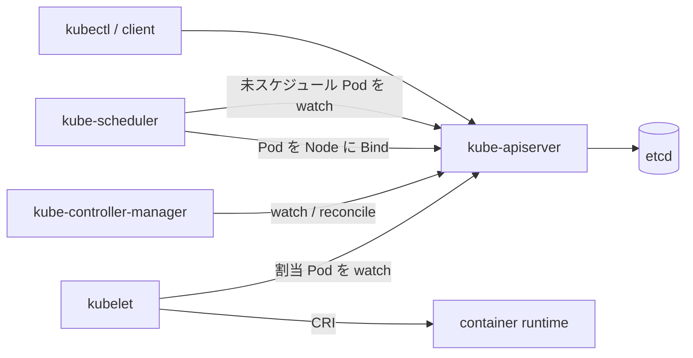

# アーキテクチャ

## 全体像

Kubernetes は中心に置かれた API サーバを取り巻くプロセス群だ。API サーバだけが真実の源である etcd と通信する。ほかのすべては API サーバの変更を watch して反応する。コントロールプレーンのコンポーネント (`kube-apiserver`, `kube-controller-manager`, `kube-scheduler`) が「何をどこで動かすか」を決め、ノードのコンポーネント (`kubelet`, `kube-proxy`) が各マシン上でそれを実現する。各コントロールプレーンのバイナリは薄い `main` を持ち、Cobra コマンドへ委譲する (例: [cmd/kube-scheduler/scheduler.go:29](https://github.com/kubernetes/kubernetes/blob/8c64324b69ac1e444979f2fddf07a63baa759e5a/cmd/kube-scheduler/scheduler.go#L29))。実装本体は `pkg/` 配下にある。

## コンポーネント

### kube-apiserver

入り口であり、etcd への唯一の書き手。API オブジェクトを検証・永続化し、ほかのすべてが購読する watch を提供する。エントリポイント: [cmd/kube-apiserver/apiserver.go:32](https://github.com/kubernetes/kubernetes/blob/8c64324b69ac1e444979f2fddf07a63baa759e5a/cmd/kube-apiserver/apiserver.go#L32)。実装は `pkg/controlplane` と `pkg/kubeapiserver` 配下。

### kube-scheduler

ノード未割当の Pod を watch し、feasible なノードを選び、binding を API サーバへ書き戻す。エントリポイント: [cmd/kube-scheduler/scheduler.go:29](https://github.com/kubernetes/kubernetes/blob/8c64324b69ac1e444979f2fddf07a63baa759e5a/cmd/kube-scheduler/scheduler.go#L29)。中核ロジックは `pkg/scheduler`。

### kube-controller-manager

組み込みのコントローラ群 (Deployment, ReplicaSet, Node など) を動かす。各コントローラはオブジェクトを watch し、観測された状態を望ましい状態へ収束させる。実装は `pkg/controller` 配下。

### kubelet

各ノードのエージェント。自ノードに割り当てられた Pod を API サーバから watch し、CRI 経由でコンテナランタイムを駆動してコンテナを起動・停止する。エントリポイント: [cmd/kubelet/kubelet.go:35](https://github.com/kubernetes/kubernetes/blob/8c64324b69ac1e444979f2fddf07a63baa759e5a/cmd/kubelet/kubelet.go#L35)。実装は `pkg/kubelet` 配下。

## リクエストの流れ

Pod 1 個のスケジューリングが代表的なパスだ。アンカーはすべて `pkg/scheduler/schedule_one.go` 内。

1. `ScheduleOne` がキューから次のエンティティを取り出し、Pod なら `scheduleOnePod` へ振り分ける ([schedule_one.go:67](https://github.com/kubernetes/kubernetes/blob/8c64324b69ac1e444979f2fddf07a63baa759e5a/pkg/scheduler/schedule_one.go#L67))。
2. `scheduleOnePod` は Pod に対応する scheduling profile を解決し、サイクル用に新しい `CycleState` を確保する ([schedule_one.go:93](https://github.com/kubernetes/kubernetes/blob/8c64324b69ac1e444979f2fddf07a63baa759e5a/pkg/scheduler/schedule_one.go#L93))。
3. `schedulingCycle` がノードスナップショットを更新し、スケジューリングアルゴリズムを走らせる ([schedule_one.go:177](https://github.com/kubernetes/kubernetes/blob/8c64324b69ac1e444979f2fddf07a63baa759e5a/pkg/scheduler/schedule_one.go#L177))。
4. `schedulePod` がノードをフィルタし、残ったものをスコアリングして最高スコアを選ぶ ([schedule_one.go:564](https://github.com/kubernetes/kubernetes/blob/8c64324b69ac1e444979f2fddf07a63baa759e5a/pkg/scheduler/schedule_one.go#L564))。
5. `prepareForBindingCycle` が Pod をキャッシュへ assume し、Reserve と Permit プラグインを走らせる ([schedule_one.go:196](https://github.com/kubernetes/kubernetes/blob/8c64324b69ac1e444979f2fddf07a63baa759e5a/pkg/scheduler/schedule_one.go#L196))。
6. binding は別 goroutine で走り、次の Pod は API 書き込みを待たない ([schedule_one.go:141](https://github.com/kubernetes/kubernetes/blob/8c64324b69ac1e444979f2fddf07a63baa759e5a/pkg/scheduler/schedule_one.go#L141))。

既定の binder は `v1.Binding` を選択ノード宛に作って API サーバへ POST する。これが Pod を実際にノードへ束縛する唯一の書き込みだ ([default_binder.go:52](https://github.com/kubernetes/kubernetes/blob/8c64324b69ac1e444979f2fddf07a63baa759e5a/pkg/scheduler/framework/plugins/defaultbinder/default_binder.go#L52))。

## 主要な設計判断

API サーバが etcd への唯一の書き手であり、ほかのすべては宣言された状態へ収束させる watcher だ。整合性モデルを 1 箇所にまとめ、コントローラを独立に動かせる。

スケジューラは Pod を自身のキャッシュへ楽観的に assume してから非同期に bind する ([schedule_one.go:141](https://github.com/kubernetes/kubernetes/blob/8c64324b69ac1e444979f2fddf07a63baa759e5a/pkg/scheduler/schedule_one.go#L141))。bind の API 往復をクリティカルパスから外すので、スケジューリングのスループットがそれに律速されない。代償として、API がまだ確定していない配置をキャッシュが一瞬保持しうる。

## 拡張ポイント

スケジューラは完全に framework プラグインから構成される。`Framework` インターフェースが拡張点を定義する: PreFilter・Filter・Score・Reserve・Permit・PreBind・Bind ([pkg/scheduler/framework/interface.go:200](https://github.com/kubernetes/kubernetes/blob/8c64324b69ac1e444979f2fddf07a63baa759e5a/pkg/scheduler/framework/interface.go#L200))。クラスタレベルでは Custom Resource Definition とコントローラ、admission webhook、ランタイム・ネットワーク・ストレージ向けの CRI・CNI・CSI インターフェースを公開する。
