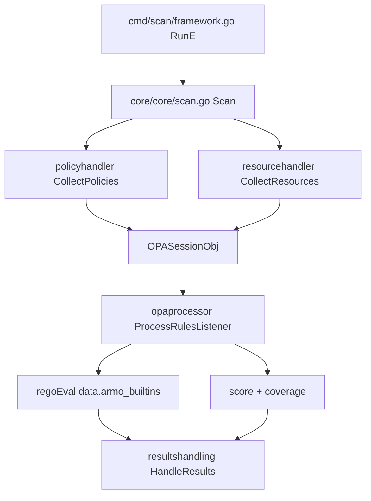

# アーキテクチャ

## 全体像

Kubescape は 2 つに分かれる。このリポジトリは CLI とスキャンエンジン本体で、リソースを収集し、ポリシーを取得し、評価し、結果を出力する。in-cluster の microservices 群 (operator、脆弱性スキャナ、node-agent、storage) は別リポジトリの `kubescape` org にあり、Helm でデプロイする。このページは CLI を扱う。

CLI のエントリポイントは小さい。`main.go:21` の `func main()` は `cmd.Execute(ctx, version, commit, date)` を呼ぶだけで、`version` / `commit` / `date` はビルド時に GoReleaser が埋める (`main.go:14-19`)。以降は `cmd/` 配下の Cobra コマンドツリーが `core/core/` のメソッド実装を駆動する。

## コンポーネント

### コマンドツリー (`cmd/`)

Cobra コマンドが表層を定義する: `scan` (framework、control、workload、image)、`fix`、`patch`、`download`、`list`、`config`、`diff`。各コマンドはフラグを検証して `core` を呼ぶ。例えば `cmd/scan/framework.go:70` が `scan framework` の `RunE` を定義する。

### スキャンエンジン (`core/core/`)

各コマンドの実装を `Kubescape` 型のメソッドとして持つ: `scan.go`、`fix.go`、`patch.go`、`image_scan.go`、`download.go`。`core/core/scan.go:183` の `Scan` が他パッケージを束ねるパイプライン。

### エンジン部品 (`core/pkg/`)

稼働パッケージ群: `policyhandler` (ポリシー取得)、`resourcehandler` (K8s / ファイル収集)、`opaprocessor` (Rego / CEL 評価)、`resourcesprioritization` (attack track 優先度付け)、`score`、`containerscan`、`fixhandler`、`vapreconcile` (ValidatingAdmissionPolicy)、`reportcrypto`、`anonymizer`、`hostsensorutils`、`resultshandling` (printer / reporter)。

### 共有型と設定 (`core/cautils/`)

共通データ構造と設定: `OPASessionObj` (`core/cautils/datastructures.go:49`)、`ScanInfo` (`core/cautils/scaninfo.go:102`)、GitHub release からポリシーを DL する `getter/`。`core/meta/ksinterface.go:11` が CLI と core の境界となる `IKubescape` インターフェースを定義する。

### 画像スキャン (`pkg/imagescan/`)

Anchore Grype と Syft をラップし、画像脆弱性スキャンと SBOM 生成を行う (`pkg/imagescan/imagescan.go`)。

## リクエストの流れ

`kubescape scan framework nsa` を追う:

1. `cmd/scan/framework.go:70` の `RunE` がフラグを検証し、`scanInfo.SetScanType(cautils.ScanTypeFramework)` (`cmd/scan/framework.go:122`) と `scanInfo.SetPolicyIdentifiers(frameworks, apisv1.KindFramework)` (`cmd/scan/framework.go:124`) を設定し、`ks.Scan(scanInfo)` (`cmd/scan/framework.go:126`) と `results.HandleResults(...)` (`cmd/scan/framework.go:131`) を呼ぶ。
2. `core/core/scan.go:183` の `Scan` がパイプラインを回す。`getInterfaces` (`core/core/scan.go:191`) で K8s クライアント、tenant config、host scanner、resource handler、reporter、printer を構築する。ポリシー getter を選ぶ (`core/core/scan.go:205` `getter.NewDownloadReleasedPolicy()`)。air-gapped 判定は `isAirGappedMode` (`core/core/scan.go:397`)。
3. ポリシー収集: `policyhandler.NewPolicyHandler(...).CollectPolicies(...)` (`core/core/scan.go:232-233`、定義は `core/pkg/policyhandler/handlepullpolicies.go:51`)。ここで `*OPASessionObj` を生成する。
4. リソース収集: `resourcehandler.CollectResources(...)` (`core/core/scan.go:242`、定義は `core/pkg/resourcehandler/handlerpullresources.go:18`) が稼働 K8s オブジェクトまたは YAML/JSON ファイルをセッションに格納する。
5. 評価: `opaprocessor.NewOPAProcessor(scanData, ...)` (`core/core/scan.go:256`) → `ProcessRulesListener(...)` (`core/core/scan.go:258`、定義は `core/pkg/opaprocessor/processorhandler.go:83`)。
6. 結果ハンドラに渡す: `resultsHandling.SetData(scanData)` (`core/core/scan.go:281`)。その後にオプションで暗号化・匿名化のパスが続く。
7. コマンドに戻り、終了ゲートがスコアを比較する。risk-score を `FailThreshold` と (`cmd/scan/framework.go:135`)、compliance-score を `ComplianceThreshold` と比較し (`cmd/scan/framework.go:139`)、加えて severity・coverage・policy degradation のゲートを判定する (`cmd/scan/framework.go:142-144`)。

## 主要な設計判断

- ポリシー内容はバイナリにコンパイルされない。スキャナは GitHub release から controls を DL し (`core/core/scan.go:205`、`core/cautils/getter`)、ルール本体は別リポジトリ `kubescape/regolibrary` にある。NSA/CISA・MITRE・CIS のルール更新は CLI を再ビルドせず配れ、`--keep-local` / `--use-from` でエンジンを air-gapped に倒せる (`core/core/scan.go:397`)。
- per-control timeout を context で実装する。`ControlTimeout` を超えた control は timed out としてマークされ、スキャン全体を落とさず「未評価」として計上される (`core/pkg/opaprocessor/processorhandler.go:143-151`)。coverage と degradation は `BuildScanCoverage` で追跡し (`core/pkg/opaprocessor/processorhandler.go:98`)、degraded な実行をゲートにできる (`cmd/scan/framework.go:144`)。
- スコアは 2 方向。risk-score は高いほど悪く `FailThreshold` で上限を切る。compliance-score は高いほど良く `ComplianceThreshold` で下限を切る。両者は逆方向にゲートされる (`cmd/scan/framework.go:135-139`)。

## 拡張ポイント

- control 内容は外部にある。新規・変更ルールは `kubescape/regolibrary` で書き、このリポジトリを編集せず getter で取り込む。
- ルールは Rego で書き、Kubescape が登録した Cosign の組み込み関数 (`cosign_verify`、`cosign_has_signature`) を呼べる。登録は `core/pkg/opaprocessor/processorhandler.go:513-517` で 1 回だけ行う。ルールは画像署名チェックをポリシー内で直接表現できる。
- 第 2 のルール言語 CEL がディスパッチに配線されている (`core/pkg/opaprocessor/processorhandler.go:494-503`)。CEL 環境は `core/pkg/opaprocessor/cel/env.go` にある。評価器はこのコミットではスタブ (内部実装を参照)。
- `vapreconcile` は Kubernetes の ValidatingAdmissionPolicy オブジェクトを生成し、posture control を API サーバで強制できるようにする。
