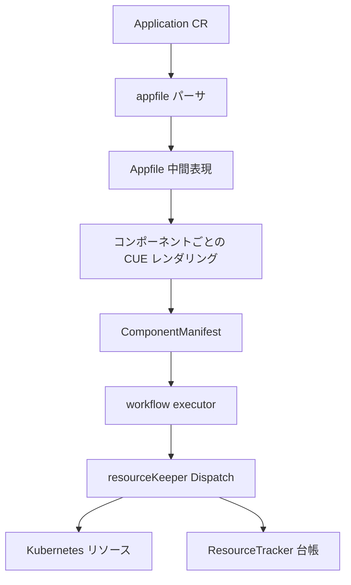

# アーキテクチャ

## 全体像

KubeVela は Kubernetes の CRD コントローラだ。ユーザが書く唯一の入力は、API グループ `core.oam.dev` の `Application` カスタムリソース 1 つ。`Application` はコンポーネント・ポリシー・ワークフローの 3 つを持つ (`src/apis/core.oam.dev/v1beta1/application_types.go:51-65`)。コントローラはこのリソースを中間表現にパースし、各コンポーネントをその CUE 定義経由で実際の Kubernetes オブジェクトへレンダリングし、それらを適用する workflow ステップを実行し、適用したものを記録して後で GC する。

## コンポーネント

### API 型

OAM の API 型は `src/apis/core.oam.dev/` に集約される。`Application` 型と `ApplicationSpec` は `src/apis/core.oam.dev/v1beta1/application_types.go:81-87` と `:51-65`。合成単位の `ApplicationComponent` は `Type` / `Properties` / `Traits` を持ち `src/apis/core.oam.dev/common/types.go:351`。

### controller-manager

reconcile ロジックは controller-manager で動く。エントリポイントは `src/cmd/core/main.go:25` で `app.NewCoreCommand()` を呼ぶ。`Application` reconciler 本体は `src/pkg/controller/core.oam.dev/v1beta1/application/application_controller.go:109`。

### pkg サブシステム

処理は `src/pkg/` 配下のパッケージに分かれる: `appfile` は `Application` を中間表現にパース、`cue` は CUE template を評価、`workflow` はステップエンジン、`resourcekeeper` と `resourcetracker` は適用済みリソースの台帳と GC、`multicluster` はクラスタまたぎ配信、`definition` は X-Definition の CUE 型を解決する。

### CLI と kubectl プラグイン

運用者向けにもう 2 つエントリポイントがある: `./references/cmd/cli/main.go` からビルドする `vela` CLI (`src/makefiles/build.mk:4`) と、`src/cmd/plugin/main.go` の kubectl プラグイン。

## リクエストの流れ

`Application` 1 件の reconcile を端から端まで追うと、中心は `src/pkg/controller/core.oam.dev/v1beta1/application/application_controller.go:109` の `Reconcile`:

1. `Application` を取得 (`:115-124`)。
2. パーサとハンドラを生成: `appfile.NewApplicationParser(r.Client)` と `NewAppHandler` (`:144-145`)。
3. `Application` を `Appfile` 中間表現に変換: `appParser.GenerateAppFile(logCtx, app)` (`:180`)、実装は `src/pkg/appfile/parser.go:87`。
4. ポリシーを適用: `handler.ApplyPolicies(logCtx, appFile)` (`:211`)。
5. workflow インスタンスと runner 群を生成: `handler.GenerateApplicationSteps(...)` (`:222`)。
6. 実行: `executor.New(workflowInstance)` から `workflowExecutor.ExecuteRunners(authCtx, runners)` (`:231-236`)。histogram で計測 (`:237`)。

レンダリングがクラスタに到達するのはコンポーネント適用ステップだ。ここで `h.resourceKeeper.Dispatch(ctx, resources, applyOptions)` (`src/pkg/controller/core.oam.dev/v1beta1/application/generator.go:104`) を呼び、その本体は `src/pkg/resourcekeeper/dispatch.go:61`。

## 主要な設計判断

他のすべてを形づくる判断は、抽象層を Go ではなく CUE template で表現したことだ。ComponentDefinition と TraitDefinition は CUE で reconcile 時に評価され、トレイトのワークロードへの適用は CUE の構造的単一化 (`Unify`) で行う (`src/pkg/appfile/appfile.go:564`, `:570`)。見返りはプラットフォームチームがコントローラを再コンパイルせず新しい型を足せること。コストは CUE 評価エラー専用の整形パス `FormatCUEError` が必要になる点だ (`src/pkg/appfile/appfile.go:604`)。

2 つめの判断は、適用済みリソースを owner reference だけに頼らず `ResourceTracker` CR で台帳化したことだ。削除は台帳の差分計算で行うため、宣言から消えたリソースを確実に回収できる。台帳は圧縮保存できる (`src/apis/core.oam.dev/v1beta1/resourcetracker_types.go:86`)。

## 拡張ポイント

- **X-Definition**: ComponentDefinition / TraitDefinition / WorkflowStepDefinition / PolicyDefinition は CUE で書く CRD で、サードパーティが新しい能力型を追加するために供給する。
- **Addon**: `src/pkg/addon` 配下のアドオンシステムが拡張をパッケージ化・インストールする。
- **Terraform 等の外部ランタイム**: category が Terraform のコンポーネントは CUE ではなく Terraform module としてレンダリングされる (`src/pkg/appfile/appfile.go:343`)。
- **マルチクラスタ**: リモートクラスタへの配信は `multicluster` パッケージを通る。
