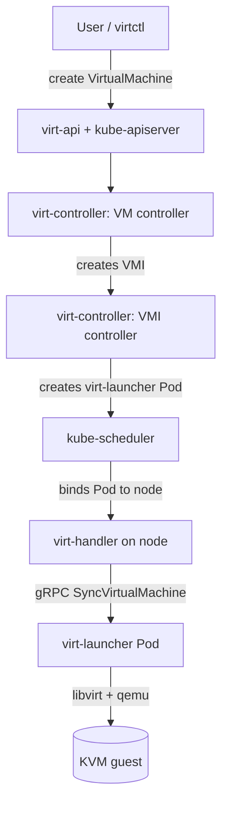

# アーキテクチャ

## 全体像

KubeVirt は Kubernetes クラスタを拡張する複数のバイナリ群で、それぞれが `cmd/` 配下に独自の `main` を持つ。単一のエントリポイントはない。`virt-operator` が残りをインストール・アップグレードする。`virt-api` と `virt-controller` がコントロールプレーンを成す。`virt-handler` は全ノードで動き、稼働中の VM 1 台ごとに 1 つの `virt-launcher` Pod が包む。REST API に素直に乗らない操作は `virtctl` CLI が担う。

## コンポーネント

### virt-operator

インストールとライフサイクルの operator。KubeVirt のクラスタ導入起点であり、operator マニフェストと `KubeVirt` カスタムリソースを適用すると、残りのコンポーネントを配備・アップグレード・管理する ([docs/getting-started.md](https://github.com/kubevirt/kubevirt/blob/main/docs/getting-started.md))。

### virt-api

aggregated API server。KubeVirt カスタムリソースを検証する admission webhook をホストし、素の REST オブジェクトモデルに収まらない console / VNC / pause などの subresource を提供する。

### virt-controller

クラスタレベルのコントローラ群。`VirtualMachineInstance`・`VirtualMachine`・migration・replica set・pool を reconcile する。`cmd/virt-controller/virt-controller.go:28` の `main` は `watch.Execute()` を呼ぶだけだ。

### virt-handler

各ノードで動く DaemonSet。VMI の期待状態をノード上の実ドメインに突き合わせ、ノード内の `virt-launcher` と gRPC で通信する (`pkg/virt-handler/vm.go:2055`)。自身では libvirt を動かさない。

### virt-launcher

VM 1 台あたり 1 つの Pod。Pod の内側に libvirt と QEMU を抱え、`LibvirtDomainManager` (`pkg/virt-launcher/virtwrap/manager.go:1371`) でドメインを操作する。

### virtctl

`cmd/virtctl` 配下のユーザ向け CLI。start・stop・console・vnc・migrate など、REST 呼び出しで表現しづらい操作を担う。

## リクエストの流れ

VM 起動は次のホップをたどる。

1. ユーザが `VirtualMachine` を作成する。VM コントローラが `VirtualMachineInstance` (VMI) を生成する。
2. VMI コントローラの reconcile ループ `execute(key)` (`pkg/virt-controller/watch/vmi/vmi.go:306`) が VMI を取得し、`c.sync(...)` (`pkg/virt-controller/watch/vmi/vmi.go:364`) を呼ぶ。
3. Pod がまだ無い場合、`sync()` (`pkg/virt-controller/watch/vmi/lifecycle.go:66`) が `RenderLaunchManifest(vmi)` (`pkg/virt-controller/watch/vmi/lifecycle.go:156`) で launch マニフェストを描画し、`createPod(...)` (`pkg/virt-controller/watch/vmi/lifecycle.go:174`) で Pod を作成する。
4. 標準の `kube-scheduler` が Pod をノードに割り当てる。
5. そのノードの `virt-handler` が VMI を検知し、`client.SyncVirtualMachine(vmi, options)` (`pkg/virt-handler/vm.go:2055`) を gRPC 経由でノード内の `virt-launcher` に送る。
6. `virt-launcher` の `SyncVMI()` (`pkg/virt-launcher/virtwrap/manager.go:1371`) が VMI を libvirt ドメインへ変換し QEMU を起動する。

## 主要な設計判断

決定的な選択は、VMI 1 台に対し `virt-launcher` Pod を 1 つ立て、libvirt と QEMU をその Pod の中で動かすことだ。これにより VM が第一級の Kubernetes ワークロードになり、並行 hypervisor スケジューラではなく標準のスケジューラ・Pod ネットワーク・PVC・eviction を再利用できる。トレードオフは、素の hypervisor に比べて層 (VM を包む Pod) が 1 つ増える点。

第二の選択は委譲だ。`virt-handler` は libvirt を動かさず、期待状態をノード内の `virt-launcher` に gRPC で送る (`pkg/virt-handler/vm.go:2055`)。Kubernetes の VMI 仕様から libvirt ドメイン XML への宣言型から命令型への変換は、1 つの converter (`pkg/virt-launcher/virtwrap/converter/converter.go:967`) に閉じ込められている。

## 拡張ポイント

- カスタムリソース: `VirtualMachine`・`VirtualMachineInstance`・`VirtualMachineInstanceMigration`・`VirtualMachineInstanceReplicaSet` (`staging/src/kubevirt.io/api/core/v1/types.go` で定義)。
- `virt-api` が提供する、それらリソースを検証する admission webhook。
- `virt-operator` が消費する `KubeVirt` CR。インストール設定を行い、ハードウェア仮想化のないノード向けの software emulation もここで指定する。
