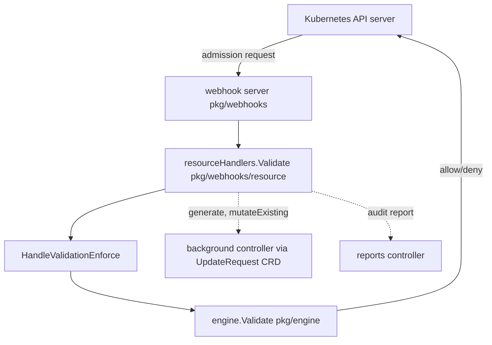

# アーキテクチャ

## 全体像

Kyverno は単一プロセスではない。`cmd/` 以下の複数バイナリに分かれる。admission controller (`cmd/kyverno/main.go`)、background controller (`cmd/background-controller`)、cleanup controller (`cmd/cleanup-controller`)、reports controller (`cmd/reports-controller`)、そして `kubectl-kyverno` CLI (`cmd/cli`) だ。API server が呼ぶのは admission controller。他の controller は、同期的な admission リクエストの中で計算できない (あるいはすべきでない) 状態を reconcile する。共有の評価ロジックは `pkg/engine` にあり、すべての経路がここを通る。

## コンポーネント

### Webhook サーバ (`pkg/webhooks`)

HTTP のエントリポイント。`pkg/webhooks/server.go` が mux にルートを登録する。CEL ベースのポリシーには専用パスが割り当てられる。MutatingPolicy には `/mpol/*policies` と `/nmpol/*policies` (`server.go:78`, `server.go:91`)、ValidatingPolicy には `/vpol/*policies` (`server.go:105`)、ImageVerificationPolicy には `/ivpol/validate/*policies` と `/ivpol/mutate/*policies` (`server.go:131`, `server.go:144`)、GeneratingPolicy には `/gpol/*policies` (`server.go:158`)。旧来 `ClusterPolicy` の経路は `registerWebhookHandlersWithAll` で配線される (`server.go:182`, `server.go:384`)。各 handler はチェーン (`handlerFunc(...).WithFilter(...).WithMetrics(...).WithAdmission(...).ToHandlerFunc(...)`) で包まれ、フィルタ・RBAC ルックアップ・メトリクス・トレースが raw handler に重ねられる。

### エンジン (`pkg/engine`)

ポリシー評価器。`Engine` interface (`pkg/engine/api/engine.go:17`) は 6 メソッドを公開する。`Validate`, `Mutate`, `Generate`, `VerifyAndPatchImages`, `ApplyBackgroundChecks`, `ContextLoader` だ。すべてのポリシー適用がこの interface を通るため、webhook サーバと background controller は 1 つの評価コードパスを共有する。

### CEL ポリシーエンジン (`pkg/cel`)

新しいポリシー型はそれぞれ `pkg/cel/policies` 以下に独自のエンジンを持つ (`vpol`, `mpol`, `ivpol`, `gpol`)。`cmd/kyverno/main.go:24-31` がそれらを import する (例: `vpolengine "github.com/kyverno/kyverno/pkg/cel/policies/vpol/engine"`)。これら CEL CRD の Go 型は別モジュール `github.com/kyverno/api` にあり、`cmd/kyverno/main.go:14` で import される。

### コントローラ (`pkg/controllers`)

admission のホットパス外にあるものの reconcile ループ。policy cache、policy status、webhook の TLS を発行する cert manager、webhook 登録、global context だ。generate と既存リソースの mutate は、インラインで完結させずここへ渡される。

## リクエストの流れ

ValidatingWebhook の admission リクエストは次の経路を通る。

1. API server が admission リクエストを webhook サーバへ POST。`pkg/webhooks/handlers/admission.go` の admission ミドルウェアが `AdmissionRequest` を組み立て、`resourceHandlers.Validate` を呼ぶ。
2. `pkg/webhooks/resource/handlers.go:112` の `Validate` が `retrieveAndCategorizePolicies` (`handlers.go:117`) を呼び、match したポリシーを validate / mutate / generate / audit-warn のバケットに分類する。
3. `validation.NewValidationHandler` を作り (`handlers.go:127`)、`vh.HandleValidationEnforce` を `wait.Group` 内で実行する (`handlers.go:145`)。dry-run でなければ generate と mutate-existing の処理を `handleBackgroundApplies` で background 経路へ渡す (`handlers.go:150`)。
4. `pkg/webhooks/resource/validation/validation.go:74` の `HandleValidationEnforce` がリクエストから `PolicyContext` を構築し (`validation.go:88`)、ポリシーごとに `tracing.ChildSpan` を開いて `v.engine.Validate(ctx, policyContext)` を呼ぶ (`validation.go:107`)。`engineResponse.IsSuccessful()` が false なら、そのポリシーは失敗扱い (`validation.go:115`)。
5. 全ポリシー実行後、`webhookutils.BlockRequest(engineResponses, failurePolicy, logger)` が deny するか判定する (`validation.go:148`)。block なら blocked メッセージを返し (`validation.go:152`)、そうでなければ `handlers.go:177` が `ResponseSuccess` を返す。
6. audit report は、HTTP リクエストのライフサイクルから意図的に切り離し、独自の 30 秒タイムアウト context を持つ別 goroutine で生成される (`handlers.go:159`)。
7. エンジン内では `pkg/engine/engine.go:68` の `Validate` がポリシーコンテキストを match し (`engine.go:75`)、`e.validate` を呼び (`engine.go:76`)、`WithStats` で実行統計を記録し (`engine.go:79`)、メトリクスが有効なら `RecordResponse` を呼ぶ (`engine.go:81`)。
8. `pkg/engine/validation.go:16` の `validate` が `autogen.Default.ComputeRules(policy, gvk.Kind)` で rule を展開する (`validation.go:30`)。各 rule につき `handlerFactory` が rule 種別から適切な handler を選び (Assert, verifyManifest, PodSecurity, CEL, または既定の `NewValidateResourceHandler`, `validation.go:58`)、`e.invokeRuleHandler` が実行する (`validation.go:72`)。

## 主要な設計判断

インラインと background。validate と mutate は admission リクエストに同期で答える必要があるためインラインで走る。generate と既存リソースの mutate は admission タイムアウトに縛られず、`UpdateRequest` CRD 経由で background controller を通じて非同期に走る (`handlers.go:150`)。audit report 経路もリクエストの goroutine から外し、独自のタイムアウト context を持たせている (`handlers.go:159`)。これにより report の書き込みが遅くても失敗しても、admission の判定を遅らせたり失敗させたりしない。

rule の隔離。1 つのポリシー内で `validate` は rule ループの前に JSON context を checkpoint し、後に restore する (`pkg/engine/validation.go:26-27`)。これにより、ある rule が設定した変数が次の rule に漏れない。

1 つの engine interface。すべてのポリシー適用が `Engine` interface (`pkg/engine/api/engine.go:17`) を通るため、webhook controller と background controller は同じやり方でポリシーを評価する。

## 拡張ポイント

- **ポリシー CRD**: `ClusterPolicy` と `Policy`、加えて CEL ベースの ValidatingPolicy・MutatingPolicy・ImageVerificationPolicy・GeneratingPolicy。ユーザーが主に書く面だ。
- **Context エントリ**: rule の `Context` は ConfigMap・API call・image registry・global context からデータを引ける。`ContextLoader` (`pkg/engine/engine.go:164`) を通じて読み込まれる。
- **ネイティブ admission policy への bind**: `RuleResponse` は `vapBinding` や `mapBinding` (`pkg/engine/api/ruleresponse.go:48-52`) を持て、Kubernetes ネイティブの ValidatingAdmissionPolicy / MutatingAdmissionPolicy と Kyverno を結びつける。
- **イメージ検証**: ImageVerificationPolicy 経路を通じて Sigstore/cosign の署名チェックと連携する。
