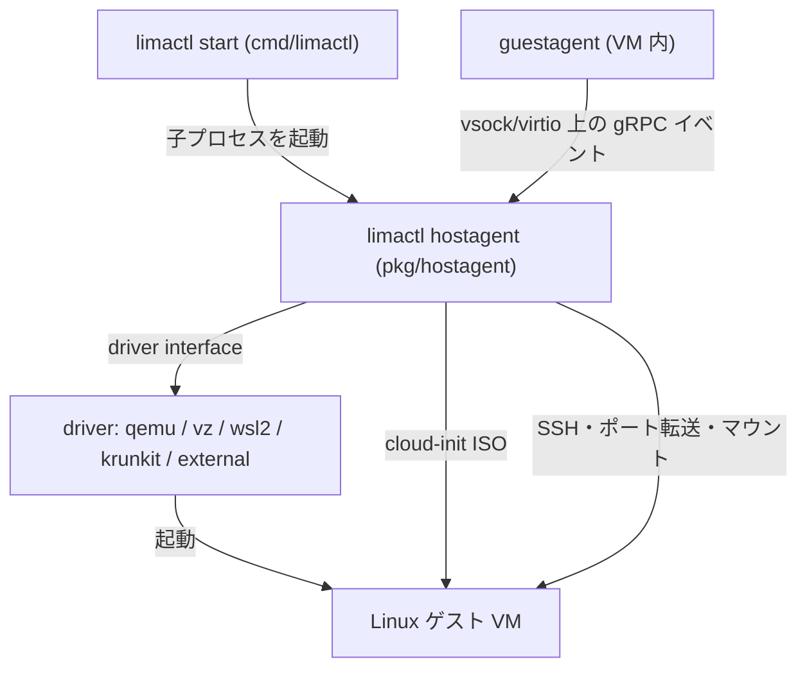

# アーキテクチャ

## 全体像

Lima は 3 層に分かれる。CLI (`limactl`)、インスタンスごとのホストデーモン (hostagent)、ゲスト内のエージェント (guestagent) だ。CLI はテンプレートを解析しライフサイクルを統括する。hostagent は長命の子プロセスとして動き、プラグイン可能なドライバ経由で VM を駆動し、SSH・マウント・ポートフォワード・DNS を管理する。guestagent は VM 内で動き、イベントをホストへストリームする。`main()` エントリポイントは cobra アプリで `cmd/limactl/main.go:33` にある。

## コンポーネント

### CLI: `cmd/limactl`

ユーザ向けバイナリ。cobra で構築され、`start` / `stop` / `shell` / `list` / `edit` / `snapshot` などを実装する。`main()` は `cmd/limactl/main.go:33`。`lima` バイナリは `limactl shell` の薄いラッパ。

### インスタンスのライフサイクル: `pkg/instance`

インスタンスの作成/起動/停止を担う。`Create` は `pkg/instance/create.go:24`、`Prepare` は `pkg/instance/start.go:50`、`Start` は `pkg/instance/start.go:286` で、`StartWithPaths` (`pkg/instance/start.go:168`) を呼ぶ。

### ホストデーモン: `pkg/hostagent`

`limactl hostagent <name>` という子プロセスとして起動されるデーモン。ドライバ経由で VM を起動し、SSH・マウント・ポートフォワード・DNS を管理する。`New` は `pkg/hostagent/hostagent.go:128`、`Run` は `pkg/hostagent/hostagent.go:389`。

### ドライバ層: `pkg/driver` と `pkg/driver/{qemu,vz,wsl2,krunkit}`

VM バックエンドの抽象。`Driver` インターフェースは `pkg/driver/driver.go:81`、ケイパビリティを持つ `Info` は `pkg/driver/driver.go:110` で定義される。内蔵ドライバと外部 gRPC プラグインの両方がこれを実装する。

### ゲストエージェント: `pkg/guestagent` と `cmd/lima-guestagent`

VM 内で動き、vsock/virtio 上で gRPC の `GuestService` を提供する (`pkg/guestagent/api/guestservice.proto:8`)。ポートイベント・inotify 変更・時刻同期をホストに通知する。

### プロビジョニング: `pkg/cidata`

ゲストをプロビジョニングする cloud-init の ISO9660 (`user-data`) イメージを生成する。`GenerateCloudConfig` は `pkg/cidata/cidata.go:361`、`GenerateISO9660` は `pkg/cidata/cidata.go:386`。

## リクエストの流れ

`limactl start <name>` は各層を以下のように進む (アンカーは pin コミット基準)。

1. `startAction` (`cmd/limactl/start.go:570`) が `loadOrCreateInstance` (`cmd/limactl/start.go:215`) を呼び、テンプレートからインスタンスを生成/読込する。
2. ネットワークを `reconcile.Reconcile` (`cmd/limactl/start.go:599`) で調停する。
3. `instance.Start` (`cmd/limactl/start.go:626`) が `Start` (`pkg/instance/start.go:286`) を呼び、続いて `StartWithPaths` (`pkg/instance/start.go:168`) を呼ぶ。
4. `StartWithPaths` は `"hostagent"` 引数を組み立て (`pkg/instance/start.go:218`)、`haCmd = exec.CommandContext(...)` (`pkg/instance/start.go:234`) を構築し、`haCmd.Start()` (`pkg/instance/start.go:249`) でバックグラウンド起動する。
5. 子プロセスは `hostagentAction` (`cmd/limactl/hostagent.go:43`) に入り、`hostagent.New` (`cmd/limactl/hostagent.go:109`)、続いて `ha.Run` (`cmd/limactl/hostagent.go:136`) を呼ぶ。
6. `New` (`pkg/hostagent/hostagent.go:128`) 内でドライバが確定し、`cidata.GenerateISO9660` (`pkg/hostagent/hostagent.go:188`) で cloud-init ISO を生成する。
7. `Run` (`pkg/hostagent/hostagent.go:389`) は `a.driver.Start(ctx)` (`pkg/hostagent/hostagent.go:424`) で VM を起動し、`startRoutinesAndWait` (`pkg/hostagent/hostagent.go:498`) に入る。
8. `startHostAgentRoutines` (`pkg/hostagent/hostagent.go:543`) は SSH 疎通を待ち、マウントを設定し、ポートフォワードを反映する `watchGuestAgentEvents` (`pkg/hostagent/hostagent.go:697`) を起動する。

## 主要な設計判断

- **push でなく「設定をデータとして注入」。** ゲスト設定は `pkg/cidata` が生成する cloud-init ISO9660 イメージ経由で起動時に投入される (`GenerateISO9660` は `pkg/cidata/cidata.go:386`)。稼働中のエージェントへ push するのではない。
- **host/guest イベントは vsock/virtio 上の gRPC。** guestagent は `GuestService` (`pkg/guestagent/api/guestservice.proto:8`) を提供し、`GetEvents` はサーバストリーム。SSH はシェル・コマンド実行とポートフォワードの土台を担い、イベント通知は vsock の gRPC を優先する。
- **Driver インターフェースでバックエンドを差し替え可能に。** 単一の `Driver` インターフェース (`pkg/driver/driver.go:81`) により、QEMU / vz / WSL2 / krunkit / 外部ドライバをインスタンスごとに選べる。

## 拡張ポイント

- **別プロセスとしての外部ドライバ。** out-of-tree バックエンドは gRPC の `service Driver` (`pkg/driver/external/driver.proto:7`) を実装し、独自の実行ファイルとして動き、`ExternalDrivers` マップ (`pkg/registry/registry.go:42`) に登録される。
- **テンプレート。** `templates/` 配下の YAML テンプレートが再利用可能なインスタンス構成を定義する。
- **ラッパバイナリ。** `cmd` には `nerdctl.lima` / `docker.lima` / `kubectl.lima` / `podman.lima` / `apptainer.lima` のラッパとドライバ別バイナリが含まれる。

## 出典

1. Lima ソース (コミット [`9a3f1c4`](https://github.com/lima-vm/lima/commit/9a3f1c443389c673eb619f7b1922b1a4d8e4fd16)), 参照 2026-06-24。
2. [lima-vm/lima README](https://github.com/lima-vm/lima), 参照 2026-06-24。
