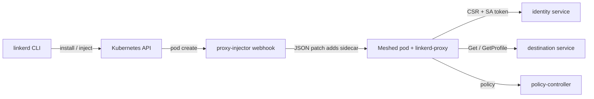

# アーキテクチャ

## 全体像

Linkerd には 2 つのプレーンがある。データプレーンは Rust 製マイクロプロキシ (`linkerd-proxy`) で、メッシュ対象の各 Pod にサイドカーとして注入される。そのソースは別リポジトリ `linkerd/linkerd2-proxy` にある (出典 6)。コントロールプレーンはこのリポジトリ内の Go サービス群で、それらの proxy を設定する。ディスカバリ用の destination サービス、mTLS 証明書を発行する identity サービス、サイドカーを注入し設定を検証する admission webhook 群である。Rust 製のポリシーコントローラが認可 CRD を解決し proxy に配信する。`linkerd` CLI がインストールと Day-2 運用を駆動する。

## コンポーネント

### CLI (`cli/`)

`linkerd` バイナリは `install`・`inject`・`check` などのコマンドを扱う。エントリポイントは `cli/main.go`。CLI は Helm チャートをローカルでレンダリングし、`kubectl apply` 用のマニフェストを出力する。

### コントロールプレーンのコントローラ (`controller/`)

コントロールプレーンは単一の Go バイナリとして出荷され、第一引数でディスパッチする。`controller/cmd/main.go:21` が `os.Args[1]` を `destination`・`heartbeat`・`identity`・`proxy-injector`・`sp-validator`・`service-mirror` に振り分ける (`controller/cmd/main.go:21-33`)。

- `destination`: gRPC ディスカバリサーバ。proxy はエンドポイントのために `Get` を (`controller/api/destination/server.go:142`)、サービスごとの ServiceProfile 設定のために `GetProfile` を呼ぶ (`controller/api/destination/server.go:307`)。
- `identity`: mTLS の認証局。proxy の CSR を受け、`Certify` で短命のリーフ証明書を発行する (`pkg/identity/service.go:212`)。
- `proxy-injector`: Pod 作成時にサイドカーを注入する mutating admission webhook (`controller/proxy-injector/webhook.go:31`)。
- `sp-validator`: ServiceProfile リソース用の validating webhook。
- `heartbeat` と `service-mirror`: テレメトリとクラスタ跨ぎミラーリング。

### ポリシーコントローラ (`policy-controller/`)

サーバ側の認可ポリシー (`Server` や `ServerAuthorization` 系の CRD) を Kubernetes から解決し proxy に配信する Rust サービス。cargo でビルドされ (`policy-controller/Cargo.toml`)、`core`・`grpc`・`k8s`・`runtime` のクレートに分かれる。

### 補助ツリー

`viz/` は可観測性を追加する (Prometheus メトリクス、tap、ダッシュボード)。`multicluster/` はクラスタ跨ぎのサービスミラーリングを担う。`web/` はダッシュボード。`charts/` はコントロールプレーン・CRD・注入用パッチチャートの Helm チャートを保持する。`proto/` は gRPC の protobuf 定義を保持する。

## リクエストの流れ

Pod 作成をプロキシ注入を通して追う。

1. webhook サーバが admission リクエストを受ける。ボディを 10MB 上限で読み、`processReq` に渡す (`controller/webhook/server.go:124`、`server.go:129`)。
2. `processReq` が `AdmissionReview` をデコードし、リクエスト UID が空でないことを確認してから、登録済みハンドラを呼ぶ (`controller/webhook/server.go:160-171`)。
3. ハンドラは `Inject`。マウントした ConfigMap から Helm Values を読み、信頼アンカー PEM を読み込み、`IdentityTrustAnchorsPEM` を設定する (`controller/proxy-injector/webhook.go:31`、`webhook.go:43-51`)。
4. `ResourceConfig` を組み、`ParseMetaAndYAML(request.Object.Raw)` でワークロードをパースして注入レポートを作る (`controller/proxy-injector/webhook.go:57-63`)。
5. `report.Injectable()` で注入可否を判定する。可なら `created-by` アノテーションを付与し、namespace アノテーションを継承し、デフォルトの opaque ports アノテーションを補完する (`controller/proxy-injector/webhook.go:102-123`)。
6. `resourceConfig.GetPodPatch(true, overrider)` でパッチを生成する (`controller/proxy-injector/webhook.go:125`)。
7. ハンドラは `PatchType: JSONPatch` の `AdmissionResponse` を返し (`controller/proxy-injector/webhook.go:143-149`)、`processReq` がそれを `AdmissionReview` のレスポンスに詰め、サーバが JSON でマーシャルする (`controller/webhook/server.go:183`)。

Pod が動き出すと、その proxy は identity サービスに対し mTLS をブートストラップし ([内部実装](./internals) を参照)、destination サービスにエンドポイントを問い合わせる。

## 主要な設計判断

Linkerd は注入パッチを手書きの JSON Patch ではなく、インストール時と同じ Helm チャートをレンダリングして組む。`GetPodPatch` が実行時に `patch` チャートの `templates/patch.json` をレンダリングし、その結果を JSON Patch にする (`pkg/inject/inject.go:814-831`)。インストール時のテンプレートと実行時のサイドカー注入が、単一のテンプレート経路と単一の `Values` 型を共有する。代償は、テンプレートが吐く末尾カンマを正規表現で除去する処理である (`pkg/inject/inject.go:834`)。

もう 1 つの決定的な判断はデータプレーンそのものである。Envoy ではなく専用の Rust 製マイクロプロキシを採用し、低レイテンシ・低メモリ・メモリ安全を狙う (出典 6, 12, 13)。

## 拡張ポイント

- Admission webhook: proxy-injector (mutating) と sp-validator (validating) は標準的な Kubernetes webhook である。
- CRD: ServiceProfile がサービスごとのルートとリトライを駆動し、ポリシーコントローラが `Server` や `ServerAuthorization` 系の認可 CRD を消費する。
- Gateway API と GitOps: Linkerd は Kubernetes Gateway API、そして Helm・Flux・Argo によるデリバリと統合する (出典 12)。

## 出典

- 出典 6: [linkerd/linkerd2-proxy (Rust data plane)](https://github.com/linkerd/linkerd2-proxy)
- 出典 12: [Linkerd vs Istio (Buoyant)](https://www.buoyant.io/linkerd-vs-istio)
- 出典 13: [What is a service mesh? (linkerd.io)](https://linkerd.io/what-is-a-service-mesh/)
