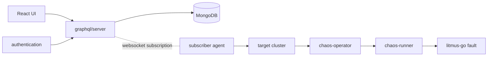

# アーキテクチャ

## 全体像

Litmus は 2 つの面を持つ。Chaos Control Plane (ChaosCenter) は chaos workflow を構築・スケジュール・可視化する中央ツールである。Chaos Execution Plane は chaos agent と、対象 Kubernetes クラスタ内で実験を実行・監視するオペレータ群である。この分割は README (`README.md:31-52`) に明記されている。

本リポジトリはコントロールプレーン (`chaoscenter/` 配下) を含む。実行プレーンのオペレータは別リポジトリにある。`chaos-operator` が ChaosEngine リソースを reconcile し、`chaos-runner` が実験 job を起動し、`litmus-go` が障害を注入し、`chaos-exporter` が結果を Prometheus メトリクスとして公開する。

## コンポーネント

### graphql/server

GraphQL API でありコントロールプレーンの心臓部。gqlgen 生成のスキーマを Gin 上で提供し、MongoDB を状態ストアとする。サーバの entrypoint は `chaoscenter/graphql/server/server.go:94`、executable schema の構築は `server.go:124`、service の依存注入は `server.go:185`、`/query` endpoint の配線は `server.go:192`。

### authentication

`chaoscenter/authentication/` 配下の独立した REST 認証サービス。`chaoscenter/authentication/dex-server/` に dex 連携がある。entrypoint は `chaoscenter/authentication/api/main.go`。

### subscriber

各対象クラスタ内で動く chaos agent。コントロールプレーンへ websocket でダイヤルバックし、push された manifest をクラスタに apply する。entrypoint は `chaoscenter/subscriber/subscriber.go:138`、action の受信開始は `subscriber.go:159`。

### web、event-tracker、upgrade-agents

React UI (`chaoscenter/web/`)、event tracker、upgrade agents がコントロールプレーンのサービスを構成する。

## リクエストの流れ

ここでは既存実験の再実行 (`RunChaosExperiment` mutation) を、API から対象クラスタまで追う。全 anchor は pinned commit 基準。

1. `chaoscenter/graphql/server/graph/chaos_experiment_run.resolvers.go:24` `RunChaosExperiment` が resolver の entrypoint。`:31` で `authorization.ValidateRole` の RBAC チェック、`:43` で MongoDB から実験を取得、`:50` で `RunChaosWorkFlow` を呼ぶ。
2. `chaoscenter/graphql/server/pkg/chaos_experiment_run/handler/handler.go:670` `RunChaosWorkFlow` は対象インフラが active か確認し、Revision を新しい順にソートして最新 manifest を採用し、kind が `cronworkflow` なら `RunCronExperiment` へ分岐する。
3. `handler.go:934` `GenerateExperimentManifestWithProbes` が probe を manifest に展開し、`handler.go:944` で `chaos_infrastructure.SendExperimentToSubscriber(...)` を呼ぶ。
4. `chaoscenter/graphql/server/pkg/chaos_infrastructure/infra_utils.go:226` `SendExperimentToSubscriber` は `infra_utils.go:206` の `SendRequestToSubscriber` に委譲し、`infra_utils.go:220` で action を agent のインメモリ channel へ push する (`observer <- newAction`)。
5. 対象クラスタ側の subscriber が action を受信する。`chaoscenter/subscriber/subscriber.go:159` が `AgentConnect` (`chaoscenter/subscriber/pkg/requests/webhook.go:16`) を起動し、`webhook.go:17` で `subscription { infraConnect(...) }` クエリを組み立て、`webhook.go:30` で websocket を Dial し、push された manifest を Kubernetes に apply する。
6. サーバ側の subscription resolver は `chaoscenter/graphql/server/graph/chaos_infrastructure.resolvers.go:272` `InfraConnect`。`:287` で channel を `data_store.Store.ConnectedInfra[infraID]` に登録し、`ctx.Done()` を待って切断時に channel を削除し infra を inactive 化する。

## 主要な設計判断

コントロールプレーンは対象クラスタへ一切接続しに行かない。逆に各対象クラスタの subscriber が起動時にコントロールプレーンへダイヤルバックし、`infraConnect` GraphQL subscription を張りっぱなしにする (`chaoscenter/subscriber/pkg/requests/webhook.go:17`、`chaos_infrastructure.resolvers.go:272`)。実験実行時はその開いた channel に action を push するだけである (`infra_utils.go:220`)。

利点はリーチである。NAT やファイアウォール内の対象クラスタでも outbound 接続だけで繋がり、1 つの ChaosCenter が多数のクラスタを統制できる。

トレードオフは、接続状態が GraphQL サーバプロセスのメモリ内にあることである。`ConnectedInfra` (channel の map) は `chaoscenter/graphql/server/pkg/data-store/store.go:10-18` の `StateData` の一部である。サーバ再起動で全 agent の接続が切れ、各 agent が貼り直すまで復旧せず、複数レプリカ間でも共有されない。`InfraConnect` resolver は同一 infra ID の二重接続を強制切断する (`chaos_infrastructure.resolvers.go:281-285`)。実質シングルトン前提のコントロールプレーンである。

## 拡張ポイント

- **Chaos カスタムリソース** (`README.md:39-52`): ChaosExperiment はインストール可能な障害テンプレートで、サードパーティ障害ツールを使う BYOC (bring-your-own-chaos) に対応する。ChaosEngine は障害を対象に結びつけ定常状態 probe を定義する。ChaosResult は exporter が読む verdict を保持する。
- **ChaosHub**: `litmuschaos/chaos-charts` を通じて共有・バージョン管理される実験バンドル。
- **Resilience probe**: `chaoscenter/graphql/server/pkg/probe/` 配下の http/cmd/k8s/prom probe。
- **GitOps**: `chaoscenter/graphql/server/pkg/gitops` 配下の実験同期。
