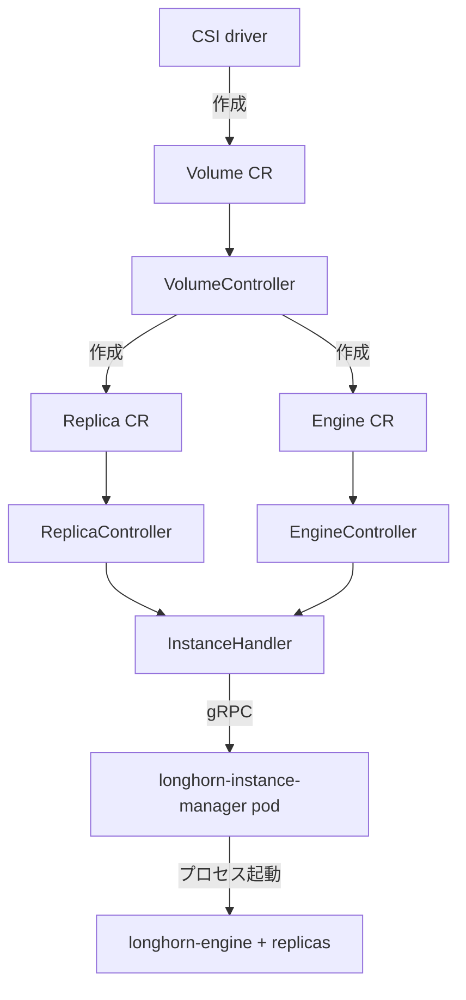

# アーキテクチャ

## 全体像

Longhorn は control plane と data plane にきれいに分かれる。control plane は `longhorn-manager` で、DaemonSet として 1 ノードに 1 pod 動く単一の Go バイナリ。CRD と、それらを reconcile するコントローラ群を所有する。data plane はボリュームごとのエンジンとレプリカのプロセスで、各ノードの `longhorn-instance-manager` pod 内で起動され、実際のブロック I/O は `longhorn-engine` が担う。manager 自身は I/O を捌かず、望ましい状態を宣言して data plane をそこへ収束させる。

## コンポーネント

### CLI と daemon エントリ (`main.go`, `app/`)

バイナリは `urfave/cli` で複数サブコマンドを束ねる。`daemon` / `recurring-job` / `csi` / `pre-upgrade` / `post-upgrade` / `uninstall` などだ (`main.go:63-74`)。manager の常駐モードは `app.DaemonCmd()`。`startManager` (`app/daemon.go:250`) がクライアントを組み立て、`controller.StartControllers` (`app/daemon.go:332`) を呼ぶ。

### CRD 型 (`k8s/pkg/apis/longhorn/v1beta2/`)

すべての Longhorn オブジェクトは CRD だ。`Volume` / `Engine` / `Replica` / `Node` / `InstanceManager`、スナップショットとバックアップ系、`ShareManager`、backing image 系、`EngineImage` / `RecurringJob` / `Orphan` など。`register.go` がそれらを scheme へ登録する。

### コントローラ (`controller/`)

中核。CRD 1 つにつきコントローラが 1 つある。`controller/controller_manager.go:43` が 30 個以上のコントローラを構築し、各々が独自の `go ...Run()` ループで起動される (例: `controller/controller_manager.go:191`)。コントローラは Kubernetes API を直接叩かず、`datastore` パッケージ経由で読み書きする。

### Datastore (`datastore/`)

informer cache と typed client の薄いラッパ。コントローラはオブジェクトを `c.ds.*` 経由で読み書きし、cache 一貫性を 1 か所に集約しつつ、テスト時のモック差し替えを成立させる。

### Scheduler (`scheduler/`)

`scheduler/replica_scheduler.go` がレプリカをどのノード/ディスクに置くかを決める純ロジックを持ち、anti-affinity、zone、node selector、ディスク容量を評価する。

### Engine API (`engineapi/`)

data plane へのクライアント境界。`engineapi/instance_manager.go:16` が `longhorn/longhorn-instance-manager/pkg/client` を import し、クライアントは `InstanceServiceClient` と `ProcessManagerClient` を保持する (`engineapi/instance_manager.go:55-56`)。manager がノードの instance manager に gRPC でエンジン/レプリカプロセスの起動・停止を依頼するのはここ。

### CSI, webhook, upgrade (`csi/`, `webhook/`, `upgrade/`)

`csi/` は動的プロビジョニング/スナップショット/拡張のための CSI driver。`webhook/` は admission/conversion webhook。`upgrade/` はバージョン間マイグレーション。

## リクエストの流れ

`PersistentVolumeClaim` からのボリューム作成は端から端まで次のように進む。

1. CSI driver が `Volume` CR (`k8s/pkg/apis/longhorn/v1beta2/volume.go:454`) を作る。`VolumeController.processNextWorkItem` (`controller/volume_controller.go:252`) がそれを `syncVolume` (`controller/volume_controller.go:307`) へ取り出す。
2. `syncVolume` は `c.ds.GetVolume` (`controller/volume_controller.go:320`) でボリュームを取得し、`isResponsibleFor` (`controller/volume_controller.go:334`) で自分担当か判定する。owner でなければ即 return。担当なら自ノードを `Status.OwnerID` に書いて所有を主張し (`controller/volume_controller.go:342`)、engine / replica / frontend を list する (`controller/volume_controller.go:355`)。
3. reconcile 本体 (`controller/volume_controller.go:603-659`) は `handleVolumeAttachmentCreation`、続いて `ReconcileEngineReplicaState` (`controller/volume_controller.go:607`)、`ReconcileVolumeState` (`controller/volume_controller.go:655`)、`cleanupReplicas` (`controller/volume_controller.go:659`) を呼ぶ。defer ブロック (`controller/volume_controller.go:550`) が spec/status の変更を flush し、conflict なら requeue する。
4. レプリカ補充は `replenishReplicas` (`controller/volume_controller.go:3066`) で走る。まず `CheckAndReuseFailedReplica` (`controller/volume_controller.go:3118`) で失敗レプリカの再利用を試み、できなければ `RequireNewReplica` (`controller/volume_controller.go:3142`) を経て `newReplicaCR` (`controller/volume_controller.go:3143`) で新規 `Replica` CR を作る。
5. スケジューリングは `ScheduleReplica` (`scheduler/replica_scheduler.go:66`) で行われ、`FindDiskCandidates` (`scheduler/replica_scheduler.go:138`)、`getNodeCandidates` (`scheduler/replica_scheduler.go:213`)、`getDiskCandidates` (`scheduler/replica_scheduler.go:301`) を経て、最後に `scheduleReplicaToDisk` (`scheduler/replica_scheduler.go:673`) が `Replica.Spec.NodeID` と `DiskID` を埋める。
6. `ReplicaController` と `EngineController` が各 CR を拾い、両者とも共通の `InstanceHandler.ReconcileInstanceState` (`controller/instance_handler.go:324`) に委譲する。engine 側の経路は `controller/engine_controller.go:373`。
7. 実プロセス生成では `InstanceHandler.createInstance` (`controller/instance_handler.go:544`) がコントローラの `CreateInstance` (`controller/engine_controller.go:630`) を呼び、`engineapi.NewInstanceManagerClient` (`controller/engine_controller.go:655`) でクライアントを作り、`c.EngineInstanceCreate` (`controller/engine_controller.go:718`) を発行する。この gRPC 呼び出しが control plane から data plane へ越境し、対象ノード上でプロセスを起動する。

## 主要な設計判断

- **ボリュームごとのマイクロサービス**。1 ボリューム = 1 engine + N replica で、各々が独立プロセス。共有プールの後ろの単一コントローラではない。これで爆発半径を 1 ボリュームに閉じ込め、ボリュームごとに独立してスケジュール・アップグレードできる。代償はボリューム数に比例するプロセス数とオーバヘッド。
- **CRD = 状態機械**。`VolumeSpec` が望ましい状態、`VolumeStatus` が観測状態で、コントローラはその差分を reconcile する。実 I/O はエンジンの仕事で、manager はそれを宣言的にオーケストレーションするだけ。
- **単一リーダーではなく分散オーナーシップ**。manager は全ノードで動くため、Longhorn は 1 つの active コントローラを選出しない。各 CR が `Status.OwnerID` を持ち、manager は自分が所有する CR だけを reconcile する。`syncVolume` は `isResponsibleFor` (`controller/volume_controller.go:5965`) が false なら早期に抜ける。オーナーシップはボリュームの attach ノードに寄せられ、manager がボリュームをそのエンジンと同じノードで制御し続けられる。
- **datastore 抽象**。コントローラは生の Kubernetes client を持たず、`datastore.DataStore` を経由する。cache 一貫性とテスタビリティを両立させる。

## 拡張ポイント

- **CSI driver** (`csi/`): Kubernetes のプロビジョニング/スナップショット/拡張の標準連携面。
- **admission/conversion webhook** (`webhook/`): CRD の検証と API バージョン間変換。
- **CRD 自身**: `Volume` / `Node` / `RecurringJob` / `BackingImage` などがツールが組む公開 API。
- **バックアップターゲット**: 設定と CRD 経由で構成する S3 / NFS エンドポイント。
