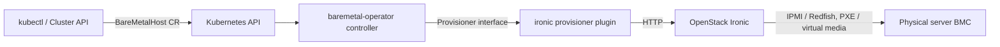

# アーキテクチャ

## 全体像

baremetal-operator は Ironic のオーケストレータである。`BareMetalHost` CRD を Kubernetes API として公開し、各ホストを明示的な有限状態機械で reconcile する。BMO 自体は Ironic API を叩くだけだ。実作業、すなわち IPMI/Redfish での電源制御、PXE/virtual media のブート、ディスク書き込みは Ironic が行う。

## コンポーネント

### CRD 型 (`apis/metal3.io/v1alpha1/`)

`BareMetalHost` 型とその仲間は独立した Go モジュール (`apis/metal3.io/`) にある。`BareMetalHost` は `apis/metal3.io/v1alpha1/baremetalhost_types.go:865` で定義され、`Spec` と `Status` を持つ。型を別モジュールに置くことで、`cluster-api-provider-metal3` のような外部コントローラが BMO 本体を import せずに API へ依存できる。

### コントローラと状態機械 (`internal/controller/metal3.io/`)

reconcile ロジックと有限状態機械を持つパッケージ。コントローラのエントリポイントは `internal/controller/metal3.io/baremetalhost_controller.go:119` の `Reconcile`、状態機械は `host_state_machine.go` で、状態から handler へのマップは `host_state_machine.go:44` で構築される。

### Webhook (`internal/webhooks/metal3.io/`)

CRD の validating / defaulting admission webhook。

### プロビジョナ (`pkg/provisioner/`)

`Provisioner` インタフェース (`pkg/provisioner/provisioner.go:143`) と実装群。本番用 `ironic`、テストでコンパイル時にバイパスする `fixture`、`demo` がある。プラグインローダ (`pkg/provisioner/plugin.go:99`) も含む。

### ハードウェアユーティリティ (`pkg/hardwareutils/`)

BMC プロトコル処理。独立した Go モジュール。

## リクエストの流れ

1 ホストの provisioning 1 ステップは次のように進む。

1. controller-runtime が `Reconcile` を呼び、BMH を取得する (`baremetalhost_controller.go:119`、取得は `:132`)。`metal3.io/paused` annotation があれば即 return (`:148`)。
1. BMC credentials secret を解決・検証する (`buildAndValidateBMCCredentials`, `:200`)。
1. `reconcileInfo` を組み立て、`ProvisionerFactory.NewProvisioner(...)` で provisioner を生成する (`:240`)。`ErrNotReady` なら遅延後に再キュー (`:242`)。
1. `newHostStateMachine(...)` を構築し、`stateMachine.ReconcileState(ctx, info)` で状態機械を 1 ステップ進める (`:250`-`:251`)。`actResult.Result()` が controller-runtime の `ctrl.Result` を返す (`:252`)。
1. `ReconcileState` (`host_state_machine.go:177`) 内では、`defer` で `updateHostStateFrom` を仕掛けつつ、delete・detached・registration の判定を順に評価し、現在状態の handler を `handlers()` マップ (`:44`) から引いて実行する。
1. provisioning 状態では `handleProvisioning` (`host_state_machine.go:540`) が `actionProvisioning` (`baremetalhost_controller.go:1365`) を呼び、それが `prov.Provision(...)` を呼ぶ (`:1392`)。結果が `Dirty` ならホストを再キュー (`:1417`)、作業が無くなれば次状態を `Provisioned` に進める (`host_state_machine.go:548`)。
1. `Reconcile` の末尾で、`actResult.Dirty()` または condition が変化していれば `saveHostStatus` が status subresource を書き戻し、postSaveCallback と events を発火する (`baremetalhost_controller.go:270`-`:286`)。

## 主要な設計判断

モデルは pull 型 reconcile + 明示的な有限状態機械だ。状態は `Status.Provisioning.State` に永続化され、各 reconcile はべき等な 1 ステップ。`actionResult` インタフェースが「再キュー要否」と「status 保存要否」を型で表現する。メンテナは、status を必要なときだけ保存しないと、回復不能エラーが同一オブジェクトを延々と reconcile する無限ループになる、とコメントしている (`baremetalhost_controller.go:266`-`:269`)。

(de)provisioning の状態遷移は容量でゲートされる。次状態が inspecting・provisioning・deprovisioning のとき、`ensureCapacity` が provisioner の空きスロットを確認し、無ければ push せず遅延させる (`host_state_machine.go:87`, `:107`-`:114`)。これで BMO が Ironic を過負荷にしないようにする。

## 拡張ポイント

- `BareMetalHost` CRD そのもの。`cluster-api-provider-metal3` などの外部コントローラが消費する。
- `internal/webhooks/metal3.io/` 配下の validating / defaulting webhook。
- `Provisioner` インタフェース (`pkg/provisioner/provisioner.go:143`)。実行時に Go の `.so` プラグインとしてロードされる (`pkg/provisioner/plugin.go:99`)。サードパーティが独自の provisioner backend を載せられる。ローダがプラグインをどう検証するかは [内部実装](./internals) を参照。
