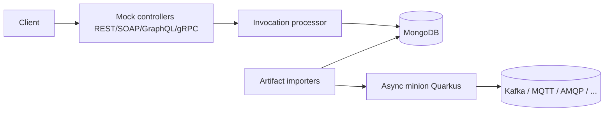

# アーキテクチャ

## 全体像

Microcks は Maven マルチモジュールプロジェクトである (`pom.xml:10-15`)。`webapp` モジュールが Spring Boot コアで、REST API、各プロトコルのモックコントローラ、アーティファクトの importer、service、MongoDB repository、Angular の SPA を持つ。`commons/model`、`commons/util`、`commons/util-el` は共通のドメインモデルと式言語ヘルパーを持つ。`minions/async` はイベント駆動プロトコルを担う別建ての Quarkus アプリケーションである。`distro` モジュールはディストリビューションを組み立てる。

コアは Spring Boot 4.0.7 / Java 25 で動く (`webapp/pom.xml:6,18` が `pom.xml:64` の `spring-boot.version` を解決)。async minion は Quarkus 3.31.4 で動く (`minions/async/pom.xml:24`)。アプリのエントリポイントは `webapp/src/main/java/io/github/microcks/MicrocksApplication.java:38` で、`@SpringBootApplication @EnableAsync @EnableScheduling` が付く (`MicrocksApplication.java:29-31`)。

## コンポーネント

### webapp (Spring Boot コア)

`webapp` モジュールは同期モックに必要なすべてを持つ。`io.github.microcks` 配下は `web` (コントローラと invocation processor)、`service` (import とテストのオーケストレーション)、`repository` (Spring Data Mongo) に加え、`event`、`listener`、`security`、`task`、`util`、`config` に整理されている。`webapp/src/main/java/io/github/microcks/web/` のモックコントローラは REST (`RestController`)、SOAP (`SoapController`)、GraphQL (`GraphQLController`)、gRPC (`GrpcServerCallHandler`)、動的 REST (`DynamicMockRestController`) をカバーする。同じディレクトリには `McpController` (モックを Model Context Protocol サーバとして公開) と `AICopilotController` もある。

### commons/model

ドメインモデルは `commons/model/src/main/java/io/github/microcks/domain/` にある。中心となる型は `Service` (`Service.java:27`)、`Operation` (`Operation.java:32`)、`Response` (`Response.java:26`)。これらがモックを組み立てる単位で、詳細は [内部実装](./internals) で扱う。

### minions/async (Quarkus 非同期エンジン)

async minion は `minions/async` 配下のスタンドアロン Quarkus アプリである。producer manager は `minions/async/src/main/java/io/github/microcks/minion/async/producer/` にあり、`KafkaProducerManager`、`MQTTProducerManager`、`AMQPProducerManager`、`NATSProducerManager`、`GooglePubSubProducerManager`、`AmazonSNSProducerManager`、`AmazonSQSProducerManager`、WebSocket 系の producer を含む。AsyncAPI のモックメッセージをブローカーへ publish しつつ、AsyncAPI のコントラクトテストも実行する。

## リクエストの流れ

REST モック呼び出しは端から端まで以下のように流れる。すべて基準コミットで確認済み。

1. リクエストは `/rest/{service}/{version}/**` にマップされた `RestController.execute(...)` に届く (`RestController.java:97-107`)。`/rest-valid/...` 版はリクエストボディ検証を追加する (`RestController.java:110-120`)。両者とも private な `doExecute(...)` を呼ぶ (`RestController.java:123`)。
2. `doExecute` は service と operation を解決し、operation が一致しなければ CORS の OPTIONS を処理し、必要なら OpenAPI スキーマでボディを検証してから、invocation を `RestInvocationProcessor` へ委譲する。
3. `RestInvocationProcessor.processInvocation(...)` (`RestInvocationProcessor.java:145`) は fallback / proxy-fallback を解決して dispatcher と rules を決め、`computeDispatchCriteria(...)` を呼ぶ (`RestInvocationProcessor.java:164`)。
4. `computeDispatchCriteria(...)` (`RestInvocationProcessor.java:327`) は `switch (dispatcher)` (`RestInvocationProcessor.java:342`) を回し dispatch style ごとに criteria 文字列を組む。URI 系のスタイルは `DispatchCriteriaHelper.extractFromURIPattern` を使い、`SCRIPT`/`GROOVY` は `scriptEngine.eval(...)` でユーザスクリプトを評価する (`RestInvocationProcessor.java:360`)。
5. `getResponse(...)` (`RestInvocationProcessor.java:450`) は `responseRepository.findNonCallbackByOperationIdAndDispatchCriteria(...)` (`RestInvocationProcessor.java:455`) で MongoDB を完全一致検索する。該当が無ければ criteria を response 名とみなし `findNonCallbackByOperationIdAndName` で再検索する (`RestInvocationProcessor.java:464`)。
6. それでも無く fallback があれば fallback 名を使う。proxy が設定されていれば `proxyService.callExternal(...)` で上流へ転送する (`RestInvocationProcessor.java:213`)。dispatcher 有りで該当無しの場合は HTTP 400 を返す (`RestInvocationProcessor.java:231`)。
7. processor はヘッダとコンテンツを組み立て、callback や AsyncAPI トリガーを発火し、`ResponseResult` を返す (`RestInvocationProcessor.java:258`)。

## 主要な設計判断

中心的な設計判断はマッチング戦略である。リクエスト毎にルーティングルールを評価する代わりに、Microcks は import 時に `dispatchCriteria` 文字列を事前計算し各 `Response` に保存する。実行時は生きたリクエストから同じ形式の文字列を再計算し、MongoDB の完全一致クエリ 1 回で応答を解決する。criteria のキーはソート済みで生成されるため、クエリパラメータの順序は影響しない。この対称性は [内部実装](./internals) で詳述する。

もう 1 つの注目点は可観測性である。OpenTelemetry の explain tracing が各モック判断 (dispatcher 選択、response lookup、delay、proxy) を `processInvocation` 内の span event として記録するため (`RestInvocationProcessor.java:159-262`)、モックがなぜその応答を返したかをトレースから読み取れる。

## 拡張ポイント

- 複数の dispatch style。うち `SCRIPT`/`GROOVY`/`JS` dispatcher はユーザ提供スクリプトを実行して応答を選ぶ (`RestInvocationProcessor.java:342-384`)。
- `webapp/src/main/java/io/github/microcks/util/` 配下のプラガブルな importer (OpenAPI, AsyncAPI, Postman, SoapUI, gRPC, GraphQL, HAR)。
- operation 上の proxy / fallback 仕様。example が一致しないとき実際の上流へ転送できる。
- async minion のブローカー producer。AsyncAPI モックとテストのトランスポートを追加する。
