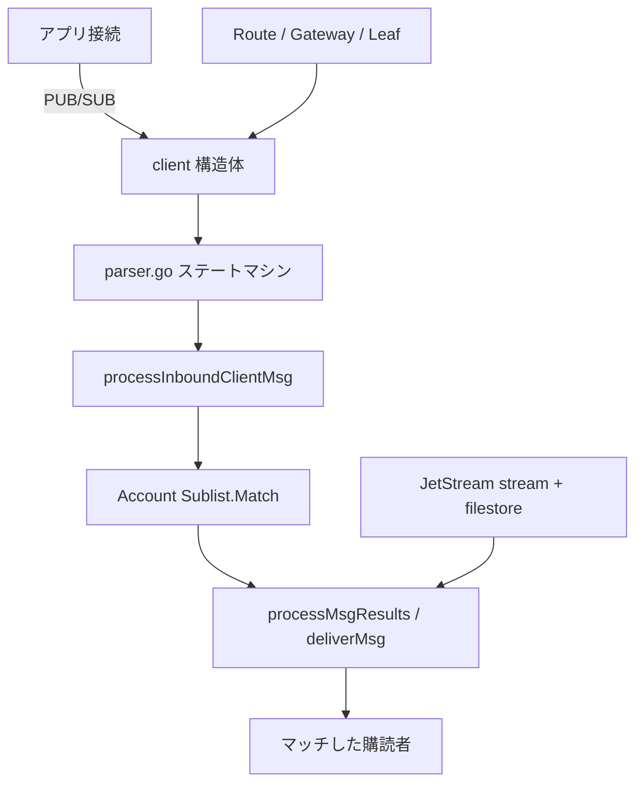

# アーキテクチャ

## 全体像

サーバはほぼ全体が `server/` パッケージにあり、`main.go` は薄い CLI ラッパだ。稼働中の `Server` ([`server/server.go:168`](https://github.com/nats-io/nats-server/blob/bd058fac3d0c04398698b113e986b35065212fda/server/server.go#L168)) は接続を accept し、すべての接続が `client` ([`server/client.go:259`](https://github.com/nats-io/nats-server/blob/bd058fac3d0c04398698b113e986b35065212fda/server/client.go#L259)) になる。アプリ、クラスタ内の別サーバ、ゲートウェイ、leaf node、内部 JetStream 接続のどれであっても同じだ。構造体の `kind` フィールドで区別するため、CLIENT・ROUTER・GATEWAY・LEAF・JETSTREAM・SYSTEM の各接続を 1 つのコードパスが扱う。

ルーティングは subject ベース。各アカウントが購読 interest の木 (`Sublist`) を持ち、メッセージの publish はその subject を木に照合して購読者を見つけることを意味する。

## コンポーネント

### 接続とプロトコル処理

`server/client.go` が `client` 構造体・read ループ・publish/subscribe 処理を持つ。`server/parser.go` はワイヤプロトコルを操作に変換する手書きステートマシンだ。どちらも全メッセージのホットパス上にある。

### 購読マッチング

`server/sublist.go` が `Sublist` を実装する。subject トークンの木に結果キャッシュを備えたものだ。subject は `.` で分割され、レベルごとに走査される。各レベルは通常の子ノードに加え、`*` と `>` のワイルドカードノードを持つ。別の generic な実装が `server/gsl/` にある。

### アカウントとマルチテナンシ

`server/accounts.go` がテナント境界である `Account` ([`server/accounts.go:52`](https://github.com/nats-io/nats-server/blob/bd058fac3d0c04398698b113e986b35065212fda/server/accounts.go#L52)) を定義する。各アカウントが自前の `Sublist` (`acc.sl`) と import/export ルールを持つため、subject 名前空間はアカウント単位で隔離される。

### クラスタリングと接続種別

`server/route.go` がクラスタ内サーバ間の route を、`server/gateway.go` がクラスタを連結してスーパークラスタを作る gateway を、`server/leafnode.go` がクラスタをエッジへ延ばす leaf node を扱う。

### JetStream 永続化

`server/jetstream*.go`・`server/stream.go`・`server/consumer.go` が durable な stream と consumer を実装する。`server/filestore.go` と `server/memstore.go` がストレージバックエンドで、`server/raft.go` が JetStream 状態をクラスタ間で複製する合意を提供する。

### 認証

`server/auth.go` と `server/auth_callout.go` が認証を扱う。JWT と nkeys を中心に構築されている。

## リクエストの流れ

core publish を追う。クライアントが `PUB subject reply size` を送り、続けて payload を送り、メッセージがマッチした購読者へ届くまで。

1. `readLoop` がソケットから読み ([`server/client.go:1403`](https://github.com/nats-io/nats-server/blob/bd058fac3d0c04398698b113e986b35065212fda/server/client.go#L1403))、バイト列を `parse` へ渡す ([`server/parser.go:137`](https://github.com/nats-io/nats-server/blob/bd058fac3d0c04398698b113e986b35065212fda/server/parser.go#L137))。
2. パーサは `PUB` の引数を蓄積し、完了すると `processPub` を呼ぶ ([`server/client.go:2880`](https://github.com/nats-io/nats-server/blob/bd058fac3d0c04398698b113e986b35065212fda/server/client.go#L2880))。
3. payload 受信後、`processInboundClientMsg` ([`server/client.go:4311`](https://github.com/nats-io/nats-server/blob/bd058fac3d0c04398698b113e986b35065212fda/server/client.go#L4311)) が統計を更新し、publish 権限を確認し、購読者を解決する。
4. マッチングはまず per-client の L1 キャッシュ (その接続が持つ、subject からマッチ購読者へのキャッシュ済みマップ) を引き、ミス時に `acc.sl.Match` へフォールバックする ([`server/client.go:4433`](https://github.com/nats-io/nats-server/blob/bd058fac3d0c04398698b113e986b35065212fda/server/client.go#L4433)、[`server/sublist.go:532`](https://github.com/nats-io/nats-server/blob/bd058fac3d0c04398698b113e986b35065212fda/server/sublist.go#L532))。
5. 配送は `processMsgResults` ([`server/client.go:5127`](https://github.com/nats-io/nats-server/blob/bd058fac3d0c04398698b113e986b35065212fda/server/client.go#L5127)) を通り、最終的に各購読者の書き込みバッファへ `deliverMsg` ([`server/client.go:3690`](https://github.com/nats-io/nats-server/blob/bd058fac3d0c04398698b113e986b35065212fda/server/client.go#L3690)) する。

[内部実装](./internals) のページがこのパスを行単位で歩く。

## 主要な設計判断

中核プロトコルは at-most-once。publish されたメッセージは現在の interest に照合され、今この瞬間に購読している相手へ配送される。何も保存しない。durability は JetStream による opt-in で、独自の追記型ファイル形式と Raft 複製を用いて永続化を上に重ねる ([JetStream docs](https://docs.nats.io/nats-concepts/jetstream))。

publish パスのスループットはロックではなくキャッシュで稼ぐ。アカウント共有の `Sublist` は read-write mutex で保護されるが、サーバは publish のたびにそれを取らずに済ませる。per-client の L1 結果キャッシュを subject をキーに保持し、sublist の atomic な世代カウンタで検証するからだ ([`server/client.go:4421`](https://github.com/nats-io/nats-server/blob/bd058fac3d0c04398698b113e986b35065212fda/server/client.go#L4421))。メンテナはこれを計測由来の最適化だとコメントで明記している ([`server/client.go:4371`](https://github.com/nats-io/nats-server/blob/bd058fac3d0c04398698b113e986b35065212fda/server/client.go#L4371))。

1 つの `client` 構造体を全接続種別で使い回すことで、プロトコルコードを 1 箇所にまとめている。同じパーサと配送ロジックがアプリクライアント・サーバ間 route・gateway・leaf node を担い、挙動の差は `kind` で分岐する。

## 拡張ポイント

NATS クライアントは `nats-io` 組織配下の別リポジトリとして 40+ 言語に存在する ([nats-io org](https://github.com/nats-io))。JetStream は同じプロトコル上で key/value とオブジェクトストアの API を公開し、leaf node はエッジ接続点を提供し、サーバはネイティブプロトコルに加えて MQTT と WebSocket を話す ([nats.io about](https://nats.io/about/))。認証は auth callout で委譲できる ([`server/auth_callout.go`](https://github.com/nats-io/nats-server/blob/bd058fac3d0c04398698b113e986b35065212fda/server/auth_callout.go))。
