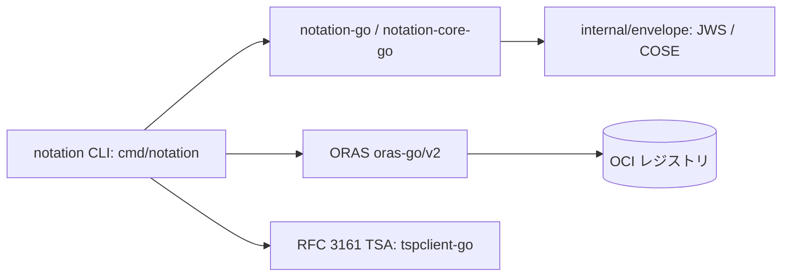

# アーキテクチャ

## 全体像

`notation` バイナリは薄いコマンド層だ。`cmd/notation/` が CLI コマンド、`internal/` がローカルの補助 (レジストリ認証・設定・TLS・失効・トレース・エンベロープ処理)、署名・検証の中核は依存ライブラリ `notation-go` / `notation-core-go` 側にある。レジストリアクセスは ORAS (`oras.land/oras-go/v2`) を通す。ルート cobra コマンドが全サブコマンドを `cmd/notation/main.go:57-70` で登録する: `blob`、`sign`、`verify`、`list`、`cert`、`policy`、`key`、`plugin`、`login`、`logout`、`version`、`inspect`。

## コンポーネント

### コマンド層 (`cmd/notation/`)

各サブコマンドはフラグと `RunE` を定義し、実処理を `notation-go` に委譲する。`main()` (`cmd/notation/main.go:77`) が `run()` (`cmd/notation/main.go:30`) を呼び、cobra ルートを組み、サブコマンドを登録し、割り込みで cancel する context 付きで実行する。

### エンベロープ処理 (`internal/envelope/`)

署名フォーマット名をメディアタイプに変換し、署名対象のペイロード型を定義する。`GetEnvelopeMediaType` は `jws` と `cose` をそれぞれのエンベロープメディアタイプに対応づける (`internal/envelope/envelope.go:42`)。署名されるペイロード型は `Payload` (`internal/envelope/envelope.go:37`)。

### レジストリアクセス (`cmd/notation/registry.go`、ORAS)

`getRepository` (`cmd/notation/registry.go:44`) がユーザー入力をリポジトリに解決する。リモートレジストリは ORAS の `remote.Repository` を構築 (`cmd/notation/registry.go:100`)。ディスク上の OCI image layout は `notationregistry.NewOCIRepository` を使う (`cmd/notation/registry.go:53`、Experimental)。

### ローカル補助 (`internal/`)

`internal/auth`、`internal/config`、`internal/httputil`、`internal/x509`、`internal/revocation`、`internal/trace` がレジストリ認証情報・TLS 処理・証明書プール・失効チェック・ログを提供する。

## リクエストの流れ

`notation sign <ref>` を端から端まで追う:

1. `signCommand` がフラグを定義する (`cmd/notation/sign.go:60`)。`RunE` (`cmd/notation/sign.go:119`) は timestamp フラグの整合性をチェックし、`runSign` (`cmd/notation/sign.go:149`) を呼ぶ。
2. `runSign` はロガーを初期化し、`sign.GetSigner` で署名者を取得する (`cmd/notation/sign.go:154`)。ローカル鍵なら generic signer、KMS の外部鍵なら plugin signer になる。
3. リポジトリ解決は `getRepository` (`cmd/notation/sign.go:158`)。リモート対象なら ORAS クライアントを構築する (`cmd/notation/registry.go:100`)。
4. 署名オプションは `prepareSigningOpts` で組む (`cmd/notation/sign.go:162`)。エンベロープ種別は `envelope.GetEnvelopeMediaType` でメディアタイプに変換 (`internal/envelope/envelope.go:42`)。`--timestamp-url` 指定時は RFC 3161 timestamper と TSA 失効バリデータを設定する (`cmd/notation/sign.go:214-230`)。
5. タグは `resolveReference` でダイジェストに解決する (`cmd/notation/sign.go:166`)。タグ参照には可変性の警告を stderr に出し (`cmd/notation/sign.go:167`)、署名対象はダイジェストに固定する (`cmd/notation/sign.go:172`)。
6. 中核呼び出しは `notation.SignOCI` (`cmd/notation/sign.go:175`、実体は `notation-go`)。署名はサブジェクトに紐づく OCI Referrer として push される。Referrers index 削除失敗時は GC 警告を出す (`cmd/notation/sign.go:177-183`)。
7. 出力は署名対象ダイジェストと push した署名ダイジェストを報告する (`cmd/notation/sign.go:186-187`)。

`notation verify` は対称的だ。`runVerify` (`cmd/notation/verify.go:103`) が検証者を取得し、リポジトリと参照を解決し、`notation.Verify` (`cmd/notation/verify.go:147`) を呼び、outcome を display ハンドラで描画する。

## 主要な設計判断

要となる判断は、署名をアーティファクトと同一リポジトリ内の OCI Referrer として保存することだ。`getRemoteRepository` はまず Referrers API を試し、未対応のレジストリでは Referrers tag schema へフォールバックする (`cmd/notation/registry.go:59-93`)。署名が同一リポジトリにアーティファクトのダイジェスト紐づけで存在するため、レジストリ間コピーでも署名が追随する。これは TUF メタデータを別サーバに置いた v1 との決定的な違いだ。

検証レベルは trust policy で決まる: `strict`、`permissive`、`audit`、`skip`。`permissive` では失効と expiry の失敗を強制せず log 扱いにするため、レジストリが侵害された場合に rollback 攻撃へ晒されうる。advisory は署名 expiry を短くし `strict` を推奨する ([source 4](https://github.com/notaryproject/specifications/blob/v1.1.0/specs/trust-store-trust-policy.md)、[source 9](https://github.com/notaryproject/specifications/security/advisories/GHSA-57wx-m636-g3g8))。

## 拡張ポイント

- KMS や HSM など外部鍵ストア向けの署名プラグイン。plugin signer 経路で扱う (`cmd/notation/sign.go:154`)。
- プラグインのインストールと管理を行う `plugin` サブコマンド (`cmd/notation/main.go:65`)。
- RFC 3161 タイムスタンプ局。`tspclient-go` で接続する (`cmd/notation/sign.go:214-230`)。
- リモートレジストリの代替としての OCI image layout 入力 (Experimental、`cmd/notation/registry.go:53`)。
