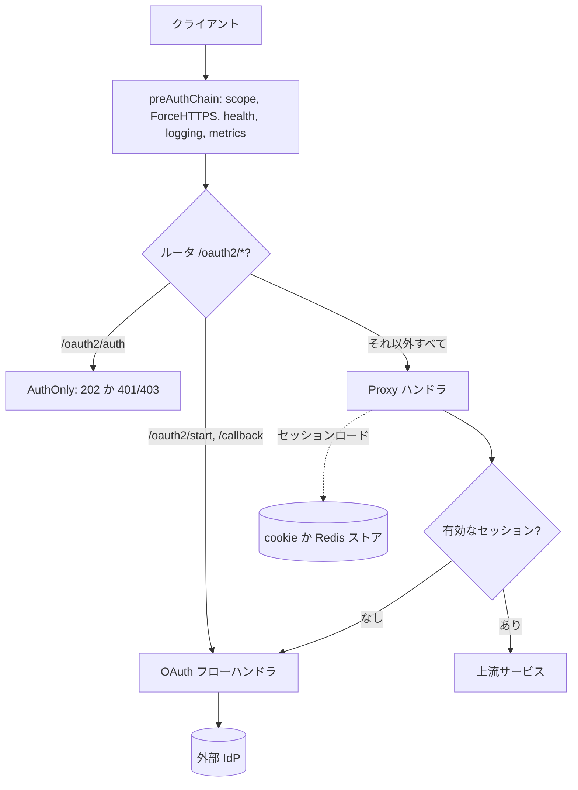

# アーキテクチャ

## 全体像

OAuth2 Proxy はリバースプロキシとして動く単一の Go バイナリだ。プロセスは `main.go` で始まる: 設定をロードし、検証し、`OAuthProxy` を構築して serve を開始する (`main.go:69-78`)。`oauthproxy.go` の `OAuthProxy` 型が中核オブジェクトで、設定されたプロバイダ、セッションストア、email validator、`justinas/alice` のミドルウェアチェーン群、上流へのリバースプロキシを保持する。

すべてのリクエストは `buildServeMux` (`oauthproxy.go:318`) で組まれたルータを通る。`/oauth2/*` の小さな一群がログインの段取りを処理し、それ以外はすべて catch-all ハンドラが受けて、上流へプロキシするかログインを強制するかを決める。

## コンポーネント

### エントリポイントと設定

`main.go` はフラグをパースし、legacy フラグ/TOML 設定か、その上に重ねる新しい alpha YAML をロードし (`loadConfiguration`, `main.go:84`)、`validation.Validate` を走らせ、プロキシを構築して起動する (`main.go:69-78`)。`NewValidator` 呼び出しがプロキシ構築前に email 許可リストを組み立てる (`main.go:69`, `validator.go:107`)。

### プロキシ中核

`OAuthProxy` (`oauthproxy.go`, `NewOAuthProxy` at `oauthproxy.go:124` で構築) が HTTP 面を所有する。ルータは `buildServeMux` (`oauthproxy.go:318`) で、`/oauth2` サブルータは `buildProxySubrouter` (`oauthproxy.go:343`) で組まれる。エンドポイントの path 定数は `oauthproxy.go:50-55` (`/sign_in`, `/sign_out`, `/start`, `/callback`, `/auth`, `/userinfo`)。

### プロバイダ

`providers/` パッケージは IdP ごとに 1 つの実装を共通インターフェース `Provider` (`providers/providers.go:22`) の背後に持つ。`NewProvider` が設定のプロバイダ種別から `switch` で実装を選ぶ (`providers/providers.go:35`)。実装には Google, GitHub, GitLab, Azure, Microsoft Entra ID, ADFS, Keycloak OIDC, 汎用 OIDC などがある。

### セッション

`pkg/sessions` は 2 つのセッションバックエンドを持つ: cookie ストア (`pkg/sessions/cookie/session_store.go`) と、ticket 抽象の上に作られたサーバ側永続ストア (Redis) (`pkg/sessions/persistence/ticket.go`)。`pkg/middleware/stored_session.go` は各リクエストでセッションをロード・検証・refresh するミドルウェアだ。

### ミドルウェアチェーン

2 つの `alice` チェーンがハンドラを守る。`buildPreAuthChain` (`oauthproxy.go:361`) は request scope、任意の HTTPS リダイレクト、health / readiness チェック、リクエストロガー、メトリクスを差し込む。`buildSessionChain` (`oauthproxy.go:411`) は proxy / auth ハンドラの前にセッションをロードする。

## リクエストの流れ

保護対象 path への未認証リクエストを 1 本追う。

1. リクエストはルータに入り pre-auth チェーンを走り (`oauthproxy.go:322-323`)、続いて session チェーンが既存セッションを request scope にロードする (`pkg/middleware/stored_session.go:107`)。
1. catch-all の `Proxy` ハンドラ (`oauthproxy.go:1041`) に到達。`Proxy` は `getAuthenticatedSession` (`oauthproxy.go:1142`) を呼ぶ。
1. `getAuthenticatedSession` は request scope からセッションを読み、許可ルートと信頼 IP は素通しし、それ以外はセッションを必須とする。セッションがなければ `ErrNeedsLogin` を返す (`oauthproxy.go:1143-1150`)。
1. `Proxy` は `ErrNeedsLogin` を受けてサインインページ表示か OAuth フロー開始を行う。`doOAuthStart` (`oauthproxy.go:825`) は CSRF cookie (プロバイダが使う場合は PKCE code verifier も) を生成し、プロバイダのログイン URL へリダイレクトする (`oauthproxy.go:851-883`)。
1. プロバイダは `/oauth2/callback` へリダイレクトし戻す。`OAuthCallback` (`oauthproxy.go:885`) は state を decode し、CSRF cookie をロードし (`oauthproxy.go:916`)、`redeemCode` で code をトークンに交換し (`oauthproxy.go:926`, `oauthproxy.go:979`)、セッションを enrich し、CSRF state を検証し、セッションを validate し、email validator と `provider.Authorize` を適用し、成功すればセッションを保存してアプリへリダイレクトする (`oauthproxy.go:933-972`)。
1. 次のリクエストではセッションが存在し、`getAuthenticatedSession` がそれを返す。`Proxy` は ID ヘッダを付与して上流へ転送する (`oauthproxy.go:1046-1053`)。

## 主要な設計判断

- **自前の認証を持たない。** プロキシは資格情報の検証を `Provider` インターフェース (`providers/providers.go:22`) 経由で外部プロバイダに委譲する。認可はあえて薄い: email チェック (`validator.go:107`) とプロバイダの `Authorize` (`oauthproxy.go:1154-1160`)。
- **セキュリティ特性の異なる 2 つのセッションバックエンド。** cookie ストアは暗号化セッションをブラウザに置き、Redis 系ストアはサーバ側に置いてセッションごとに固有の暗号鍵を与える ([内部実装](./internals) 参照)。
- **サブリクエストサポートが第一級のパス。** `/oauth2/auth` は他の `/oauth2` サブルータと別に登録され no-cache ヘッダが付かない。これで nginx が認証結果を短時間キャッシュできる (`oauthproxy.go:328-331`)。`AuthOnly` は未認可時に 401 でなく 403 を返し、サブリクエスト構成での無限リダイレクトを避ける (`oauthproxy.go:1025-1031`)。
- **encoded path を保持する。** ルータは `UseEncodedPath()` を使い、`/%2F/` のような path をそのまま上流へ届ける (`oauthproxy.go:319-321`)。

## 拡張ポイント

- **プロバイダ**: `Provider` インターフェース (`providers/providers.go:22`) を実装し `NewProvider` (`providers/providers.go:35`) に登録する。インターフェースはログイン URL 生成、code 交換、セッション enrich、認可、検証、refresh、トークンからのセッション生成をカバーする。
- **ID ヘッダ**: `addHeadersForProxying` が転送前にセッションから設定済みヘッダを注入する (`oauthproxy.go:1046-1052`)。上流が認証済み ID を消費できる。
- **セッションストア**: cookie と Redis のバックエンドが `pkg/apis/sessions` の `SessionStore` インターフェースの背後にあり、永続化の ticket モデルがサーバ側ストアで再利用される。
